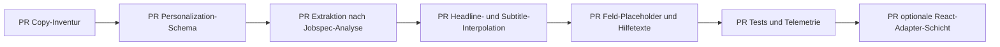

## Vorschläge für Headlines, Microcopy und Personalisierung

Die folgenden Tabellen sind bewusst produktnah formuliert: jeweils ein kompakter Headline-Vorschlag, eine erklärende Subtitle, konkrete Feld-Microcopy, Tonvarianten und ein klar konservativer Personalisierungsansatz. Ich empfehle, Personalisierung **nur** zu aktivieren, wenn der Wert aus `JobAdExtract` stammt oder die Heuristik eine hohe Sicherheit erreicht; für UI-Texte ist ein Schwellenwert von **≥ 0,85 Confidence** sinnvoll, für automatische Feldbelegung eher **≥ 0,92**. Die Personalisation sollte immer als „Vorschlag“ und nicht als „Wahrheit“ erscheinen. Diese Richtung passt zum bestehenden Produktkonzept, in dem Jobspec-Werte geprüft, bestätigt und bei Bedarf korrigiert werden. citeturn3view0turn4view0

**Start**

| Element | Vorschlag |
|---|---|
| Headline | **Stellenanzeige einlesen und Intake starten** |
| Subtitle | **Lade eine Stellenanzeige hoch oder füge den Text direkt ein. Wir extrahieren die wichtigsten Informationen, schlagen einen passenden Berufskontext vor und bereiten nur die Fragen vor, die wirklich noch offen sind.** |
| Microcopy | **Feldlabel:** „Stellenanzeige oder Jobspec“; **Upload:** „PDF, DOCX oder TXT hochladen“; **Textarea-Placeholder:** „Füge hier den vollständigen Ausschreibungstext ein …“; **PII-Toggle:** „Personenbezogene Daten vor der Analyse reduzieren“; **Analyse-CTA:** „Analyse starten“; **Hilfetext:** „Es wird immer nur die aktuell aktive Quelle analysiert.“; **Validierung:** „Bitte lade eine Datei hoch oder füge Text ein.“ / „Die Datei enthält keinen lesbaren Text. Bitte prüfe Format oder Inhalt.“ / „Wir konnten noch keinen passenden Rollenbegriff erkennen. Du kannst ihn im nächsten Schritt bestätigen oder korrigieren.“ |
| Tonvarianten | **Neutral:** „Jobspec analysieren“; **freundlich:** „Lass uns die Stelle gemeinsam einlesen“; **überzeugend:** „In zwei Minuten zur sauberen Intake-Grundlage“ |
| Personalisierung | Nach erfolgreicher Extraktion als Chips oberhalb von Phase B anzeigen: **„Erkannt: Senior Data Engineer“**, **„Unternehmen: Example GmbH“**, **„Ort: Berlin“**. CTA-Beispiele: **„Übernehmen“**, **„Stimmt nicht“**, **„Bearbeiten“**. Wenn nur ein Teilwert sicher ist: **„Wir haben vermutlich den Jobtitel erkannt: Senior Data Engineer. Bitte prüfen.“** |

**Unternehmen**

| Element | Vorschlag |
|---|---|
| Headline | **Unternehmenskontext klären** |
| Subtitle | **Hier schärfst du das Bild hinter der Vakanz: Unternehmen, Markt, Positionierung und Arbeitskontext. So werden Briefing, Ansprache und spätere Interviews konsistenter.** |
| Microcopy | **Homepage-Label:** „Unternehmenswebsite“; **Placeholder:** „https://www.beispiel.de“; **Buttons:** „Über-uns-Seite auswerten“, „Impressum auswerten“, „Vision/Mission auswerten“; **Hinweis-Auswahl:** „Welche Website-Hinweise sollen wir für offene Fragen vormerken?“; **Hilfetext:** „Die Website-Analyse soll offene Fragen abkürzen, nicht fachliche Entscheidungen ersetzen.“; **Validierung:** „Bitte gib eine vollständige Website-URL ein.“ / „Zur Website konnten keine verwertbaren Inhalte gelesen werden.“ |
| Tonvarianten | **Neutral:** „Unternehmen und Kontext“; **freundlich:** „Worum geht es bei diesem Unternehmen wirklich?“; **überzeugend:** „Mehr Kontext, weniger Rückfragen im Recruiting“ |
| Personalisierung | Wenn Company/Brand/Location sicher erkannt sind: **„Für Example GmbH in Berlin“** im Schrittkopf. Bei erkannter URL: **„Wir haben die Unternehmenswebsite erkannt. Möchtest du sie direkt für Über-uns, Impressum und Vision auswerten?“** Bei Remote-Hinweis aus Job Ad: **„Remote-Modell erkannt: Hybrid. Bitte kurz bestätigen.“** |

**Rolle & Aufgaben**

| Element | Vorschlag |
|---|---|
| Headline | **Rolle und Kernaufgaben festzurren** |
| Subtitle | **Bestätige, was die Rolle wirklich leisten soll. Aus Aufgaben, Deliverables und Erfolgskriterien entsteht die fachliche Grundlage für Briefing, Ansprache und Gehaltsprognose.** |
| Microcopy | **Bereichstitel:** „Welche Aufgaben sollen sicher in den Recruiting Brief?“; **AI-Count:** „Wie viele zusätzliche Aufgabenvorschläge möchtest du sehen?“; **AI-CTA:** „Weitere Aufgaben vorschlagen“; **Hilfetext:** „Übernimm nur Aufgaben, die für Erfolg und Priorität der Rolle wirklich relevant sind.“; **Validierung:** „Bitte übernimm mindestens eine priorisierte Aufgabe oder beantworte die offenen Fragen.“ |
| Tonvarianten | **Neutral:** „Rolle & Aufgaben“; **freundlich:** „Was soll diese Rolle konkret bewegen?“; **überzeugend:** „Aus Verantwortungen werden klare Recruiting-Signale“ |
| Personalisierung | Headline dynamisch mit Jobtitel: **„Senior Data Engineer – Rolle und Kernaufgaben“**. UI-Hinweis über Pills: **„Aus der Anzeige erkannt: Aufbau von Datenpipelines, Ownership für ETL, Stakeholder-Beratung. Was davon ist wirklich Kern der Rolle?“** |

**Skills & Anforderungen**

| Element | Vorschlag |
|---|---|
| Headline | **Skills präzisieren und priorisieren** |
| Subtitle | **Hier trennst du echte Must-haves von Nice-to-haves. Die bestätigte Skill-Liste wirkt direkt auf Matching, Interviewfragen und die Qualität des Recruiting Briefs.** |
| Microcopy | **Bereichstitel:** „Welche Skills sind zwingend – und welche nur hilfreich?“; **AI-CTA:** „Weitere Skill-Vorschläge anzeigen“; **Offene Begriffe:** „Wie soll mit diesem Begriff umgegangen werden?“; **Selectbox-Optionen:** „Auf ESCO mappen“, „Als Freitext behalten“, „Ignorieren“, „Erneut suchen“; **Hilfetext:** „Nur bestätigte Skills fließen vollständig in Briefing und Interview ein.“; **Validierung:** „Bitte bestätige mindestens einen belastbaren Skill oder entscheide offene Begriffe.“ |
| Tonvarianten | **Neutral:** „Skills & Anforderungen“; **freundlich:** „Welche Fähigkeiten braucht die Rolle wirklich zum Start?“; **überzeugend:** „Weniger Wunschliste, mehr echte Eignungskriterien“ |
| Personalisierung | Wenn Jobtitel und Tech Stack sicher erkannt sind: **„Für Senior Data Engineer wurden bereits Python, SQL und Cloud erkannt. Bitte priorisieren.“** Bei Orts-/Marktkontext: **„Für Berlin/DACH könnten zusätzlich Stakeholder-Kommunikation und Deutschkenntnisse relevant sein – bitte prüfen.“** |

**Benefits & Rahmenbedingungen**

| Element | Vorschlag |
|---|---|
| Headline | **Angebot und Rahmenbedingungen schärfen** |
| Subtitle | **Hier definierst du, wie attraktiv und zugleich realistisch das Gesamtpaket kommuniziert werden kann: Gehalt, Arbeitsmodell, Benefits und alle Faktoren, die intern sauber abgestimmt sein müssen.** |
| Microcopy | **Region-Feld:** „Region für lokale Benefits“; **Placeholder:** „z. B. Berlin, NRW, DACH“; **AI-Anzahl:** „Wie viele Benefit-Vorschläge möchtest du sehen?“; **AI-CTA:** „Benefit-Vorschläge generieren“; **Hilfetext:** „Wähle nur Benefits aus, die im Recruiting konsistent genannt werden dürfen.“; **Validierung:** „Bitte bestätige Arbeitsmodell oder Benefits, bevor du mit dem Offer-Narrativ weiterarbeitest.“ |
| Tonvarianten | **Neutral:** „Benefits & Rahmenbedingungen“; **freundlich:** „Was macht das Angebot glaubwürdig attraktiv?“; **überzeugend:** „Ein stimmiges Gesamtpaket verkauft die Rolle besser als lange Listen“ |
| Personalisierung | Wenn `remote_policy`, `salary_range` oder Benefits erkannt wurden: **„Erkannt: Hybrid · 65–80 Tsd. EUR · Weiterbildung. Bitte bestätigen oder anpassen.“** Wenn keine Benefits sicher erkannt wurden: **„Wir haben keine belastbaren Benefits gefunden. Möchtest du regionale Vorschläge für Berlin/DACH sehen?“** |

**Interviewprozess**

| Element | Vorschlag |
|---|---|
| Headline | **Interviewprozess klar und fair gestalten** |
| Subtitle | **Definiere zuerst den sichtbaren Kandidat:innen-Prozess. Danach ergänzt du interne Rollen, Kommunikation und Zeitfenster, damit Candidate Experience und interne Steuerung zusammenpassen.** |
| Microcopy | **Board-Titel:** „Welche Prozessbestandteile sollen in Summary und Export erscheinen?“; **Candidate-Communication:** „Wer wird wann informiert?“; **Ansprechpartner-Felder:** „Ansprechpartner“, „Telefonnummer“, „E-Mail-Adresse“; **Datum:** „Frühestmöglicher Start“ / „Spätester Start“ / „Interviewtag“; **Hilfetext:** „Interne Rollen helfen der Steuerung, müssen aber nicht vollständig nach außen sichtbar sein.“; **Validierung:** „Bitte wähle mindestens einen relevanten Prozessbaustein oder definiere die wichtigsten Ansprechpartner.“ |
| Tonvarianten | **Neutral:** „Interviewprozess“; **freundlich:** „Wie soll der Prozess für Kandidat:innen erlebbar sein?“; **überzeugend:** „Ein klarer Prozess reduziert Absprünge und interne Reibung“ |
| Personalisierung | Wenn Recruitment Steps oder Kontakte aus der Jobspec erkannt wurden: **„Erkannt: Phone Screen, Fachinterview, Case. Welche Schritte sollen in Summary und Export übernommen werden?“** Wenn E-Mail-Domain erkannt: E-Mail-Felder mit **„@example.com“** vorbefüllen und als Vorschlag kennzeichnen. |

**Zusammenfassung**

| Element | Vorschlag |
|---|---|
| Headline | **Alles bereit für Recruiting und Hiring-Team** |
| Subtitle | **Hier siehst du, wie entscheidungsreif die Vakanz bereits ist, welche Lücken noch offen sind und welche Recruiting-Unterlagen jetzt sinnvoll gestartet werden können.** |
| Microcopy | **Primäre CTA:** „Recruiting Brief erstellen“ / „Recruiting Brief aktualisieren“; **Recruiting-Unterlagen:** „Stellenanzeige erstellen“, „HR-Sheet erstellen“, „Fachbereich-Sheet erstellen“, „Suchstrings erstellen“; **Export-Hinweis:** „Downloads stehen bereit, sobald ein gültiger Recruiting Brief vorliegt.“; **Fallback:** „Noch kein aktueller Recruiting Brief verfügbar. Bitte prüfe Eingaben oder aktualisiere die Vakanz.“ |
| Tonvarianten | **Neutral:** „Zusammenfassung“; **freundlich:** „Deine Vakanz auf einen Blick“; **überzeugend:** „Vom Recruiting-Briefing direkt in nutzbare Recruiting-Unterlagen“ |
| Personalisierung | Schrittkopf mit sicherem Kontext: **„Senior Data Engineer bei Example GmbH – entscheidungsreif zusammengefasst“**. Unterlagen-Hinweis: **„Der Recruiting Brief für Example GmbH ist aktuell. Nächster sinnvoller Schritt: Suchstrings.“** |

## Implementierung in codex-windows-app und im Repo

Da der tatsächlich gefundene Stack **Streamlit + Python** ist, sollte die Primärintegration im bestehenden Repo erfolgen. Für deine `codex-windows-app` oder ein späteres React-Frontend empfehle ich zusätzlich einen kleinen Adapter, der denselben Personalization-State und dieselben Copy-Keys verwendet. Die wichtigste Regel dabei: **Copy, State und Heuristik dürfen nicht auseinanderlaufen.** Das Repo selbst gibt diese Richtung bereits vor: kanonische Keys in `constants.py`, Session-Defaults in `state.py`, UI in `wizard_pages/*` und generische Fragewidgets in `ui_components.py`. citeturn3view0turn4view0



**Empfohlene neue Dateien und Grep-IDs**

| Pfad | Zweck | Grep-ID |
|---|---|---|
| `personalization.py` | High-confidence-Extraktion und Interpolation | `JOB_AD_HINTS_V1` |
| `content/wizard_copy.py` | zentrale DE-Copy pro Schritt | `WIZARD_COPY_DE_V1` |
| `tests/test_personalization.py` | Unit-Tests für Confidence/Heuristik | `test_extract_high_confidence_hints` |
| `tests/test_wizard_copy_personalization.py` | Copy-Interpolation-Tests | `test_step_copy_interpolates_hints` |

**Patch für kanonischen State**

```diff
diff --git a/constants.py b/constants.py
@@
 class SSKey(str, Enum):
+    JOB_AD_HINTS = "cs.job_ad_hints"
```

```diff
diff --git a/state.py b/state.py
@@
     st.session_state[SSKey.JOB_EXTRACT.value] = None
+    st.session_state[SSKey.JOB_AD_HINTS.value] = {}
```

**Neues Personalization-Modul**

```python
# personalization.py
from __future__ import annotations

from dataclasses import dataclass, asdict
from typing import Any
from urllib.parse import urlparse
import re

from schemas import JobAdExtract

JOB_AD_HINTS_V1 = "job_ad_hints.v1"

@dataclass
class HintValue:
    value: str
    confidence: float
    source: str
    reason: str

def _clean(value: Any) -> str:
    return str(value or "").strip()

def _is_generic_title(value: str) -> bool:
    generic = {
        "m/w/d", "job", "stelle", "stellenanzeige", "position", "vacancy"
    }
    cleaned = value.casefold()
    return len(cleaned) < 3 or cleaned in generic

def _domain_stem(url: str) -> str:
    try:
        hostname = urlparse(url).hostname or ""
    except Exception:
        return ""
    parts = hostname.split(".")
    return parts[-2].casefold() if len(parts) >= 2 else ""

def _company_confidence(company_name: str, website: str) -> tuple[float, str]:
    if not company_name:
        return 0.0, "missing"
    if website and _domain_stem(website):
        stem = _domain_stem(website)
        normalized = re.sub(r"[^a-z0-9]+", "", company_name.casefold())
        if stem and stem in normalized:
            return 0.96, "company_matches_domain"
    return 0.88, "jobspec_extract_only"

def extract_high_confidence_hints(job: JobAdExtract, raw_text: str) -> dict[str, dict[str, Any]]:
    hints: dict[str, HintValue] = {}

    title = _clean(job.job_title)
    if title and not _is_generic_title(title):
        conf = 0.94 if len(title) <= 80 else 0.88
        hints["job_title"] = HintValue(title, conf, "job_extract", "structured_extract")

    company = _clean(job.company_name)
    website = _clean(job.company_website)
    company_conf, company_reason = _company_confidence(company, website)
    if company and company_conf >= 0.85:
        hints["company_name"] = HintValue(company, company_conf, "job_extract", company_reason)

    city = _clean(job.location_city)
    country = _clean(job.location_country)
    if city:
        hints["location_city"] = HintValue(city, 0.90, "job_extract", "structured_extract")
    if country:
        hints["location_country"] = HintValue(country, 0.92, "job_extract", "structured_extract")

    remote = _clean(job.remote_policy)
    if remote:
        hints["remote_policy"] = HintValue(remote, 0.87, "job_extract", "structured_extract")

    return {
        "_schema": {"version": JOB_AD_HINTS_V1},
        **{key: asdict(value) for key, value in hints.items()},
    }

def get_hint_value(hints: dict[str, Any], key: str, min_confidence: float = 0.85) -> str:
    raw = hints.get(key, {})
    if not isinstance(raw, dict):
        return ""
    try:
        confidence = float(raw.get("confidence") or 0.0)
    except Exception:
        confidence = 0.0
    value = _clean(raw.get("value"))
    return value if value and confidence >= min_confidence else ""
```

**Integration direkt nach Jobspec-Analyse**

```diff
diff --git a/wizard_pages/jobad_intake.py b/wizard_pages/jobad_intake.py
@@
 from schemas import JobAdExtract, Question, QuestionPlan
+from personalization import extract_high_confidence_hints
@@
             st.session_state[SSKey.JOB_EXTRACT.value] = _model_dump_json_compatible(job)
+            st.session_state[SSKey.JOB_AD_HINTS.value] = extract_high_confidence_hints(
+                job=job,
+                raw_text=submitted,
+            )
```

**Zentrale Copy-Datei statt verteilter Schritt-Hardcodings**

```python
# content/wizard_copy.py
from __future__ import annotations
from typing import Any
from personalization import get_hint_value

WIZARD_COPY_DE_V1 = {
    "company": {
        "title": "{company_or_fallback}",
        "subtitle": "{company_subtitle}",
    },
    "role_tasks": {
        "title": "{role_or_fallback}",
        "subtitle": "Bestätige Scope, Aufgaben und Erfolgskriterien der Rolle.",
    },
    "skills": {
        "title": "{role_skills_title}",
        "subtitle": "Trenne Must-haves sauber von Nice-to-haves.",
    },
}

def build_step_copy(step_key: str, hints: dict[str, Any]) -> dict[str, str]:
    role = get_hint_value(hints, "job_title")
    company = get_hint_value(hints, "company_name")
    city = get_hint_value(hints, "location_city")
    remote = get_hint_value(hints, "remote_policy")

    if step_key == "company":
        title = f"Unternehmen · {company}" if company else "Unternehmenskontext klären"
        subtitle_parts = [part for part in [city, remote] if part]
        subtitle = " · ".join(subtitle_parts) if subtitle_parts else "Kontext zum Unternehmen und Markt."
        return {"title": title, "subtitle": subtitle}

    if step_key == "role_tasks":
        title = f"{role} · Rolle und Kernaufgaben" if role else "Rolle und Kernaufgaben"
        return {"title": title, "subtitle": "Bestätige Scope, Aufgaben und Erfolgskriterien der Rolle."}

    if step_key == "skills":
        title = f"{role} · Skills und Anforderungen" if role else "Skills und Anforderungen"
        return {"title": title, "subtitle": "Trenne Must-haves sauber von Nice-to-haves."}

    return {"title": "", "subtitle": ""}
```

**Einbindung in einen Schritt**

```diff
diff --git a/wizard_pages/04_role_tasks.py b/wizard_pages/04_role_tasks.py
@@
 from constants import SSKey
+from content.wizard_copy import build_step_copy
@@
     job, plan = preflight
+    hints_raw = st.session_state.get(SSKey.JOB_AD_HINTS.value, {})
+    hints = hints_raw if isinstance(hints_raw, dict) else {}
+    step_copy = build_step_copy("role_tasks", hints)
@@
     render_step_shell(
-        title="Rolle & Aufgaben",
-        subtitle="Scope, Verantwortlichkeiten und Erfolgskriterien der Rolle.",
+        title=step_copy["title"] or "Rolle & Aufgaben",
+        subtitle=step_copy["subtitle"] or "Scope, Verantwortlichkeiten und Erfolgskriterien der Rolle.",
```

**Personalisierte Placeholders im generischen Fragenrenderer**

```diff
diff --git a/ui_components.py b/ui_components.py
@@
 from constants import ...
+from personalization import get_hint_value

+def _personalized_placeholder(question: Question) -> str | None:
+    hints_raw = st.session_state.get(SSKey.JOB_AD_HINTS.value, {})
+    hints = hints_raw if isinstance(hints_raw, dict) else {}
+    label = (question.label or "").casefold()
+    if "standort" in label or "location" in label:
+        city = get_hint_value(hints, "location_city")
+        country = get_hint_value(hints, "location_country")
+        if city and country:
+            return f"z. B. {city}, {country}"
+        if city:
+            return f"z. B. {city}"
+    if "unternehmen" in label or "company" in label:
+        company = get_hint_value(hints, "company_name")
+        if company:
+            return f"z. B. {company}"
+    if "rolle" in label or "jobtitel" in label or "title" in label:
+        role = get_hint_value(hints, "job_title")
+        if role:
+            return f"z. B. {role}"
+    return None
@@
         elif q.answer_type == AnswerType.SHORT_TEXT:
             value = st.text_input(
                 label,
                 value=str(current_value or ""),
                 help=q.help,
                 key=key,
-                placeholder=q.help or "Kurzantwort eingeben",
+                placeholder=_personalized_placeholder(q) or q.help or "Kurzantwort eingeben",
             )
```

**Heuristik- und Library-Empfehlung**

| Bereich | Empfehlung |
|---|---|
| Primärsignal | Verwende zuerst `JobAdExtract` als vertrauenswürdigste Quelle für UI-Personalisierung. |
| URL / Unternehmen | URL per `urllib.parse`, Domain-Stamm gegen `company_name` matchen. |
| Jobtitel | Erste Zeilen der Anzeige, Title-Case-Heuristik, Ausschluss generischer Tokens wie „m/w/d“, „Job“, „Position“. |
| Ort | Regex auf Marker wie `Standort`, `Ort`, `Arbeitsort`, `Location`; sekundär `JobAdExtract.location_city/country`. |
| Fuzzy Match | optional `rapidfuzz` für `company_name` ↔ Domain-Stamm. |
| NER | optional `spaCy` für `ORG`/`LOC` als zweite Meinung; nicht als alleinige Wahrheit. |
| Confidence | Nur `>=0,85` für Copy, `>=0,92` für Auto-Prefill echter Felder. |
| Surface | Immer mit explizitem Vorschlags-Charakter: „Erkannt“, „Vermutlich erkannt“, „Bitte prüfen“. |

**Optionale TypeScript-/React-Adapter-Schicht für codex-windows-app**

```ts
// src/features/recruitmentNeedAnalysis/personalization.ts
export type HintValue = {
  value: string;
  confidence: number;
  source: "job_extract" | "regex" | "ner";
  reason: string;
};

export type JobAdHints = {
  job_title?: HintValue;
  company_name?: HintValue;
  location_city?: HintValue;
  location_country?: HintValue;
  remote_policy?: HintValue;
};

export function highConfidenceValue(
  hints: JobAdHints,
  key: keyof JobAdHints,
  minConfidence = 0.85,
): string {
  const hit = hints[key];
  if (!hit) return "";
  return hit.confidence >= minConfidence ? hit.value : "";
}
```

```tsx
// Beispiel in einem React-Step-Header
const role = highConfidenceValue(hints, "job_title");
const company = highConfidenceValue(hints, "company_name");

<h1>{role ? `${role} – Skills und Anforderungen` : "Skills und Anforderungen"}</h1>
<p>
  {company
    ? `Für ${company} bestätigst du hier die wirklich relevanten Must-haves und Nice-to-haves.`
    : "Bestätige hier die wirklich relevanten Must-haves und Nice-to-haves."}
</p>
```

**Lokale Voraussetzungen und Verifikation**

| Bereich | Kommando / Hinweis |
|---|---|
| venv | `python -m venv .venv` |
| Aktivierung Windows | `.venv\\Scripts\\activate` |
| Installation | `pip install -r requirements.txt -c constraints.txt` |
| Start App | `streamlit run app.py` |
| Baseline | `pip check` |
| Syntax | `python -m compileall app.py components config pages salary scripts tests wizard_pages` |
| Tests | `python -m pytest -q` |
| Wichtige Env Vars | `OPENAI_API_KEY`; optional `ESCO_API_BASE_URL`, `ESCO_RELEASE_LANE`, `ESCO_SELECTED_VERSION`, `ESCO_API_MODE`, `ESCO_DATA_SOURCE_MODE` |
| Sicherheit | Keine Secrets in Code, Logs oder Fixtures; nur synthetische Testdaten verwenden. |

## Barrierefreiheit, Lokalisierung, Tests und Metriken

Für die deutschen UX-Texte empfehle ich drei Leitplanken: **kurz, konkret, reversibel**. „Kurz“ heißt: Headlines möglichst unter **65 Zeichen**, Subtitles unter **160 Zeichen**, Hilfetexte ideal unter **120 Zeichen**, Validierungen in einem Satz plus klare nächste Aktion. „Konkret“ heißt: keine Produktsprache ohne Handlungsbezug; lieber „Welche Skills sind zwingend?“ als „Bitte evaluieren Sie Anforderungen“. „Reversibel“ heißt: jeder automatisch erkannte Wert muss als Vorschlag erscheinen und ohne Reibung ablehnbar sein. Diese Regeln passen gut zum bestehenden Produktmuster aus Prüfung, Bestätigung und Korrektur. citeturn3view0turn4view0

Für Accessibility solltest du im bestehenden Streamlit-Setup vor allem vier Dinge absichern. Erstens: Alle interaktiven Felder brauchen sichtbare Labels; Hinweise gehören ergänzend in `help` oder `caption`, nicht allein in Placeholders. Zweitens: Validierungsfehler müssen feldnah erscheinen und in Klartext sagen, was jetzt zu tun ist. Drittens: Bei Personalisierung darf nie nur Farbe oder Position den Status „erkannt/vorgeschlagen“ kommunizieren; nutze immer Text wie „Erkannt“ oder „Bitte prüfen“. Viertens: Wenn Extraktion scheitert, muss der Fallback vollständig manuell nutzbar bleiben, ohne dass Nutzer:innen eine Sackgasse erleben. Diese Empfehlungen lassen sich direkt im vorhandenen generischen Renderer und in den Step-Shells verankern. citeturn3view0turn4view0

**Empfohlene Fallback-Texte**

| Situation | Fallback-Text |
|---|---|
| kein lesbarer Upload | „Wir konnten aus der Datei keinen lesbaren Text extrahieren. Bitte füge den Inhalt direkt ein oder prüfe das Dateiformat.“ |
| kein sicherer Jobtitel | „Wir konnten noch keinen verlässlichen Jobtitel erkennen. Du kannst ihn im weiteren Verlauf manuell festlegen.“ |
| Company nicht sicher | „Zum Unternehmen liegen noch keine verlässlichen Angaben vor. Bitte ergänze die wichtigsten Eckdaten manuell.“ |
| Ort nicht sicher | „Der Arbeitsort konnte nicht sicher erkannt werden. Bitte trage Stadt oder Region ein.“ |
| ESCO nicht sicher | „Der fachliche Rollenanker ist noch nicht bestätigt. Du kannst ohne ESCO weitermachen, einige Funktionen bleiben dann eingeschränkt.“ |

**Testing-Checkliste**

| Ebene | Testfall | Erwartung |
|---|---|---|
| Unit | `extract_high_confidence_hints()` mit sauberem `JobAdExtract` | `job_title`, `company_name`, `location_city` werden mit Confidence gespeichert |
| Unit | Domain-Match `example.com` ↔ `Example GmbH` | `company_name.confidence >= 0.95` |
| Unit | generischer Titel „Position“, „Job“, „m/w/d“ | kein High-Confidence-Titel |
| Unit | `_personalized_placeholder()` für Standortfrage | Platzhalter enthält Stadt/Land nur bei ausreichender Confidence |
| Unit | `build_step_copy()` ohne Hints | sauberer generischer Fallback ohne leere Strings |
| Unit | `build_step_copy()` mit Hints | interpolierte Titel/Subtitles korrekt |
| Integration | Jobspec hochladen → Analyse | `SSKey.JOB_EXTRACT` und `SSKey.JOB_AD_HINTS` gesetzt |
| Integration | Schrittwechsel Start → Rolle & Aufgaben | personalisierte Headline sichtbar, wenn Jobtitel sicher |
| Integration | Confidence unter Schwelle | keine Auto-Prefill-Nutzung, nur generische Copy |
| E2E | Upload einer bekannten Demo-Anzeige | Chips „Erkannt: …“ erscheinen, lassen sich übernehmen/ablehnen |
| E2E | Extraktion schlägt fehl | manueller Text-Fallback bleibt nutzbar, kein Dead End |
| E2E | Screenreader-/Keyboard-Smoketest | Fokus-Reihenfolge logisch, Fehlertexte sichtbar, CTA erreichbar |

**Repo-nahe pytest-Sets**

```bash
python -m pytest -q \
  tests/test_state_reset.py \
  tests/test_wizard_contract.py \
  tests/test_ui_mode_flow.py \
  tests/test_question_limits.py \
  tests/test_question_progress.py
```

```bash
python -m pytest -q \
  tests/test_personalization.py \
  tests/test_wizard_copy_personalization.py
```

**Metriken für Klarheit und Engagement**

| Metrik | Warum sie wichtig ist |
|---|---|
| Zeit bis erste erfolgreiche Analyse | misst Friktion im Start-Schritt |
| Abbruchrate je Schritt | zeigt copy- oder prozessbedingte Hürden |
| Anteil übernommener vs. abgelehnter Vorschlagswerte | misst Qualität der Personalisierung |
| Feldfehlerquote je Label | zeigt unklare Microcopy oder falsche Eingabeerwartung |
| Anteil bearbeiteter Auto-Fills | trennt „hilfreich“ von „korrigierbedürftig“ |
| Completion Rate bis Summary | misst Gesamtverständlichkeit des Wizards |
| Anteil aktueller Recruiting Briefs nach Summary-Besuch | zeigt, ob die Summary zum nächsten sinnvollen Schritt führt |
| Qualitative 5-Sekunden-Verständnisfrage pro Schritt | prüft, ob Nutzer:innen sofort wissen, was hier entschieden werden soll |
