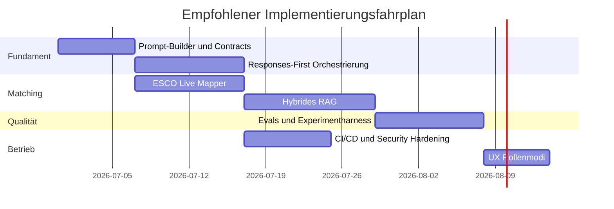

# Priorisierte Codex-optimierte Aufgaben für dein Recruiting-Bedarfsanalyse-Tool

## Executive Summary

Dein Repository zeigt bereits ein ungewöhnlich solides Fundament: Die App ist kein Prototyp, sondern ein zustandsbehafteter Recruiting-Workflow mit kanonischen Konstanten, Pydantic-Schemata, ESCO-Verankerung, fakten- und evidenzbasierter Zusammenfassung, Exporten sowie privacy-first Intake. Außerdem existieren schon modellfähigkeitsabhängige Request-Builder, ein taskbasiertes Modellrouting, Session-Cache für LLM-Antworten, Retry-Logik sowie Schema-Contract-Tests. Das ist wichtig, weil die größten Produktgewinne jetzt **nicht** mehr durch „noch einen Prompt“ entstehen, sondern durch **saubere Vereinheitlichung von Prompt-Contracts, API-Orchestrierung, ESCO-Mapping, RAG-Qualität, Evals und Betriebs-Guardrails**. fileciteturn2file1L4-L4 fileciteturn3file1L659-L690 fileciteturn3file1L791-L845 fileciteturn3file1L928-L952 fileciteturn8file1L4-L4

Die wichtigste strategische Entscheidung ist, die produktive LLM-Orchestrierung entlang der aktuellen OpenAI-Empfehlung stärker auf die **Responses API** auszurichten. OpenAI empfiehlt für neue Text- und Reasoning-Workloads die Responses API gegenüber der älteren Chat-Completions-API; zusätzlich profitieren komplexere agentische und mehrstufige Abläufe davon, dass Responses-Kontexte und Reasoning-Items sauberer weitergereicht werden können. Für komplexe Tool-/Funktionsketten ist Chat Completions dagegen stateless und dadurch in agentischen Fällen tendenziell schwächer. citeturn10view5turn10view4turn27view4turn8view2

Für deine Domäne ist besonders relevant, dass ESCO inzwischen offiziell als **ESCO v1.2.1** ausgewiesen wird und die European Commission zwei Hauptzugänge hervorhebt: den Web-Service und die lokale API. In der REST-Doku sind für den laufenden Einsatz vor allem `/search` für Volltextsuche, `/resource/occupation` und `/resource/skill` für kanonische Einzelressourcen sowie die Sprach- und Versionsparameter zentral; der alte `/suggest`-Endpunkt ist ausdrücklich als veraltet markiert. Daraus folgt: Deine nächste Ausbaustufe sollte ESCO nicht nur als Hilfsanker, sondern als **kanonische Mappingschicht mit URI-first Persistenz** behandeln. citeturn15view0turn16view6turn17view0turn17view1turn16view2turn16view3turn16view5

Im Retrieval ist dein aktueller Stand bereits brauchbar, aber noch konservativ: Das Repo nutzt OpenAI Vector Store Search mit `rewrite_query=False`, Filter-Fallbacks und optionalen ESCO-RAG-Flags. OpenAI dokumentiert allerdings für Retrieval standardmäßig 800-Token-Chunks mit 400 Token Overlap, konfigurierbare Chunking-Strategien, Re-Ranking-Optionen, Query-Rewriting und Ergebnisgrenzen von 1 bis 50 Treffern. Daraus ergibt sich ein klarer Hebel: **Hybrid-Retrieval mit kontrolliertem Chunking, Metadatenfiltern, zweistufiger Suche und Eval-Harness**. fileciteturn6file1L4-L4 fileciteturn6file1L260-L348 citeturn9view1turn9view0

Die priorisierte Roadmap in diesem Bericht setzt daher auf sieben zusammenhängende Arbeitspakete: **kanonische Codex-Prompt-Builder**, **Responses-First-Orchestrierung**, **ESCO-Live-Mapping**, **hybrides RAG**, **rollenbasierte UX-Trigger für Recruiter und Kandidaten**, **Evals und kontrollierte Experimente** sowie **CI/CD, Monitoring und Datenschutz-Härtung**. Das Ziel ist nicht nur bessere Antworten, sondern bessere **Verifizierbarkeit, Kostenkontrolle, Halluzinationsreduktion und Änderbarkeit durch Codex**. citeturn9view4turn7view3turn7view5turn26view0turn30view2turn31view0

## Befund aus Repository und offiziellen Leitquellen

Im Repository ist der Produktkern bereits klar definiert: Intake aus PDF/DOCX/TXT oder Text, PII-Reduktion standardmäßig aktiv, strukturierte Jobspec-Extraktion über OpenAI Structured Outputs, reviewbare Fakten/Evidenzblöcke, deterministische Occupation-Overlay-Logik, ESCO-Ankerung, Summary-Hub und Exporte. Gleichzeitig dokumentiert das README selbst eine zentrale Lücke: **vollständige offizielle ESCO-Bulk-Ingestion ist noch nicht umgesetzt**, der Offline-Index ist derzeit lookup-orientiert. Genau daraus folgt die hohe Priorität für ESCO-Live-Mapping und Retrieval-Ausbau. fileciteturn2file1L4-L4

Die OpenAI-Konfiguration im Repo ist schon sauber geschichtet: Secrets/Umgebungsvariablen, getrennte Modellrollen für Lightweight-, Medium- und High-Reasoning-Tasks, optionales `REASONING_EFFORT`, `VERBOSITY`, Timeout, ESCO-Vector-Store-ID und task-spezifische Token-/Bullet-/Sentence-Limits. Das ist eine hervorragende Voraussetzung, um Codex nicht auf Einzelprompts, sondern auf **kanonische Prompt-Builder pro Task-Klasse** anzusetzen. fileciteturn2file1L4-L4 fileciteturn5file1L1-L41

Die Request-Building-Schicht ist bereits fortgeschritten: `model_capabilities.py` bündelt GPT-5-Familienlogik, Reasoning-/Verbosity-Gating und Temperatur-Regeln; `llm_client.py` baut darauf capability-gated Requests für Responses und Chat Parse auf. Genau diese Zentralisierung sollte beibehalten und erweitert werden, weil OpenAI für strukturierte Ausgaben und für Reasoning-Modelle klare API- und Prompt-Patterns vorgibt: Responses API für neue Projekte, klare `instructions`, strukturierte Outputs statt JSON Mode, sowie einfache, direkte Prompts statt Chain-of-Thought-Anweisungen. fileciteturn4file1L5-L81 fileciteturn3file1L620-L706 citeturn10view5turn10view4turn7view3turn27view4

Die Repo-Tests prüfen bereits wertvolle Invarianten: strikte JSON-Schemata mit `additionalProperties=False`, typisierte `anyOf`-Felder und modelldifferenziertes Request-Building. OpenAI verlangt für Structured Outputs, dass alle Felder `required` sind; optionales Verhalten soll über `null`-Union modelliert werden. Das passt sehr gut zu deinem bestehenden Schema-Fokus und sollte systematisch auf alle LLM-Ein- und Ausgänge erweitert werden. fileciteturn8file1L4-L4 fileciteturn9file1L4-L4 citeturn7view5turn7view4turn7view3

Bei ESCO-RAG ist der aktuelle Code bewusst defensiv: Retrieval läuft nur mit gesetzter Vector-Store-ID und Flag, nutzt Filterkombinationen, deaktiviertes Query-Rewriting und einen Fallback auf lockerere Filter. Das ist robust, aber noch nicht optimal für Recall. OpenAI dokumentiert, dass Vector Store Search `rewrite_query`, Re-Ranking und Score-Schwellen unterstützt; die Retrieval-Guide nennt außerdem ein Default-Chunking von 800/400 Tokens. Für ESCO-Matching und Recruiting-Text liegt hier ein klarer Hebel, besonders für deutsche Inputs und mehrsprachige Taxonomievarianten. fileciteturn6file1L260-L348 citeturn9view0turn9view1

Auch Betriebsaspekte sind schon teilweise vorhanden: Sitzungscache für LLM-Antworten, Exponential Backoff bei transienten OpenAI-Fehlern, Streamlit als UI- und State-Layer. OpenAI weist zusätzlich auf Prompt Caching ab 1024 Tokens hin; Streamlit dokumentiert eigene Caching- und Session-State-Mechanismen, aber warnt explizit vor unsicherem Pickle-basiertem Cache/State in untrusted Kontexten. GitHub wiederum liefert mit Secrets, OIDC, Secret Scanning, Push Protection, Dependabot und Workflow-Logs die passenden DevSecOps-Komponenten, um die App deutlich produktionsfester zu machen. fileciteturn3file1L791-L845 fileciteturn3file1L928-L952 citeturn9view3turn32view2turn32view3turn32view4turn28view5turn29view1turn28view1turn28view2turn28view3

## Priorisierte Task-Backlog

Die folgende Priorisierung ist auf **Impact zuerst**, aber bewusst auf **Codex-Freundlichkeit** optimiert: kleine, reviewbare, testbare Aufgaben mit klaren Erfolgs- und Verifikationskriterien. Die Schätzungen sind bewusst als grobe Entwicklungsaufwände zu verstehen.

| ID | Title | Description | Priority | Effort (hours) | Risk | Dependencies | Deliverables | Example prompt |
|---|---|---|---|---:|---|---|---|---|
| COD-01 | Kanonische Prompt-Builder und Output-Contracts | Einheitliche Prompt-Module pro Task, mit klaren Inputs, Success Criteria, Structured Output Schema und Verifikationsschritten für Codex. | P1 | 12–18 | Niedrig | Bestehende `schemas.py`, `llm_client.py`, `settings_openai.py` | `prompt_builders/`, JSON-Schemas, Fixtures, golden tests | „Refactor the recruiter brief prompt into a canonical prompt builder with placeholders, strict schema output, fixture tests, and verification steps.“ |
| COD-02 | Responses-First OpenAI-Orchestrierung | Primäre Umstellung neuer Flows auf Responses API, Nutzung von `instructions`, `store`, `previous_response_id`, funktionsfähiger Fallback auf Chat nur wo nötig. | P1 | 16–24 | Mittel | COD-01 | neuer OpenAI adapter, telemetry hooks, retry/rate-limit layer | „Migrate vacancy brief generation to Responses API without changing schema outputs. Add retries, request IDs, latency logging, and fallback tests.“ |
| COD-03 | ESCO Live Mapper mit URI-first Persistenz | Einführung eines zweistufigen ESCO-Mappers: `/search` für Kandidaten und `/resource/occupation|skill` für kanonische Auflösung, inkl. deutscher Query-Expansion. | P1 | 18–28 | Mittel | COD-01 | `esco_mapper.py`, query examples, URI persistence schema | „Implement ESCO occupation and skill mapping with search candidate retrieval, canonical resource hydration, confidence scoring, and bilingual tests.“ |
| COD-04 | Hybrides RAG für Jobspec, ESCO und Website-Kontext | Besseres Chunking, Metadatenfilter, BM25+Vector-Hybrid oder wenigstens zweistufige Suche, kontrolliertes Re-Ranking, Eval-Set gegen Halluzinationen. | P1 | 20–32 | Mittel | COD-02, COD-03 | indexing scripts, retrieval config, rerank switch, ablation report | „Upgrade retrieval to hybrid search with metadata-aware chunking, query rewrite toggle, score threshold tuning and eval harness.“ |
| COD-05 | Rollenbasierte UX- und Prompting-Muster | Getrennte Gesprächsmodi für Recruiter und Kandidat, progressive Offenlegung, Rückfragenlogik, Unsicherheitsmarkierung, evidenzbasierte Antwortbausteine. | P2 | 12–20 | Niedrig | COD-01 | UI states, prompt variants, acceptance tests | „Add recruiter and candidate interaction modes with different prompts, safety constraints, and session-state backed UI toggles.“ |
| COD-06 | Evals, Experimente und Qualitätsmetriken | Goldenset für Accuracy, Halluzinationsrate, Latenz, Kosten und Mapping-Qualität; kontrollierte Modell- und Retrieval-Vergleiche. | P2 | 16–26 | Niedrig | COD-01 bis COD-04 | eval datasets, graders, dashboards, experiment matrix | „Create an eval suite for extraction, ESCO mapping, retrieval citation quality, latency, and token cost. Output CSV and JSON reports.“ |
| COD-07 | CI/CD, Monitoring, Security und GDPR-Härtung | GitHub Actions, OIDC/Secrets, Secret Scanning, Dependabot, strukturierte Logs, Alerts, Data-Retention-Policies, DPIA-Checkliste. | P2 | 14–24 | Mittel | COD-02, COD-06 | workflows, dashboards, alerts, GDPR checklist | „Set up CI with tests, security scans, secret hygiene, cost telemetry, alerting, and GDPR-oriented config checks.“ |

### Priorisierungsmatrix

| ID | Impact | Effort | Risk | Begründung |
|---|---|---|---|---|
| COD-01 | Sehr hoch | Niedrig–Mittel | Niedrig | Hebt Prompt-Qualität, Testbarkeit und Codex-Bearbeitbarkeit gleichzeitig. |
| COD-02 | Sehr hoch | Mittel | Mittel | Größter Hebel für konsistente OpenAI-Nutzung, bessere agentische Ketten und geringere spätere Komplexität. |
| COD-03 | Sehr hoch | Mittel | Mittel | Verbessert ESCO-Treffsicherheit, Nachvollziehbarkeit und Exportqualität deutlich. |
| COD-04 | Hoch | Mittel–Hoch | Mittel | Größter Hebel gegen Fehlabrufe, „lost in the middle“ und irrelevante Kontexteinmischung. |
| COD-05 | Mittel | Mittel | Niedrig | Erhöht Nutzbarkeit und Antwortqualität, ist aber von guter Prompt-Infrastruktur abhängig. |
| COD-06 | Hoch | Mittel | Niedrig | Verhindert regressionsgetriebene Verschlechterung und macht Modellwechsel kontrollierbar. |
| COD-07 | Hoch | Mittel | Mittel | Produktionsreife, Datenschutz und Betriebssicherheit; fachlich nicht sichtbar, aber geschäftskritisch. |

## Codex-Prompts, API-Aufgaben und Codebausteine

OpenAI empfiehlt für Codex Aufgaben mit **klaren Zielen, reproduzierbaren Prüfungen, kleineren Schritten und expliziten Verifikationsanweisungen**. Für Reasoning-Modelle sollen Prompts dagegen **einfach, direkt und ohne „think step by step“** formuliert werden; klare Delimiter, Zielkriterien und bei Bedarf wenige saubere Beispiele sind sinnvoll. Außerdem sollte für strukturierte Antworten nach Möglichkeit **Structured Outputs statt JSON mode** verwendet werden. citeturn9view4turn27view4turn26view5turn26view6turn7view3turn7view5

### Gemeinsames Prompt-Grundmuster für Codex

```text
Goal:
Implement <TASK_NAME> for the recruitment need analysis tool.

Repository context:
- Keep schema ↔ logic ↔ UI ↔ exports in sync.
- Reuse canonical constants and existing Pydantic models.
- Do not introduce secrets into code or logs.
- Preserve German as default UI language.

Files to inspect first:
- <FILE_PATH_1>
- <FILE_PATH_2>
- <FILE_PATH_3>

Constraints:
- Prefer small, reviewable changes.
- Add or update tests.
- Keep backward compatibility unless a migration is included.
- Use strict structured outputs where applicable.

Plan:
1. Propose a minimal implementation plan.
2. Implement the smallest viable slice.
3. Add tests and fixtures.
4. Run verification steps.
5. Summarize exact changed files and risks.

Verification:
- <TEST_COMMAND_1>
- <TEST_COMMAND_2>
- <MANUAL_REPRO_STEP>

Deliverables:
- Updated code
- Tests
- Short migration note
```

Dieses Muster folgt direkt den Codex-Hinweisen: kleines Arbeitspaket, klare Zieldefinition, konkrete Dateien, Repro-/Verifikationsschritte und reviewfreundliche Deliverables. citeturn9view4turn7view2

### COD-01 Kanonische Prompt-Builder und Output-Contracts

**Ziel:** Alle produktionsrelevanten LLM-Tasks bekommen einen kanonischen Builder mit festen Platzhaltern, striktem Output-Schema und Golden-Test. Das passt besonders gut zu deinem bestehenden Schema-Fokus und zu OpenAIs Structured-Outputs-Empfehlung. fileciteturn8file1L4-L4 citeturn7view3turn7view5

**Codex-Prompt**

```text
Goal:
Refactor one LLM task into a canonical prompt builder with placeholders, strict schema output, and regression tests.

Start with:
- llm_client.py
- schemas.py
- tests/test_schema_contracts.py

Success criteria:
- Prompt text is generated from a typed builder function.
- Dynamic values are passed through placeholders only.
- Output schema sets additionalProperties=false and treats optional fields as explicit null unions where needed.
- Add one fixture-based test and one smoke test.
```

**Python**

```python
from pydantic import BaseModel, Field
from typing import Literal

class NeedAnalysisBrief(BaseModel):
    role_title: str
    hiring_reason: str | None
    must_have_skills: list[str] = Field(default_factory=list)
    risk_flags: list[str] = Field(default_factory=list)
    confidence: Literal["low", "medium", "high"]

def build_need_analysis_prompt(*, jobspec_text: str, locale: str = "de") -> tuple[str, str]:
    instructions = f"""
# Identity
You generate a structured recruiting need brief.
# Instructions
Return only schema-compliant JSON.
Use the provided jobspec text only.
Mark uncertainty explicitly.
# Locale
{locale}
""".strip()

    user_input = f"""
<JOBSPEC>
{jobspec_text}
</JOBSPEC>
""".strip()
    return instructions, user_input
```

**JavaScript**

```javascript
export function buildNeedAnalysisPrompt({ jobspecText, locale = "de" }) {
  const instructions = [
    "# Identity",
    "You generate a structured recruiting need brief.",
    "# Instructions",
    "Return only schema-compliant JSON.",
    "Use only the supplied jobspec text.",
    "Mark uncertainty explicitly.",
    "# Locale",
    locale,
  ].join("\n");

  const input = `<JOBSPEC>\n${jobspecText}\n</JOBSPEC>`;
  return { instructions, input };
}
```

### COD-02 Responses-First OpenAI-Orchestrierung

**Ziel:** Neue und komplexere Flows primär über die Responses API führen, mit `instructions`, optionalem `store`, kontrollierter Weitergabe via `previous_response_id`, robustem Retry und rate-limit-aware Backoff. OpenAI empfiehlt die Responses API für neue Text- und Reasoning-Anwendungen; `store` kann Response-State API-seitig verfügbar halten, ist aber aus Datenschutzsicht bewusst zu steuern. Rate Limits wirken auf Organisations- und Projektebene. citeturn10view5turn10view4turn8view2turn7view9turn31view4

**Codex-Prompt**

```text
Goal:
Migrate the vacancy brief flow to Responses API without changing output schema or UI behavior.

Inspect:
- llm_client.py
- model_capabilities.py
- settings_openai.py
- tests/test_openai_smoke_modes.py

Verification:
- schema test passes
- smoke mode tests pass
- one manual request logs request_id, latency_ms, token usage
```

**Python**

```python
import time
from openai import OpenAI

client = OpenAI()  # API key from env or Streamlit secrets

def call_responses_with_retry(instructions: str, input_text: str, schema, model="gpt-5.5"):
    backoff = 0.5
    for attempt in range(3):
        try:
            started = time.perf_counter()
            resp = client.responses.parse(
                model=model,
                store=False,
                instructions=instructions,
                input=input_text,
                text_format=schema,
                max_output_tokens=1200,
            )
            latency_ms = int((time.perf_counter() - started) * 1000)
            return {
                "data": resp.output_parsed,
                "response_id": getattr(resp, "id", None),
                "latency_ms": latency_ms,
                "usage": getattr(resp, "usage", None),
            }
        except Exception as exc:
            if attempt == 2:
                raise RuntimeError(f"OpenAI request failed after retries: {type(exc).__name__}") from exc
            time.sleep(backoff)
            backoff *= 2
```

**JavaScript**

```javascript
import OpenAI from "openai";
const client = new OpenAI({ apiKey: process.env.OPENAI_API_KEY });

export async function callResponsesWithRetry({ instructions, input, textFormat, model = "gpt-5.5" }) {
  let backoffMs = 500;
  for (let attempt = 0; attempt < 3; attempt += 1) {
    try {
      const started = Date.now();
      const resp = await client.responses.parse({
        model,
        store: false,
        instructions,
        input,
        text: { format: textFormat },
        max_output_tokens: 1200,
      });
      return {
        data: resp.output_parsed,
        responseId: resp.id ?? null,
        latencyMs: Date.now() - started,
        usage: resp.usage ?? null,
      };
    } catch (err) {
      if (attempt === 2) throw err;
      await new Promise((r) => setTimeout(r, backoffMs));
      backoffMs *= 2;
    }
  }
}
```

### COD-03 ESCO Live Mapper mit URI-first Persistenz

**Ziel:** Aus Freitext wird zuerst ein Kandidatenset via `/search`, dann eine kanonische Auflösung via `/resource/occupation` oder `/resource/skill`. Persistiert wird immer URI-first, nicht label-first. Das ist stabiler über Sprachvarianten und Versionswechsel hinweg. ESCO verlangt Sprach- und Versionsparameter; `/suggest` ist als deprecated markiert. citeturn17view0turn16view2turn16view3turn16view5turn17view1

**Codex-Prompt**

```text
Goal:
Implement ESCO canonical mapping from free text to occupation/skill URI with confidence scoring.

Requirements:
- candidate search via /search
- canonical hydration via /resource/occupation or /resource/skill
- persist URI, preferred_label, language, selectedVersion
- add German and English query-expansion tests
```

**Python**

```python
import requests

ESCO_BASE = "https://ec.europa.eu/esco/api"

def search_esco(text: str, types=("occupation",), language="de", selected_version="v1.2.1", limit=10):
    params = {
        "text": text,
        "language": language,
        "type": list(types),
        "limit": limit,
        "selectedVersion": selected_version,
    }
    r = requests.get(f"{ESCO_BASE}/search", params=params, timeout=20)
    r.raise_for_status()
    return r.json()

def get_esco_resource(uri: str, kind: str, language="de", selected_version="v1.2.1"):
    endpoint = "occupation" if kind == "occupation" else "skill"
    r = requests.get(
        f"{ESCO_BASE}/resource/{endpoint}",
        params={"uri": uri, "language": language, "selectedVersion": selected_version},
        timeout=20,
    )
    r.raise_for_status()
    return r.json()
```

**JavaScript**

```javascript
export async function searchEsco({ text, type = ["occupation"], language = "de", selectedVersion = "v1.2.1", limit = 10 }) {
  const url = new URL("https://ec.europa.eu/esco/api/search");
  url.searchParams.set("text", text);
  url.searchParams.set("language", language);
  type.forEach((t) => url.searchParams.append("type", t));
  url.searchParams.set("limit", String(limit));
  url.searchParams.set("selectedVersion", selectedVersion);

  const res = await fetch(url);
  if (!res.ok) throw new Error(`ESCO search failed: ${res.status}`);
  return res.json();
}

export async function getEscoResource({ uri, kind, language = "de", selectedVersion = "v1.2.1" }) {
  const endpoint = kind === "occupation" ? "occupation" : "skill";
  const url = new URL(`https://ec.europa.eu/esco/api/resource/${endpoint}`);
  url.searchParams.set("uri", uri);
  url.searchParams.set("language", language);
  url.searchParams.set("selectedVersion", selectedVersion);

  const res = await fetch(url);
  if (!res.ok) throw new Error(`ESCO resource failed: ${res.status}`);
  return res.json();
}
```

### COD-04 Hybrides RAG für Jobspec, ESCO und Website-Kontext

**Ziel:** Retrieval so umbauen, dass Chunking, Metadatenfilter und Re-Ranking kontrollierbar werden. OpenAI nennt für Retrieval standardmäßig 800/400 Tokens; Search unterstützt `rewrite_query`, `ranker`, `score_threshold` und bis zu 50 Ergebnisse. Zugleich zeigt „Lost in the Middle“, dass relevante Information in langen Kontexten gerade in der Mitte schlechter genutzt wird. Deshalb ist **gutes Chunking und aggressives Kontextkürzen** wichtiger als bloß mehr Kontext. citeturn9view1turn9view0turn23view1

**Codex-Prompt**

```text
Goal:
Upgrade retrieval to metadata-aware chunking and configurable reranking.

Inspect:
- esco_rag.py
- settings_openai.py
- retrieval-related config locations

Success criteria:
- chunk profile is configurable
- score threshold is configurable
- query rewrite can be toggled
- retrieval logs include hit count and top score
```

**Python**

```python
from openai import OpenAI
client = OpenAI()

def search_vector_store(vector_store_id: str, query: str, max_num_results: int = 8):
    try:
        result = client.vector_stores.search(
            vector_store_id=vector_store_id,
            query=query,
            max_num_results=max_num_results,
            rewrite_query=True,
            ranking_options={"ranker": "auto", "score_threshold": 0.35},
        )
        payload = result.model_dump() if hasattr(result, "model_dump") else {}
        return payload.get("data", [])
    except Exception as exc:
        raise RuntimeError(f"Vector search failed: {type(exc).__name__}") from exc
```

**JavaScript**

```javascript
import OpenAI from "openai";
const client = new OpenAI({ apiKey: process.env.OPENAI_API_KEY });

export async function searchVectorStore({ vectorStoreId, query, maxNumResults = 8 }) {
  try {
    const result = await client.vectorStores.search(vectorStoreId, {
      query,
      max_num_results: maxNumResults,
      rewrite_query: true,
      ranking_options: { ranker: "auto", score_threshold: 0.35 },
    });
    return result.data ?? [];
  } catch (err) {
    throw new Error(`Vector search failed: ${err?.name || "unknown_error"}`);
  }
}
```

### COD-05 Rollenbasierte UX- und Prompting-Muster

**Ziel:** Recruiter und Kandidaten sollten nicht denselben Antwortstil erhalten. Recruiter brauchen Lücken, Risiken, Konflikte, Verifikationsfragen und nächste Schritte; Kandidaten brauchen Klarheit, Erwartungen, Transparenz und verständliche Begründungen. Streamlit Session State eignet sich für pro-Session Rollenmodi; Callbacks und Multipage-Zustand sind dafür vorgesehen. citeturn32view3turn20view0

**Codex-Prompt**

```text
Goal:
Add role-based prompting and UI mode switches for recruiter and candidate views.

Constraints:
- persist mode in Session State
- do not duplicate business logic
- only prompt style, exposition depth, and CTA blocks may differ
- add one AppTest case per role
```

**Python**

```python
import streamlit as st

if "audience_mode" not in st.session_state:
    st.session_state.audience_mode = "recruiter"

def build_audience_instructions(mode: str) -> str:
    if mode == "candidate":
        return "Answer clearly, translate jargon, explain expectations, and avoid internal scoring language."
    return "Answer as a recruiter copilot: highlight gaps, risks, evidence conflicts, and next-best questions."

st.radio(
    "Ansichtsmodus",
    options=["recruiter", "candidate"],
    key="audience_mode",
)
```

**JavaScript**

```javascript
export function buildAudienceInstructions(mode) {
  if (mode === "candidate") {
    return "Answer clearly, translate jargon, explain expectations, and avoid internal scoring language.";
  }
  return "Answer as a recruiter copilot: highlight gaps, risks, evidence conflicts, and next-best questions.";
}
```

### COD-06 Evals, Experimente und Qualitätsmetriken

**Ziel:** Prompt- und Retrieval-Änderungen nur noch über reproduzierbare Evals ausrollen. OpenAI beschreibt den Eval-Loop explizit als: Task definieren, mit Testdaten laufen lassen, analysieren und iterieren; Evals nutzen Datenquellenschema und Testing Criteria. Für deinen Fall brauchst du zusätzlich domänenspezifische Grader für ESCO-Mapping, Fakten-Treue und Halluzination. citeturn26view0

**Codex-Prompt**

```text
Goal:
Create evals for extraction, ESCO mapping, retrieval faithfulness, latency, and token cost.

Deliverables:
- JSONL fixture files
- eval runner
- CSV summary
- failing thresholds for CI
```

**Python**

```python
from statistics import mean

def evaluate_run(rows):
    return {
        "accuracy": round(mean(r["correct"] for r in rows), 4),
        "hallucination_rate": round(mean(r["hallucinated"] for r in rows), 4),
        "avg_latency_ms": round(mean(r["latency_ms"] for r in rows), 2),
        "avg_cost_usd": round(mean(r["cost_usd"] for r in rows), 4),
        "esco_top1": round(mean(r["esco_top1"] for r in rows), 4),
    }
```

**JavaScript**

```javascript
export function summarizeEval(rows) {
  const avg = (key) => rows.reduce((s, r) => s + r[key], 0) / Math.max(rows.length, 1);
  return {
    accuracy: Number(avg("correct").toFixed(4)),
    hallucinationRate: Number(avg("hallucinated").toFixed(4)),
    avgLatencyMs: Number(avg("latency_ms").toFixed(2)),
    avgCostUsd: Number(avg("cost_usd").toFixed(4)),
    escoTop1: Number(avg("esco_top1").toFixed(4)),
  };
}
```

### COD-07 CI/CD, Monitoring, Security und GDPR-Härtung

**Ziel:** Alles Relevante in GitHub Actions mit Secrets/OIDC, Security-Scans, Testläufen, Kosten- und Fehlertelemetrie. GitHub empfiehlt Secrets auf Repo-/Environment-/Org-Ebene; OIDC reduziert langlebige Cloud-Secrets durch kurzlebige Tokens; Secret Scanning, Push Protection und Dependabot ergänzen das. Streamlit empfiehlt, `secrets.toml` nie zu committen. citeturn28view5turn29view1turn28view1turn28view2turn32view2

**Codex-Prompt**

```text
Goal:
Set up CI/CD and security hardening for the recruitment need analysis tool.

Include:
- test workflow
- lint/type/security workflow
- secret hygiene checks
- dependency updates
- structured deployment logs
- alert conditions for latency, cost, and failure spikes
```

**Python**

```python
import logging
logger = logging.getLogger("need_analysis")

def log_model_call(task_kind, model, latency_ms, prompt_tokens=None, completion_tokens=None, cache_hit=None):
    logger.info(
        "model_call task=%s model=%s latency_ms=%s prompt_tokens=%s completion_tokens=%s cache_hit=%s",
        task_kind, model, latency_ms, prompt_tokens, completion_tokens, cache_hit
    )
```

**JavaScript**

```javascript
export function logModelCall({ taskKind, model, latencyMs, promptTokens, completionTokens, cacheHit }) {
  console.info(
    "model_call",
    JSON.stringify({ taskKind, model, latencyMs, promptTokens, completionTokens, cacheHit })
  );
}
```

## Datenmodell, Tests, Experimente und Betriebsdesign

### RAG- und Orchestrierungsarchitektur

Die folgende Zielarchitektur ist für dein Produkt besonders passend, weil sie **URI-first ESCO-Mapping**, **retrieval-basierte Evidenz**, **Responses-First-Orchestrierung** und **evalbare Ausgabeschemata** sauber trennt. Sie ist eine direkte Weiterentwicklung deines bestehenden Zustands- und Schema-Ansatzes. fileciteturn2file1L4-L4 fileciteturn6file1L260-L348


### Beispielhafte Ein- und Ausgabeschemata

Dein Repo ist bereits auf strikte Pydantic-Contracts ausgerichtet; OpenAI Structured Outputs verlangen zusätzlich strikte Schema-Adhärenz und vollständige `required`-Definitionen. Für neue LLM-Task-Outputs solltest du deshalb dieses Muster standardisieren. fileciteturn8file1L4-L4 citeturn7view3turn7view5turn7view4

**Input JSON**

```json
{
  "request_id": "na_2026_06_24_001",
  "locale": "de",
  "audience_mode": "recruiter",
  "source": {
    "type": "jobspec_text",
    "text": "Wir suchen eine Teamleitung Recruiting mit Erfahrung in Active Sourcing..."
  },
  "company_context": {
    "name": "Beispiel GmbH",
    "industry": "Dienstleistung",
    "homepage_url": "https://example.org"
  },
  "constraints": {
    "privacy_mode": "pii_reduced",
    "budget_band_eur": [65000, 85000],
    "employment_type": "full_time"
  }
}
```

**Output JSON**

```json
{
  "job_facts": {
    "role_title": "Teamleitung Recruiting",
    "seniority": "lead",
    "location_model": "hybrid",
    "must_have_skills": ["Active Sourcing", "Stakeholder Management", "Recruiting KPIs"],
    "nice_to_have_skills": ["Employer Branding"],
    "confidence": "high"
  },
  "esco_mapping": {
    "primary_occupation": {
      "uri": "http://data.europa.eu/esco/occupation/...",
      "preferred_label": "recruitment manager",
      "language": "de",
      "selected_version": "v1.2.1",
      "confidence_score": 0.89
    },
    "skill_uris": [
      {
        "uri": "http://data.europa.eu/esco/skill/...",
        "preferred_label": "active sourcing",
        "confidence_score": 0.92
      }
    ]
  },
  "evidence": {
    "retrieved_chunks": 6,
    "used_sources": ["jobspec", "esco", "homepage"],
    "hallucination_risk": "low"
  },
  "next_best_questions": [
    "Wie viele Einstellungen pro Quartal sind geplant?",
    "Welche Führungsspanne hat die Rolle?"
  ]
}
```

### Testfälle und Zielmetriken

Für dein Produkt sollten Tests vier Ebenen abdecken. **Schema-Tests** validieren strikte Outputs. **Deterministische Mapping-Tests** prüfen ESCO-URI-Zuordnung. **Retrieval-Tests** messen Recall/Precision, Trefferposition und Zitattreue. **End-to-End-Evals** prüfen fachliche Brauchbarkeit, Halluzinationsrate, Antwortlatenz und Kosten. OpenAI empfiehlt, Prompt-Änderungen über repräsentative Fixtures und Evals zu führen; Streamlit stellt mit `AppTest` einen nativen Testrahmen bereit, der lokal und in GitHub Actions laufen kann. citeturn26view0turn20view0turn32view5

| Metrik | Definition | Zielwert |
|---|---|---|
| Extraction Accuracy | Anteil korrekt extrahierter Pflichtfelder | ≥ 0,90 |
| ESCO Top-1 Accuracy | Primäre Occupation-/Skill-Zuordnung korrekt | ≥ 0,85 |
| Retrieval Faithfulness | Finale Aussage stützt sich auf vorhandene Evidenz | ≥ 0,90 |
| Hallucination Rate | Anteil sachlich nicht gestützter Aussagen | ≤ 0,05 |
| p95 Latency | End-to-End-Dauer pro Kernflow | ≤ 8 s |
| Cost per analysis | API-Kosten pro vollständigem Briefing | teaminternes Budgetziel |
| Clarification Utility | Anteil sinnvoller Rückfragen statt Vermutungen | ≥ 0,70 |
| Recruiter Acceptance | fachlich akzeptierte Ausgaben pro Review | ≥ 0,80 |

**Beispiel-Testfälle**

| Fall | Erwartung |
|---|---|
| Deutscher Jobspec mit unscharfem Titel | ESCO-Kandidatenset > 1, aber finale Top-1 mit Unsicherheitslabel |
| Kandidatentext ohne Seniorität | Rückfrage statt erfundener Seniority |
| Jobspec mit widersprüchlichem Gehalt | Konfliktflag statt Mittelwert-Halluzination |
| Lange Website-Kontexte | Nur zitierte/relevante Chunks im Finalprompt |
| Modellwechsel `gpt-4o-mini` zu `gpt-5.5` | Keine Schema-Regression, Kosten/Latenz dokumentiert |

### Experimentdesign für Modelle und Retrieval

Für Experimente empfehle ich eine kleine, aber saubere Matrix. OpenAI unterscheidet klar zwischen schnelleren GPT-Modellen für gut definierte Ausführung und stärkeren Reasoning-Modellen für mehrdeutige, mehrstufige Entscheidungen. In Recruiting bedeutet das fast immer: **Reasoning-Modell für Planung/Disambiguation, günstigeres Modell für Extraktion und formale Umformatierung**. citeturn27view1turn10view4

| Experiment | Varianten | Primäre Metrik |
|---|---|---|
| Planer vs. Ausführer | `gpt-5.5` vs `gpt-4o-mini` für Planung; `gpt-4o-mini` für Rendering | Accuracy, Cost |
| Responses vs Chat | gleicher Task in beiden APIs | Halluzination, Tool-Stabilität |
| Chunking | 400/80, 800/400, 1200/200 | Faithfulness, p95 Latency |
| Reranking | `none` vs `auto` | Retrieval Precision, Latency |
| Query Rewriting | `false` vs `true` | Recall, irrelevante Treffer |
| ESCO-Suche | nur `/search` vs `/search + resource hydration` | Mapping Accuracy |
| Kontextarten | jobspec only vs jobspec+ESCO vs jobspec+ESCO+homepage | Acceptance, Halluzination |

### Umsetzungszeitplan



## Datenschutz, UX-Muster und Compliance

### Privacy und GDPR

Für dein Produkt sind GDPR-Grundsätze wie Zweckbindung, Datenminimierung und Transparenz besonders wichtig, weil Recruiting-Daten fast immer personenbezogen sind. Relevante Pflichten sind insbesondere die Grundsätze aus Artikel 5, die Informationspflichten aus Artikel 13, „data protection by design and by default“ aus Artikel 25, Sicherheitsmaßnahmen nach Artikel 32 sowie eine mögliche DPIA nach Artikel 35, wenn Profiling, systematische Bewertung oder höheres Risiko vorliegen. citeturn22view0turn22view4turn22view1turn22view2turn22view3

Technisch ist für OpenAI relevant, dass die Plattform für Business/API-Nutzung standardmäßig keine Kundendaten zum Modelltraining verwendet. Gleichzeitig dokumentiert OpenAI aber auch Storage- und Retention-Aspekte: Die Responses API speichert Anwendungszustand standardmäßig bzw. bei `store=true` mindestens 30 Tage; bei Zero Data Retention wird `store` für `/v1/responses` und `/v1/chat/completions` immer wie `false` behandelt. Daraus folgt für ein deutsches Recruiting-Tool: **PII reduzieren, `store` standardmäßig deaktivieren, nur begründete Persistenz, Löschkonzept und DPA sauber dokumentieren**. citeturn30view1turn31view0turn31view1turn31view4

**Konkrete GDPR-Maßnahmen**

| Risiko | Maßnahme |
|---|---|
| Zu viele personenbezogene Rohdaten im Prompt | PII-Reduktion vor LLM-Aufruf; Rollen-/Unternehmensdaten statt Klarnamen |
| Unklare Rechtsgrundlage | Datenschutzhinweise, Verarbeitungsverzeichnis, DPA mit Dienstleistern |
| Unerwünschte Persistenz | `store=false` als Default; kurze Draft-Retention; Löschworkflow |
| Falsche/erfundene Kandidatenaussagen | Evidenzpflicht und Unsicherheitslabel |
| Systematische Profiling-Risiken | Mensch-in-der-Schleife, Audit-Log, ggf. DPIA |
| Geheimnisabfluss in CI/CD | GitHub Secrets/OIDC, Push Protection, Secret Scanning |

### UX- und Prompting-Muster für Recruiter und Kandidaten

Recruiter-UX sollte auf **Entscheidungsunterstützung** optimiert sein, nicht auf schöne Prosa. Gute Antworten enthalten: bestätigte Fakten, unbestätigte Annahmen, Widersprüche, offene Fragen, empfohlene nächste Schritte und – wenn vorhanden – ESCO-Anker. Kandidaten-UX dagegen sollte auf **Verständlichkeit, Erwartungsklarheit und Fairness** optimiert sein: weniger interne Fachsprache, keine impliziten Negativsignale, klare Erklärung, was Muss-/Kann-Kriterien bedeuten. Diese Trennung reduziert Halluzinationen, weil die Antwortziele klarer sind. Das passt zugleich zu OpenAIs Empfehlung, klare Zielkriterien und Rolleninstruktionen über `instructions` bzw. strukturierte Prompt-Sektionen zu transportieren. citeturn10view4turn26view5turn26view6turn27view4

**Recruiter-Muster**

```text
Du bist Recruiting-Co-Pilot.
Gib nur:
1. bestätigte Fakten,
2. unsichere Annahmen,
3. Konflikte,
4. nächste beste Rückfragen,
5. ESCO-Mapping mit Konfidenz.
Erfinde keine fehlenden Fakten.
```

**Kandidaten-Muster**

```text
Du erklärst die Rolle kandidatengerecht.
Nutze einfache Sprache.
Trenne Muss-Kriterien, Lernfelder und Teamkontext.
Wenn Informationen fehlen, sage das offen.
```

### CI/CD und Monitoring-Empfehlungen

GitHub erlaubt Secrets auf Repo-, Environment- und Organisationsebene; OIDC ersetzt langlebige Cloud-Secrets durch kurzlebige Tokens. Secret Scanning und Push Protection helfen gegen geleakte Zugangsdaten, Dependabot gegen veraltete oder verwundbare Dependencies, und Workflow-Logs lassen sich bei Fehlern durchsuchen bzw. herunterladen. Streamlit empfiehlt außerdem explizit, lokale `secrets.toml` nie ins Repository einzuchecken. citeturn28view5turn29view1turn28view1turn28view2turn28view3turn32view2

**Empfohlenes Monitoring-Set**

| Signal | Quelle | Alarm bei |
|---|---|---|
| p95 Latenz je Task | App-Logs / APM | > Zielwert über 15 min |
| Fehlerquote je Modell | API wrapper | > 3 % |
| Retry-Rate | OpenAI wrapper | plötzlicher Spike |
| Cost per run | Token usage | Budgetüberschreitung |
| Halluzinationsrate | Eval-Pipeline | Regression ggü. Baseline |
| ESCO Top-1 Accuracy | Eval-Pipeline | Regression > 5 %-Punkte |
| Secret/Event Leak | GitHub Secret Scanning | sofort |
| Dependency Risk | Dependabot/SCA | sofort bei Critical |

## Quellen und offene Punkte

### Wichtigste Primärquellen

**Repository KleinerBaum/cs_need_analysis**: README, OpenAI-Settings, Model-Capabilities, ESCO-RAG und Tests. fileciteturn2file1L4-L4 fileciteturn5file1L1-L41 fileciteturn4file1L5-L81 fileciteturn6file1L260-L348 fileciteturn8file1L4-L4 fileciteturn9file1L4-L4

**OpenAI Codex Prompting**: Codex arbeitet besser mit klaren Goals, kleinen Arbeitspaketen und expliziten Verifikationsschritten. citeturn9view4turn7view2

**OpenAI Text/Responses API**: Responses API wird für neue Text- und Reasoning-Anwendungen empfohlen. citeturn10view5turn10view4

**OpenAI Structured Outputs**: Structured Outputs statt JSON Mode; strenge Schema-Adhärenz; alle Felder `required`. citeturn7view3turn7view5turn7view4

**OpenAI Embeddings, Retrieval und Vector Stores**: Dimensions-Parameter, Default-Chunking 800/400, Search-Parameter wie `rewrite_query`, `ranker`, `score_threshold`, `max_num_results`. citeturn8view3turn9view2turn9view1turn9view0

**OpenAI Prompt Caching, Rate Limits und Data Controls**: Caching ab 1024 Tokens, rate limits auf Org-/Projekt-Ebene, Auswirkungen von `store`, Zero Data Retention und Retention-Verhalten. citeturn9view3turn7view9turn31view0turn31view4

**ESCO offizielle Seiten und REST-Dokumentation**: Zugriff über Web-Service/API, aktuelle Version, `/search`, `/resource/occupation`, `/resource/skill`, Sprach- und Versionsparameter, Deprecation von `/suggest`. citeturn15view0turn16view6turn17view0turn16view2turn16view3turn16view5turn17view1

**GitHub Docs**: Secrets, OIDC, Secret Scanning, Push Protection, Dependabot, Workflow-Logs. citeturn28view5turn29view1turn28view1turn28view2turn28view3

**Streamlit Docs**: `st.secrets`, `secrets.toml`, Session State, Caching, AppTest. citeturn32view2turn32view3turn32view4turn20view0

**Primärliteratur zu RAG und Long Context**: RAG-Paper von Lewis et al. und „Lost in the Middle“ zu Positionsproblemen in langen Kontexten. citeturn23view0turn23view1

**Aktuelle ESCO-nahe Forschung**: CareerBERT für ESCO/EURES-basierte Jobempfehlung und MELO für mehrsprachige Occupation-Entity-Linking-Benchmarks. citeturn24view1turn24view2turn24view3

**GDPR/EDPB**: EUR-Lex DSGVO und EDPB-Leitlinie zu Verantwortlichem/Auftragsverarbeiter. citeturn21view0turn22view5

### Offene Fragen und Grenzen

Einige Prioritäten hängen von Entscheidungen ab, die im Repository nicht vollständig sichtbar sind: erstens, ob du künftig bei OpenAI Vector Stores bleiben willst oder zusätzlich eine externe Vektor-Datenbank einsetzen möchtest; zweitens, welche Datenklassen im Produkt wirklich persistent sein müssen; drittens, ob ESCO vor allem als Taxonomieanker, als semantische Suchgrundlage oder als exportierbarer Referenzstandard dienen soll. Diese Fragen ändern die konkrete Umsetzung, aber **nicht** die Reihenfolge der Prioritäten: **erst kanonische Prompt-/Schema-Contracts, dann Responses-Orchestrierung, dann ESCO-Mapping und Retrieval, anschließend Evals und Betrieb**.