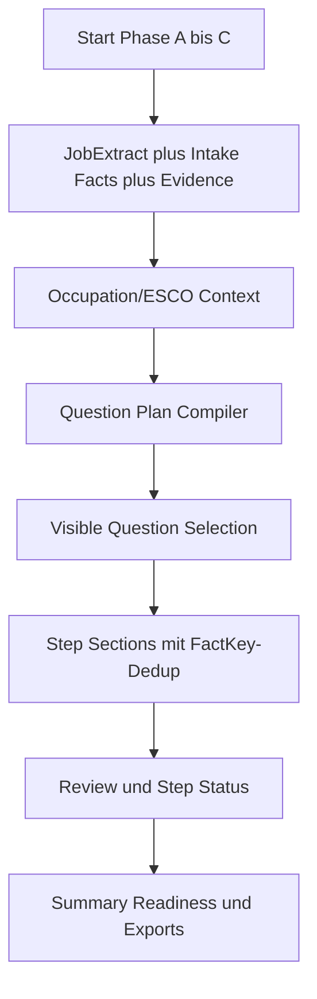
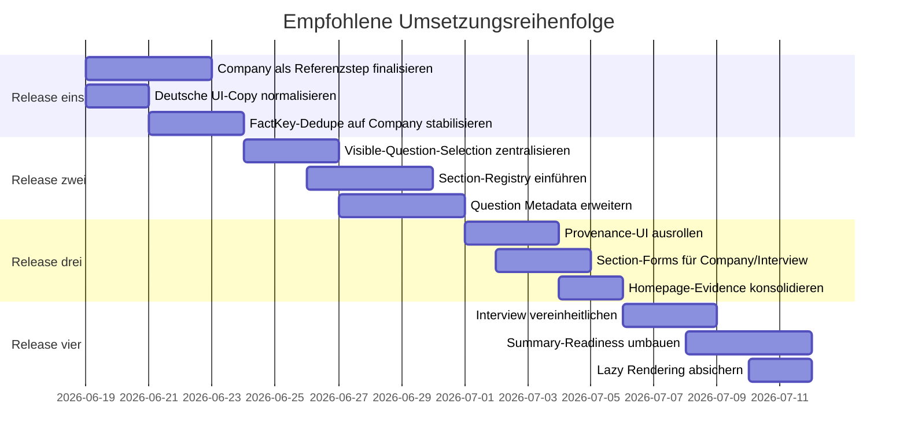

# Aktualisierter Implementierungsreport für den dynamischen Intake-Wizard

## Executive Summary

Auf Basis des aktuell hochgeladenen ZIP-Stands und des öffentlichen Repos `KleinerBaum/cs_need_analysis` ist der Wizard heute deutlich weiter als ein früher Intake-Prototyp: Die aktive Wizard-Route ist sauber definiert, der Startschritt ist als mehrphasiger Intake angelegt, Company ist als aktiver Schritt gesetzt, Team-Kontext gehört laut Repo-Vertrag in Schritt „Unternehmen“, und die mittleren Schritte sind bereits als wiederkehrendes Muster aus Quellenvergleich, offenen Fragen und Review gedacht. Das ergibt eine tragfähige Grundlage für einen belastbaren, dynamischen Recruiting-Intake. citeturn3view0turn2view2

Der größte Engpass liegt im aktuellen Stand nicht mehr primär bei „zu wenig Logik“, sondern bei der **sichtbaren Orchestrierung**: Schritt 2 ist fachlich stark gewachsen, aber noch nicht die verbindliche Referenzarchitektur für alle Folgeschritte. Außerdem existieren weiter Spannungen zwischen strukturierten Fact-Sections, generierten Fragen, adaptiver Sichtbarkeitslogik, Step-Status und Review. Genau dort entsteht der Eindruck, dass ein Schritt sich trotz substanzieller Logik für Nutzer:innen manchmal nach „nur ein bis zwei Fragen“ anfühlt. citeturn3view0turn4view1turn4view3

Die wichtigste Priorität ist deshalb: **Schritt 2 „Unternehmen“ zum kanonischen Referenzstep machen** und anschließend dieselbe Grammatik auf Rolle, Skills, Benefits und Interview ausrollen. Dazu gehören FactKey-basierte Deduplizierung, eine zentrale Section-Registry, konsistente sichtbare Fragensets, einheitliche Progress-/Statuslogik, sichtbare Provenance und klar gruppierte Form-Abschnitte. Diese Richtung passt sowohl zur Repo-Architektur als auch zu OpenAI’s Empfehlungen für klare Informationshierarchie, sparsame, aber gezielte UI-Nutzung und kontextbewusste UX. citeturn3view0turn2view0turn2view1

Für die Umsetzung mit lokalem Codex ist eine fein gesplittete Backlog-Struktur sinnvoll. OpenAI empfiehlt für komplexe Coding-Aufgaben klare Done-Kriterien, kleine reviewbare Arbeitspakete, explizite Verification Commands und modellgerechte Aufgabenzuschnitte; GPT-5.5 ist laut aktueller Codex-Dokumentation für anspruchsvolle Umbauten die naheliegende Standardwahl, während kleinere UI- und Test-Anpassungen auf leichtere Modelle ausgelagert werden können. citeturn2view6turn2view7

## Prüfbasis und aktuelle Diagnose

Die aktive Produktkette ist laut Repo-Vertrag derzeit: `landing` → `company` → `role_tasks` → `skills` → `benefits` → `interview` → `summary`. Der frühere Team-Schritt ist explizit als Legacy-/Hidden-Step markiert; Team-Kontext soll in `wizard_pages/02_company.py` über `wizard_pages/team_section.py` behandelt werden. Der Intake ist außerdem bewusst gestuft: Start Phase A bis C, danach Company, dann Role/Skills/Benefits, anschließend Interview und Summary. Diese Kette soll laut `AGENTS.md` synchron über `constants.py`, `state.py`, `question_*`, Wizard-Seiten, Summary-/Export-Code, Tests und README gehalten werden. citeturn3view0

Im aktuellen Repo ist der Company-Schritt klar sichtbar in die aktive Wizard-Route eingebunden, und die Repo-Hotspots nennen `wizard_pages/02_company.py` und `wizard_pages/team_section.py` explizit als Träger von Company-/Team-Kontext, Homepage-Enrichment und Role-Context-Suggestions. Gleichzeitig beschreibt der Repo-Vertrag die mittleren Schritte bereits als „unified blocks“ mit extrahierten Jobspec-Werten, Source Comparison, Salary Forecast, offenen Fragen und Review. Das bedeutet: Die Zielarchitektur für einen vereinheitlichten Wizard ist im Projekt bereits angelegt, aber noch nicht über alle Schritte gleich konsequent umgesetzt. citeturn3view0

Die UX-Anforderung ist damit sehr gut mit den OpenAI Apps SDK Guidelines vereinbar: Statt eine klassische App-Navigation in ChatGPT zu reproduzieren, sollen Apps klar gegliederte, selektive UI einsetzen, atomare Teilaufgaben sichtbar machen, mehrdeutige Zustände vermeiden und kontextrelevante Informationen klar priorisieren. Ebenso empfehlen die UX Principles, Konversationskontext produktiv zu nutzen, statt denselben Sachverhalt mehrfach unterschiedlich abzufragen. Genau das spricht in deinem Fall für einen Wizard, der aus Schritt 1 aktiv herleitet, **welche Facts noch fehlen**, **warum sie fehlen** und **in welcher Step-Section sie am besten erhoben werden**. citeturn2view0turn2view1

Streamlit unterstützt diese Zielarchitektur technisch gut. Offizielle Streamlit-Dokumentation empfiehlt `st.form`, wenn mehrere Eingaben gesammelt und erst gemeinsam bestätigt werden sollen; das reduziert Rerun-Lärm und passt ideal zu logisch gruppierten Wizard-Abschnitten. Gleichzeitig weist Streamlit darauf hin, dass Inhalte in `st.expander` und `st.tabs` standardmäßig trotzdem berechnet werden; für komplexe Seiten spricht das für gezielte Progressive Disclosure und Lazy Rendering statt breiter Tab-Navigation oder verschachtelter Expander. citeturn2view3turn2view4turn2view5

Meine Diagnose zum aktuellen Stand des ZIPs ist deshalb:

| Bereich | Aktueller Befund | Bewertung |
|---|---|---|
| Schrittkette und Routing | sauber definiert, Team bewusst in Company integriert | stark |
| Start-Schritt und Intake | mehrphasig und fachlich belastbar | stark |
| Schritt 2 Company | bereits stark strukturiert, aber noch nicht kanonischer Referenzstep | gut, aber unvollständig |
| FactKey-Deduplizierung | in Company teilweise umgesetzt, noch nicht step-übergreifend | teilweise |
| Question Metadata | Schema kann viel, deterministische Packs nutzen Potenzial noch nicht aus | teilweise |
| Progress / Step-Status | gute Grundlagen, aber noch nicht vollständig vereinheitlicht | teilweise |
| Interview-Step | funktional reich, visuell noch Sonderfall | mittel |
| German UI Copy | noch gemischte ASCII-/Umlaut-Labels im sichtbaren UI | offen |

Diese Einschätzung deckt sich mit dem Repo-Vertrag, der minimale Diffs, kanonische Konstanten, SSKey-basierte State-Änderungen, gezielte Testpacks und eine saubere Synchronisierung zwischen State, Wizard, Summary und Export ausdrücklich verlangt. citeturn3view0

## Schritt Unternehmen im Soll-Vergleich

### Aktueller und gewünschter Section-Zuschnitt

Der Company-Step ist die richtige Stelle, um die endgültige Designgrammatik zu setzen. Die aktuelle Richtung des Repos ist bereits klar: extrahierte Werte, strukturierte Bereiche, Website-Enrichment und offene Fragen. Im Soll sollte dieser Schritt aber **nicht nur mehrere Container** haben, sondern eine **kanonische Section-Architektur**, die später in Role, Skills, Benefits und Interview wiederverwendet wird. citeturn4view1turn2view0turn2view1

| Section | Ist-Zustand | Soll-Zustand |
|---|---|---|
| Unternehmensprofil | vorhanden, aber noch page-lokal definiert | kanonische Section mit klarer Completion-Regel |
| Business-Kontext | teilweise implizit über offene Fragen | eigene primäre Section mit Hiring-Reason, Business-Impact, Priorität |
| Team & Reporting | vorhanden und stark erweitert | verbindlicher Company-Block, kein mentaler Legacy-Schatten |
| Arbeitsmodell | vorhanden | klarer Zusammenhang mit Folgefragen und Angebotslogik |
| Non-Negotiables & Compliance | vorhanden | mit eindeutiger FactKey-Abdeckung und Dealbreaker-Logik |
| Website-Enrichment | vorhanden | als persistente Evidence-Quelle mit sichtbarer Provenance |
| Offene Fragen | vorhanden | nur noch echte Lücken, keine Duplikate zu strukturierten Sections |
| Review | vorhanden | Section- und Step-übergreifend konsistent mit Progress/Summary |

### Empfohlene FactKey-Abdeckung für Schritt 2

Für Schritt 2 sollte ein klarer Vertrag gelten: Was strukturiert im Schritt erfasst wird, wird nicht gleichzeitig noch einmal als generierte Frage ausgespielt, sofern nicht ein inhaltlich echter Follow-up-Fall vorliegt. Das passt sowohl zum Repo-Vertrag als auch zu OpenAI’s Forderung nach klaren, nicht redundanten UI-Flows. citeturn3view0turn2view1

| Ziel-Section | Primäre FactKeys |
|---|---|
| Arbeitgeberprofil | `COMPANY_EMPLOYER_PITCH`, `COMPANY_BUSINESS_UNIT`, `COMPANY_ROLE_RELEVANT_POSITIONING` |
| Business-Kontext | `COMPANY_HIRING_REASON`, `COMPANY_GROWTH_CONTEXT` oder sichere Defaults, falls noch nicht kanonisiert |
| Team & Reporting | `TEAM_NAME`, `TEAM_LEADERSHIP_SCOPE`, `TEAM_SIZE_DIRECT`, `TEAM_STAKEHOLDERS_PRIMARY`, `TEAM_SUCCESS_CONTEXT_90D` |
| Arbeitsmodell & Standort | `COMPANY_WORK_ARRANGEMENT`, `COMPANY_OFFICE_DAYS_PER_WEEK`, `COMPANY_ALLOWED_REGIONS_TIMEZONES`, `COMPANY_LANGUAGE_INTERNAL`, `COMPANY_LANGUAGE_EXTERNAL` |
| Non-Negotiables & Compliance | `COMPANY_NON_NEGOTIABLES`, `COMPANY_COMPLIANCE_CONTEXT`, `COMPANY_TARIFF_CONTEXT` |
| Website-Evidence | bestehende FactKeys plus `FactSourceType.HOMEPAGE` als Evidence-Schicht |

Wenn einzelne Business-Kontext-FactKeys noch nicht kanonisch definiert sind, ist die sichere Default-Strategie: zuerst in `constants.py` ergänzen, dann `INTAKE_FACTS`, Review, Summary, Export und Tests im selben Change nachziehen. Genau dieses Vorgehen verlangt auch das Repo-AGENTS-Dokument für neue kanonische State-/Fact-Konzepte. citeturn3view0

### Relevante Duplikatquellen im aktuellen Flow

Der aktuelle Stand deutet auf drei typische Duplikatquellen hin, die schrittweise bereinigt werden sollten:

| Doppelte Quelle | Beispiel | Zielregel |
|---|---|---|
| strukturierte Section + offene Frage | Teamgröße, Leadership Scope, Work Arrangement | Primary UI = strukturierte Section; offene Frage nur bei echtem Follow-up |
| Jobspec-/Website-Evidence + offene Frage | Unternehmenswebsite oder Remote-Hinweis bereits vorhanden | offene Frage nur, wenn Confidence zu niedrig oder Konflikt vorliegt |
| generischer Pack + step-spezifische Section | Company Pack fragt bereits vorhandene Section-Facts erneut | Deduplizierung per `fact_key`, nicht per Label |

Das ist nicht nur ein UX-Thema, sondern auch ein Vertrauenssignal: Wenn der Wizard dasselbe Fact in unterschiedlicher Gestalt mehrfach erhebt, wirkt die Logik weniger „smart“, selbst wenn intern alles korrekt zusammenläuft. OpenAI empfiehlt ausdrücklich, UI kontextbezogen und klar zu halten; Streamlit-Forms helfen zusätzlich, Sections als abgeschlossene Denkblöcke wahrnehmbar zu machen. citeturn2view1turn2view3

### Datenfluss für den Zielzustand



Im finalen Modell sollte jede sichtbare Eingabe oder Frage sechs Eigenschaften haben: `step_key`, `section_key`, `fact_key`, `source_type`, `completion_state`, `provenance/rationale`. Das ist die einfachste Art, Progress, Review, Summary und Artefakte dauerhaft deckungsgleich zu halten. citeturn3view0turn2view0turn2view1

## Priorisierter Implementierungs-Backlog

### Release eins

#### Aufgabe Schritt 2 als kanonischen Referenzstep fertigstellen

**Ziel**  
`wizard_pages/02_company.py` soll nicht nur ein gut ausgebauter Schritt sein, sondern die verbindliche Referenz für alle späteren Wizard-Schritte: klar sichtbare Sections, klare FactKey-Zuordnung, klare Herkunft, klare Completion States. citeturn3view0turn4view1

**Betroffene Dateien**  
`wizard_pages/02_company.py`, `constants.py`, `components/design_system.py`, `ui_layout.py`, `ui_components.py`, `tests/test_company_team_scope_regression.py`, `tests/test_ui_step_shell_order.py`, `tests/test_question_progress.py`.

**Kleine Codex-Subtasks zum direkten Kopieren**

1. `wizard_pages/02_company.py` in explizite kanonische Abschnitte umstrukturieren: Arbeitgeberprofil, Business-Kontext, Team & Reporting, Arbeitsmodell & Standort, Non-Negotiables & Compliance, Website-Evidence, offene Fragen, Review.  
2. Falls `Business-Kontext` noch keine vollständigen kanonischen FactKeys hat: in `constants.py` sichere Defaults ergänzen, z. B. `COMPANY_HIRING_REASON`, `COMPANY_GROWTH_CONTEXT`, `COMPANY_ROLE_BUSINESS_IMPACT` als neue `FactKey`s. Wenn das Naming unspezifiziert ist, diese Namen als sichere Defaults verwenden.  
3. Pro Section ein kleines Metabanner einführen: „Bereits erkannt“, „Noch offen“, „Quelle“.  
4. `render_step_shell(...)` für Company so beibehalten, dass extrahierte Werte, strukturierte Sections, offene Fragen und Review in klarer Reihenfolge sichtbar bleiben.  
5. Sicherstellen, dass Team-Fragen mental und technisch vollständig zu Company gehören, ohne `wizard_pages/03_team.py` wieder in die Route zu bringen.

**Verifikation**

```bash
python -m pytest -q \
  tests/test_company_team_scope_regression.py \
  tests/test_ui_step_shell_order.py \
  tests/test_question_progress.py

python -m compileall \
  wizard_pages/02_company.py \
  constants.py \
  ui_layout.py \
  ui_components.py \
  components/design_system.py
```

**Tests aktualisieren oder ergänzen**  
Bestehend: `tests/test_company_team_scope_regression.py`, `tests/test_ui_step_shell_order.py`.  
Neu, falls nötig: `tests/test_company_section_completion.py` als sicherer Defaultname.

**Risiken**  
Größtes Risiko ist ein zu großer UI-Refactor in einem einzigen Diff. Deshalb zuerst Company finalisieren, dann die gleiche Grammatik auf andere Schritte übertragen. citeturn3view0turn2view6

**Komplexität**  
Hoch

**Empfohlenes Modell**  
GPT-5.5 Extra High

**Codex-Prompt**

```text
Goal:
Turn wizard_pages/02_company.py into the canonical step architecture for the wizard.

Context:
The repo already treats Company as the active step for employer, team, homepage enrichment, and open question matching. Team belongs inside Company, not as a routed legacy step. The result should become the reference pattern for later Role, Skills, Benefits, and Interview steps.

Constraints:
- Keep constants.py as the single source of truth.
- Do not reintroduce wizard_pages/03_team.py into active routing.
- Use minimal diffs and preserve existing tests where possible.
- If a new FactKey is needed and the exact name is not yet specified, use safe defaults:
  COMPANY_HIRING_REASON
  COMPANY_GROWTH_CONTEXT
  COMPANY_ROLE_BUSINESS_IMPACT

Done when:
- Company has clear sections: employer profile, business context, team/reporting, working model/location, non-negotiables/compliance, website evidence, open questions, review.
- Section structure is clearly recognizable in the UI.
- Team context is fully represented inside Company.
- Tests are updated and passing.

Verification:
python -m pytest -q tests/test_company_team_scope_regression.py tests/test_ui_step_shell_order.py tests/test_question_progress.py
python -m compileall wizard_pages/02_company.py constants.py ui_layout.py ui_components.py components/design_system.py
```

#### Aufgabe Deutsche UI-Copy sofort bereinigen

**Ziel**  
Sichtbare deutsche Labels, Fragen und Hilfetexte sollen keine gemischten ASCII-Umschreibungen mit ausgeschriebenem ae/oe/ue mehr enthalten. Das ist ein schneller, hoch sichtbarer Qualitätsgewinn. Im öffentlichen Repo sind solche Mischformen weiterhin erkennbar; die deutsche UX sollte konsistent professionell sein. citeturn4view3turn2view0

**Betroffene Dateien**  
`question_packs/registry.py`, `wizard_pages/*.py`, `components/design_system.py`, `ui_components.py`, relevante Snapshot-/String-Tests.

**Kleine Codex-Subtasks**

1. Alle sichtbaren deutschen Strings in `question_packs/registry.py` und den Wizard-Seiten auf Umlaute und typografisch saubere Sprache prüfen.  
2. Nur User-Facing Labels, Help-Texte, Captions, Section-Titel und Hinweise ändern.  
3. Keine kanonischen IDs, `FactKey`, `SSKey`, Step Keys oder Export Keys umbenennen.  
4. String-basierte Tests gezielt anpassen.  
5. Einmal global nach den betroffenen ASCII-Umschreibungen im Repo suchen.

**Verifikation**

```bash
rg -n "f[u]er|F[u]ehr|G[e]schaeft|regelm[a]essig|Verst[a]endnis|Regelm[a]essig" .
python -m pytest -q \
  tests/test_question_pack_compiler.py \
  tests/test_ui_step_shell_order.py \
  tests/test_ui_esco_picker_copy.py

python -m compileall question_packs wizard_pages components ui_components.py
```

**Tests aktualisieren oder ergänzen**  
Bestehend: `tests/test_question_pack_compiler.py`, `tests/test_ui_esco_picker_copy.py`, `tests/test_ui_step_shell_order.py`.

**Risiken**  
Nur sichtbare Copy anfassen; keine Datenmodelle oder Schlüssel stillschweigend umbenennen. citeturn3view0

**Komplexität**  
Niedrig bis mittel

**Empfohlenes Modell**  
GPT-5.5 Standard oder kleiner

**Codex-Prompt**

```text
Goal:
Normalize visible German UI copy across the wizard to proper German spelling with umlauts.

Constraints:
- Change only user-facing strings.
- Do not rename FactKeys, SSKeys, step IDs, or exported keys.
- Keep recruiting language professional and consistent.
- Update affected tests.

Verification:
rg -n "f[u]er|F[u]ehr|G[e]schaeft|regelm[a]essig|Verst[a]endnis|Regelm[a]essig" .
python -m pytest -q tests/test_question_pack_compiler.py tests/test_ui_step_shell_order.py tests/test_ui_esco_picker_copy.py
python -m compileall question_packs wizard_pages components ui_components.py
```

#### Aufgabe FactKey-Deduplizierung konsequent auf Company und danach auf alle Steps erweitern

**Ziel**  
Deduplizierung soll strikt über `fact_key` laufen, nicht über Labeltext. Company hat dafür bereits die richtige Richtung, aber der Mechanismus muss stabilisiert und später auf Role, Skills, Benefits und Interview ausgedehnt werden. citeturn4view1turn4view7

**Betroffene Dateien**  
`wizard_pages/02_company.py`, `ui_components.py`, neues Modul `step_sections.py` oder `question_visibility.py` als sichere Defaults, `tests/test_company_team_scope_regression.py`, `tests/test_question_progress.py`.

**Kleine Codex-Subtasks**

1. `question_visibility.py` als sicheres neues Modul anlegen, wenn es noch keine neutrale Visibility-Schicht gibt.  
2. Helper ergänzen: `is_question_covered_by_structured_section(question, section_fact_keys)`  
3. Company: aktuelle strukturierte FactKeys in eine zentrale, wiederverwendbare Konstante überführen.  
4. `render_question_step(...)` oder vorgelagerte Selektion so erweitern, dass Duplikatfragen nicht gerendert werden, wenn die jeweilige Section aktiv vorhanden ist.  
5. Echte Follow-up-Fragen ausdrücklich whitelisten, statt blind nach FactKey alles zu unterdrücken.  
6. Review/Progress so belassen, dass strukturierte Facts weiterhin auf die Originalfragen „zurückwirken“.

**Verifikation**

```bash
python -m pytest -q \
  tests/test_company_team_scope_regression.py \
  tests/test_question_progress.py \
  tests/test_ui_step_shell_order.py

python -m compileall \
  wizard_pages/02_company.py \
  ui_components.py
```

**Tests aktualisieren oder ergänzen**  
Bestehend: `tests/test_company_team_scope_regression.py`.  
Neu, falls nötig: `tests/test_factkey_deduplication.py`.

**Risiken**  
Zu aggressive Deduplizierung könnte echte Klärungsfragen entfernen. Deshalb nur bei identischer Fact-Ebene deduplizieren. citeturn2view1

**Komplexität**  
Hoch

**Empfohlenes Modell**  
GPT-5.5 Extra High

**Codex-Prompt**

```text
Goal:
Implement strict FactKey-based deduplication between structured sections and generated questions, starting with Company.

Constraints:
- Deduplicate by canonical FactKey, not by label similarity.
- Preserve explicit follow-up questions that add distinct intent.
- Keep structured section inputs as the primary UI for Company facts.
- Maintain progress/review coverage.

Done when:
- Company no longer shows duplicate questions for structured FactKeys.
- Review and progress still count those facts correctly.
- Tests cover team size, leadership scope, work arrangement, non-negotiables.

Verification:
python -m pytest -q tests/test_company_team_scope_regression.py tests/test_question_progress.py tests/test_ui_step_shell_order.py
python -m compileall wizard_pages/02_company.py ui_components.py
```

### Release zwei

#### Aufgabe Sichtbare Fragenauswahl und Step-Status zentralisieren

**Ziel**  
Es darf nur noch **eine** kanonische Logik dafür geben, welche Fragen in einem Step sichtbar sind. Dieselbe Logik muss von `render_question_step(...)`, `render_step_shell(...)`, Progress-Leiste, Sidebar und Summary genutzt werden. Die Repo-Architektur verlangt genau diese Synchronität bei Step-Semantik und Completion Logic. citeturn3view0

**Betroffene Dateien**  
`question_limits.py`, `ui_layout.py`, `ui_components.py`, `step_status.py`, `question_progress.py`, `wizard_pages/base.py`, `tests/test_question_limits.py`, `tests/test_step_status_payload.py`, `tests/test_ui_mode_flow.py`.

**Kleine Codex-Subtasks**

1. Kanonischen Helper einführen oder extrahieren, z. B. `get_visible_questions_for_step(...)`.  
2. `ui_layout._get_step_questions_from_plan(...)` an diesen Helper anschließen.  
3. `step_status.build_step_status_payload(...)` nur noch über dasselbe sichtbare Set rechnen lassen.  
4. Sicherstellen, dass `intake_facts`, `intake_fact_evidence` und `confidence_threshold` überall gleich verwendet werden.  
5. Tests so anpassen, dass Status und sichtbare Fragen im selben Szenario identisch reagieren.

**Verifikation**

```bash
python -m pytest -q \
  tests/test_question_limits.py \
  tests/test_step_status_payload.py \
  tests/test_ui_mode_flow.py

python -m compileall \
  question_limits.py \
  ui_layout.py \
  ui_components.py \
  step_status.py \
  question_progress.py \
  wizard_pages/base.py
```

**Tests aktualisieren oder ergänzen**  
Bestehend: `tests/test_question_limits.py`, `tests/test_step_status_payload.py`.  
Neu, falls nötig: `tests/test_visible_question_selection_contract.py`.

**Risiken**  
Eine globale Zentralisierung ist fachlich richtig, kann aber verdeckte Altannahmen in Tests aufbrechen. Deshalb erst gezielte Tests, dann breitere Suite. citeturn2view6

**Komplexität**  
Hoch

**Empfohlenes Modell**  
GPT-5.5 Extra High

**Codex-Prompt**

```text
Goal:
Create one canonical visible-question selection path used by question rendering, step shell status, progress, and summary.

Constraints:
- Reuse existing adaptive limit behavior.
- Keep intake_facts, intake_fact_evidence, and confidence_threshold wired consistently.
- Avoid broad unrelated refactors.
- Preserve current step IDs and routing.

Verification:
python -m pytest -q tests/test_question_limits.py tests/test_step_status_payload.py tests/test_ui_mode_flow.py
python -m compileall question_limits.py ui_layout.py ui_components.py step_status.py question_progress.py wizard_pages/base.py
```

#### Aufgabe Section-Registry einführen

**Ziel**  
Eine zentrale Registry soll definieren, welche Sections jeder aktive Wizard-Step besitzt, welche FactKeys dazu gehören und wie Completion berechnet wird. Das macht Company zur Vorlage für alle weiteren Steps und reduziert page-lokale Sonderlogik. citeturn3view0turn2view0

**Betroffene Dateien**  
Neues Modul `step_sections.py` als sicherer Default, `constants.py`, `components/design_system.py`, `wizard_pages/02_company.py`, `wizard_pages/04_role_tasks.py`, `wizard_pages/05_skills.py`, `wizard_pages/06_benefits.py`, `wizard_pages/07_interview.py`, `tests/test_ui_step_shell_order.py`.

**Kleine Codex-Subtasks**

1. `StepSectionDef` als kleines Datamodell anlegen.  
2. Kanonische Section Keys definieren, z. B. `company.employer_profile`, `company.team_reporting`, `skills.must_have`, `interview.scorecard`.  
3. Jeder Section `title`, `description`, `step_key`, `fact_keys`, `completion_policy` zuweisen.  
4. Company zuerst auf Registry umstellen; weitere Steps nur anschließen, nicht komplett refactoren.  
5. `components/design_system.py` um einen neutralen `render_step_section(...)` erweitern.

**Verifikation**

```bash
python -m pytest -q \
  tests/test_ui_step_shell_order.py \
  tests/test_design_system_step_header.py

python -m compileall \
  step_sections.py \
  constants.py \
  components/design_system.py \
  wizard_pages
```

**Tests aktualisieren oder ergänzen**  
Neu: `tests/test_step_section_registry.py`.

**Risiken**  
Registry nicht sofort auf das gesamte Projekt zwingen; zuerst Company, dann Schritt für Schritt migrieren. citeturn2view6

**Komplexität**  
Hoch

**Empfohlenes Modell**  
GPT-5.5 Extra High

**Codex-Prompt**

```text
Goal:
Introduce a central step section registry and migrate Company to use it first.

Constraints:
- Keep constants.py canonical.
- Do not migrate all steps in one giant diff.
- Start with Company and add reusable primitives for later adoption.
- Keep German UI tone.

Verification:
python -m pytest -q tests/test_ui_step_shell_order.py tests/test_design_system_step_header.py
python -m compileall step_sections.py constants.py components/design_system.py wizard_pages
```

#### Aufgabe Question Metadata für deterministische Packs vervollständigen

**Ziel**  
Das Schema kann bereits `rationale`, `impact_targets`, `info_gain_score`, `acquisition_cost` und `follow_up_prompts`; diese Felder sollen nun auch in deterministischen Packs systematisch befüllt werden. Das verbessert Ranking, Explainability und Priorisierung. citeturn4view5turn4view3

**Betroffene Dateien**  
`question_packs/registry.py`, `schemas.py`, `question_plan_compiler.py`, `question_limits.py`, `tests/test_question_pack_compiler.py`, `tests/test_question_plan_normalization.py`.

**Kleine Codex-Subtasks**

1. `_pack_entry(...)` um optionale Parameter für alle fehlenden Metadaten erweitern.  
2. Mit Company-Pack beginnen, danach Role, Skills, Benefits, Interview.  
3. Für jede Core-Frage mindestens `rationale` und `impact_targets` setzen.  
4. Für Adaptive Ranking zusätzlich `info_gain_score` und `acquisition_cost` pflegen.  
5. `follow_up_prompts` nur dort setzen, wo Expert-Modus wirklich zusätzliche Tiefe braucht.

**Verifikation**

```bash
python -m pytest -q \
  tests/test_question_pack_compiler.py \
  tests/test_question_plan_normalization.py \
  tests/test_question_limits.py

python -m compileall \
  question_packs/registry.py \
  schemas.py \
  question_plan_compiler.py \
  question_limits.py
```

**Tests aktualisieren oder ergänzen**  
Bestehend: `tests/test_question_pack_compiler.py`, `tests/test_question_plan_normalization.py`.

**Risiken**  
Die Datei ist groß; Step-für-Step-Migration vermeidet mechanische Fehler. citeturn2view6

**Komplexität**  
Hoch

**Empfohlenes Modell**  
GPT-5.5 Extra High

**Codex-Prompt**

```text
Goal:
Extend deterministic question pack entries with full metadata used by adaptive ranking and provenance UI.

Constraints:
- Keep existing question IDs stable.
- Start with Company entries first.
- Add rationale and impact_targets at minimum for core questions.
- Preserve current compile and normalization behavior.

Verification:
python -m pytest -q tests/test_question_pack_compiler.py tests/test_question_plan_normalization.py tests/test_question_limits.py
python -m compileall question_packs/registry.py schemas.py question_plan_compiler.py question_limits.py
```

### Release drei

#### Aufgabe Provenance-UI und Herkunft aus Schritt 1 sichtbar machen

**Ziel**  
Jede Question Group oder Section soll knapp erklären, **warum** sie erscheint: Jobspec deckt Fact schon ab, ESCO liefert Kontext, Homepage bestätigt, Antwort fehlt oder ist konfliktär. Das entspricht direkt den OpenAI-UX-Prinzipien für kontextbezogene, erklärende Oberflächen. citeturn2view1turn2view0

**Betroffene Dateien**  
`ui_components.py`, `components/design_system.py`, `question_plan_compiler.py`, `question_packs/registry.py`, `wizard_pages/02_company.py`, `wizard_pages/04_role_tasks.py`, `wizard_pages/05_skills.py`, `wizard_pages/06_benefits.py`, `wizard_pages/07_interview.py`.

**Kleine Codex-Subtasks**

1. Kleine Provenance-Badge-Komponente anlegen, z. B. `render_question_provenance(...)`.  
2. Anzeigeformat definieren: `Quelle`, `Warum relevant`, `Wirkt auf`.  
3. Im Standardmodus nur kompakte Chips; im Expert-Modus ausführlichere Zeile.  
4. Herkunft aus Step 1 sichtbar machen, etwa „Jobspec erkannt“, „ESCO ergänzt“, „Homepage bestätigt“, „noch ungesichert“.  
5. Prüfen, ob `QuestionFlowProvenance` aus `question_plan_compiler.py` direkt oder indirekt in die UI durchgereicht werden soll.

**Verifikation**

```bash
python -m pytest -q \
  tests/test_question_plan_normalization.py \
  tests/test_question_pack_compiler.py \
  tests/test_ui_review_helpers.py

python -m compileall \
  ui_components.py \
  components/design_system.py \
  question_plan_compiler.py \
  question_packs/registry.py \
  wizard_pages
```

**Tests aktualisieren oder ergänzen**  
Neu: `tests/test_question_provenance_ui.py`.

**Risiken**  
Nicht zu viel Metatext anzeigen. Standard soll knapp bleiben; Expert darf tiefer sein. citeturn2view1

**Komplexität**  
Mittel bis hoch

**Empfohlenes Modell**  
GPT-5.5 Standard bis Extra High

**Codex-Prompt**

```text
Goal:
Make question and section provenance visible in the UI without clutter.

Constraints:
- Standard mode: compact.
- Expert mode: richer.
- Show source, why asked, and downstream impact.
- Do not expose raw sensitive internals.

Verification:
python -m pytest -q tests/test_question_plan_normalization.py tests/test_question_pack_compiler.py tests/test_ui_review_helpers.py
python -m compileall ui_components.py components/design_system.py question_plan_compiler.py question_packs/registry.py wizard_pages
```

#### Aufgabe Company- und Interview-Abschnitte auf section-level Forms umstellen

**Ziel**  
Größere strukturierte Blöcke sollen gesammelt bestätigt werden. Das schafft eine ruhigere UX, weniger Flackern und klarere Abschnittsabschlüsse. Streamlit empfiehlt Forms genau für diesen Fall. citeturn2view3

**Betroffene Dateien**  
`wizard_pages/02_company.py`, `wizard_pages/07_interview.py`, `ui_components.py`, `state.py`, `tests/test_ui_mode_flow.py`, `tests/test_question_progress.py`.

**Kleine Codex-Subtasks**

1. Pro große Section genau eine `st.form(...)` anlegen.  
2. Keine verschachtelten Forms.  
3. Nach Submit: Answers, Intake Facts, Evidence, touched-state und Progress aktualisieren.  
4. Im Review unmittelbar sichtbar machen, dass der Abschnitt übernommen wurde.  
5. Language-/Sonderwidgets prüfen, die im aktuellen `render_question_step(...)` Forms aushebeln könnten.

**Verifikation**

```bash
python -m pytest -q \
  tests/test_ui_mode_flow.py \
  tests/test_question_progress.py \
  tests/test_company_team_scope_regression.py

python -m compileall \
  wizard_pages/02_company.py \
  wizard_pages/07_interview.py \
  ui_components.py \
  state.py
```

**Tests aktualisieren oder ergänzen**  
Bestehend: `tests/test_ui_review_helpers.py`, `tests/test_ui_mode_flow.py`.  
Neu: `tests/test_section_form_submit_flow.py`.

**Risiken**  
Forms nicht verschachteln; stabile Widget Keys verwenden; keine impliziten Wertverluste bei Rerun. citeturn2view3

**Komplexität**  
Mittel

**Empfohlenes Modell**  
GPT-5.5 Standard

**Codex-Prompt**

```text
Goal:
Use section-level Streamlit forms for larger Company and Interview sections.

Constraints:
- No nested forms.
- Exactly one submit button per form.
- Keep state persistence and progress consistent.
- Preserve existing answer/meta behavior.

Verification:
python -m pytest -q tests/test_ui_mode_flow.py tests/test_question_progress.py tests/test_company_team_scope_regression.py
python -m compileall wizard_pages/02_company.py wizard_pages/07_interview.py ui_components.py state.py
```

#### Aufgabe Homepage-Enrichment als echte Evidence-Quelle konsolidieren

**Ziel**  
Website-Hinweise sollen nicht nur ein UI-Review sein, sondern systematisch als Evidence in Progress, Review und Summary sichtbar werden. Company hat dafür schon eine starke Basis; jetzt braucht es saubere Regeln für Bestätigung, Konflikt und Confidence. citeturn3view0turn4view1

**Betroffene Dateien**  
`wizard_pages/02_company.py`, `intake_facts.py`, `question_progress.py`, `summary_facts.py`, `tests/test_company_homepage_research.py`, `tests/test_summary_fact_table.py`.

**Kleine Codex-Subtasks**

1. Bestehende Persistenzpfade für Website-Kandidaten prüfen.  
2. Falls Website-Werte aktuell direkt als bestätigt markiert werden, einen expliziten UX-Pfad für „bestätigt“ versus „nur übernommen als Hinweis“ einziehen.  
3. Konfliktfälle als solche kennzeichnen, statt still zu überschreiben.  
4. Summary-Fact-Tabelle um klare Herkunft „Homepage“ ergänzen.  
5. Optional Confidence-Schwelle für Website-Funde in `UI_PREFERENCES` anschließen, falls fachlich sinnvoll.

**Verifikation**

```bash
python -m pytest -q \
  tests/test_company_homepage_research.py \
  tests/test_question_progress.py \
  tests/test_summary_fact_table.py

python -m compileall \
  wizard_pages/02_company.py \
  intake_facts.py \
  question_progress.py \
  summary_facts.py
```

**Tests aktualisieren oder ergänzen**  
Bestehend: `tests/test_company_homepage_research.py`, `tests/test_summary_fact_table.py`.

**Risiken**  
Website-Informationen sind nicht automatisch gleichwertig mit explizit bestätigten Nutzerangaben. Deshalb Herkunft und Status klar trennen. citeturn2view1

**Komplexität**  
Mittel

**Empfohlenes Modell**  
GPT-5.5 Standard

**Codex-Prompt**

```text
Goal:
Consolidate homepage enrichment into the fact-evidence pipeline with explicit confirmation/conflict behavior.

Constraints:
- Do not silently overwrite user-confirmed facts.
- Preserve existing homepage review UX where possible.
- Surface homepage evidence in progress and summary.
- Keep source type explicit.

Verification:
python -m pytest -q tests/test_company_homepage_research.py tests/test_question_progress.py tests/test_summary_fact_table.py
python -m compileall wizard_pages/02_company.py intake_facts.py question_progress.py summary_facts.py
```

### Release vier

#### Aufgabe Interview-Step visuell und logisch an die Referenzarchitektur anschließen

**Ziel**  
Interview soll denselben Shell-/Section-/Status-Rhythmus wie Company und die Mid-Steps erhalten. Aktuell ist der Schritt funktional stark, wirkt aber noch wie ein Sonderfall. citeturn3view0turn2view0

**Betroffene Dateien**  
`wizard_pages/07_interview.py`, `components/design_system.py`, `ui_layout.py`, `tests/test_ui_step_shell_order.py`, `tests/test_step_status_payload.py`.

**Kleine Codex-Subtasks**

1. Interview in Sections schneiden: Candidate Journey, Interview Stages, Assessment Evidence, Scorecard, Candidate Communication, Internal Roles, Feedback/SLA, Compliance/Documentation.  
2. `status_position="before_footer"` nur behalten, wenn es fachlich wirklich nötig ist; sonst an die Step-Standardlogik angleichen.  
3. `render_step_section(...)` aus der neuen Registry auch hier nutzen.  
4. Review und Konsistenzcheck danach in dieselbe Grammatik setzen.

**Verifikation**

```bash
python -m pytest -q \
  tests/test_ui_step_shell_order.py \
  tests/test_step_status_payload.py \
  tests/test_question_progress.py

python -m compileall \
  wizard_pages/07_interview.py \
  ui_layout.py \
  components/design_system.py
```

**Tests aktualisieren oder ergänzen**  
Bestehend: `tests/test_ui_step_shell_order.py`.  
Neu: `tests/test_interview_section_contract.py`.

**Risiken**  
Interview enthält komplexe Facts und interne Rollenlogik; Umbau visuell vereinheitlichen, aber keine Fachlogik verlieren. citeturn3view0

**Komplexität**  
Mittel bis hoch

**Empfohlenes Modell**  
GPT-5.5 Standard

**Codex-Prompt**

```text
Goal:
Refactor the Interview step into the same visual and logical step architecture as Company and the middle steps.

Constraints:
- Preserve existing interview process data structures.
- Unify shell, sections, status, and review rhythm.
- Keep German UI tone and candidate-safe phrasing.

Verification:
python -m pytest -q tests/test_ui_step_shell_order.py tests/test_step_status_payload.py tests/test_question_progress.py
python -m compileall wizard_pages/07_interview.py ui_layout.py components/design_system.py
```

#### Aufgabe Summary-Readiness auf Fact-Resolution statt Antwortanzahl ausrichten

**Ziel**  
Summary soll nicht primär „wie viele Fragen beantwortet?“ bewerten, sondern „wie belastbar ist der Recruiting-Bedarf?“. Das ist die Voraussetzung für wirklich sinnvolle Exporte und Artefakte. citeturn3view0turn2view1

**Betroffene Dateien**  
`wizard_pages/08_summary.py`, `summary_facts.py`, `question_progress.py`, `step_status.py`, `tests/test_summary_readiness_dashboard.py`, `tests/test_summary_fact_table.py`.

**Kleine Codex-Subtasks**

1. Readiness in confirmed / inferred / assumed / conflicted / missing unterscheiden.  
2. Kritische Lücken höher gewichten als optionale offene Fragen.  
3. Source Diversity und Evidence Count sichtbar machen.  
4. Ergebnis im Dashboard verständlich erklären, nicht nur scoren.  
5. Artefaktfreigabe daran koppeln, mindestens als Hinweislogik.

**Verifikation**

```bash
python -m pytest -q \
  tests/test_summary_readiness_dashboard.py \
  tests/test_summary_fact_table.py \
  tests/test_question_progress.py

python -m compileall \
  wizard_pages/08_summary.py \
  summary_facts.py \
  question_progress.py \
  step_status.py
```

**Tests aktualisieren oder ergänzen**  
Bestehend: `tests/test_summary_readiness_dashboard.py`, `tests/test_summary_fact_table.py`.

**Risiken**  
Readiness darf nicht zu intransparent werden. Score ohne Erklärung wäre UX-seitig schlechter als vorher. citeturn2view1

**Komplexität**  
Hoch

**Empfohlenes Modell**  
GPT-5.5 Extra High

**Codex-Prompt**

```text
Goal:
Rebuild summary readiness around fact resolution status instead of mainly question counts.

Constraints:
- Make critical gaps outweigh optional unanswered details.
- Keep readiness understandable.
- Do not invent data.
- Preserve existing export flow.

Verification:
python -m pytest -q tests/test_summary_readiness_dashboard.py tests/test_summary_fact_table.py tests/test_question_progress.py
python -m compileall wizard_pages/08_summary.py summary_facts.py question_progress.py step_status.py
```

#### Aufgabe Lazy Rendering und Performance-Grenzen absichern

**Ziel**  
Teure Bereiche wie Website-Enrichment, ESCO-Matrizen, große Tabellen und Forecast-Blöcke sollen nur dann gerechnet werden, wenn sie wirklich sichtbar oder angefordert sind. Streamlit weist ausdrücklich darauf hin, dass Expander und Tabs Inhalte standardmäßig dennoch rendern. citeturn2view4turn2view5

**Betroffene Dateien**  
`wizard_pages/02_company.py`, `wizard_pages/05_skills.py`, `wizard_pages/06_benefits.py`, `wizard_pages/08_summary.py`, `ui_layout.py`, `tests/test_progressive_disclosure_helpers.py`.

**Kleine Codex-Subtasks**

1. Teure UI-Bereiche identifizieren und in aktive Sichtbarkeitsbedingungen kapseln.  
2. Keine verschachtelten Expander für primäre Wizard-Logik.  
3. Primäre Navigation nicht in Tabs umbauen.  
4. Session-State-Stabilität bei Lazy-Laden sicherstellen.  
5. Eine kleine Helper-Schicht für „render only when active“ einführen.

**Verifikation**

```bash
python -m pytest -q \
  tests/test_progressive_disclosure_helpers.py \
  tests/test_ui_mode_flow.py

python -m compileall \
  wizard_pages \
  ui_layout.py
```

**Tests aktualisieren oder ergänzen**  
Bestehend: `tests/test_progressive_disclosure_helpers.py`.

**Risiken**  
Lazy Rendering darf Inputs nicht „vergessen“. Sichtbarkeit und Persistenz müssen entkoppelt bleiben. citeturn2view4turn2view5

**Komplexität**  
Mittel

**Empfohlenes Modell**  
GPT-5.5 Standard

**Codex-Prompt**

```text
Goal:
Improve wizard performance by lazily rendering expensive blocks only when needed.

Constraints:
- No nested expanders for primary workflow sections.
- Do not turn the primary wizard structure into tabs.
- Preserve session state and user input across reruns.

Verification:
python -m pytest -q tests/test_progressive_disclosure_helpers.py tests/test_ui_mode_flow.py
python -m compileall wizard_pages ui_layout.py
```

## Codex-Workflow für lokale Threads

Das Repo selbst gibt klare Leitplanken vor: `constants.py` bleibt kanonisch, neue Session-State-Konzepte gehören in `SSKey`, Wizard-Step-Änderungen erfordern immer begleitende Tests für Progress/Status/UI-Flow, und es sollen minimale Diffs statt Drive-by-Refactors entstehen. Zusätzlich empfehlen die aktuellen Codex-Best-Practices, Aufgaben klein zu schneiden, Ergebnis- und Testkriterien direkt in den Prompt zu schreiben und Codex die Arbeit verifizieren zu lassen. citeturn3view0turn2view6

Die lokale Codex-Konfiguration im Repo ist bereits brauchbar: Im Repo liegt ein `.codex/cconfig.toml` mit `approval_policy = "on-request"` und `sandbox_mode = "workspace-write"`. Für deine großen Architektur-Aufgaben ist das passend; für reine Review-/Lesethreads kannst du read-only oder separate Profile nutzen. Gleichzeitig ist es sinnvoll, die Modellwahl gegenüber dem aktuellen Repo-Default gezielt zu überschreiben, weil die hier beschriebenen Refactors anspruchsvoller sind als Mini-Edits. citeturn2view7turn3view0

### Empfohlene Arbeitsweise

| Thread-Typ | Geeignet für | Modell |
|---|---|---|
| Architektur-Refactor | Step 2 Referenzarchitektur, zentrale Visible-Selection, Section Registry | GPT-5.5 Extra High |
| Fachlogik-Refactor | Dedupe, Question Metadata, Readiness | GPT-5.5 Extra High |
| UI-/Copy-Refactor | German UI copy, kleinere Design-System-Anpassungen | GPT-5.5 Standard |
| Test-/Regression-Thread | gezielte Pytest-Fixes, Snapshot-Updates | kleineres Modell möglich |

### Sinnvolle lokale Grundbefehle

```bash
python -m venv .venv
source .venv/bin/activate
python -m pip install --upgrade pip
python -m pip install -r requirements.txt -c constraints.txt
```

Falls nötig:

```bash
python -m pytest -q
python -m compileall .
```

### Kleiner Mermaid-Zeitplan für die Umsetzung



## Konkrete Umsetzungsreihenfolge mit Komfortfokus

Wenn du die Arbeit mit möglichst viel Komfort in lokalen Codex-Threads durchführen willst, ist diese Reihenfolge am effizientesten:

Zuerst solltest du **Company finalisieren**, weil Schritt 2 dein Referenzmuster setzt. Danach lohnt sich sofort die **German UI copy normalization**, weil sie schnell sichtbare Qualität bringt und spätere Screenshots/Reviews sauberer macht. Direkt im Anschluss kommt die **FactKey-Deduplizierung für Company**, damit du die neue Struktur nicht sofort wieder durch Duplikatfragen entwertest. Erst wenn dieser sichtbare Layer sitzt, solltest du die **kanonische sichtbare Fragenauswahl** und danach die **Section-Registry** zentralisieren. Dann folgt die **Metadata-/Provenance-Schicht**, vor allem für deterministische Question Packs. Erst danach ist der Zeitpunkt gut, **Interview** und **Summary-Readiness** auf dieselbe Architektur zu bringen. Zuletzt optimierst du **Lazy Rendering** und Performance. Diese Reihenfolge minimiert Rückbau und maximiert Review-Komfort. citeturn2view6turn3view0

Kurz gesagt: **erst sichtbare Struktur, dann Dedupe, dann zentrale Orchestrierung, dann Explainability, dann Abschlussmodule und Performance**. Das entspricht sowohl den OpenAI-UX-Prinzipien als auch den Codex-Empfehlungen, komplexe Arbeit in kleine, testbare und reviewbare Threads zu zerlegen. citeturn2view1turn2view6turn2view7

Die wichtigsten externen Referenzen für diese Priorisierung sind die offiziellen OpenAI Apps SDK UI Guidelines, die UX Principles, die Codex Best Practices und die Streamlit-Dokumentation zu Forms, Expandern und Tabs. Die wichtigste interne Referenz ist dein eigener Repo-Vertrag in `AGENTS.md`, der die Wizard-Route, die staged acquisition pipeline und die Synchronisationspflichten über State, Steps, Progress, Tests und Summary festlegt. citeturn2view0turn2view1turn2view3turn2view4turn2view5turn2view6turn3view0
