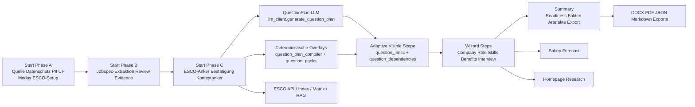

# Codex-Implementierungsfahrplan für cs_need_analysis

Die folgende Auswertung ist bewusst **nicht** als allgemeiner Research-Report geschrieben, sondern als **priorisierte, direkt ausführbare Codex-Arbeitsgrundlage** für das aktuelle Projekt `cs_need_analysis`, wie im angehängten Arbeitsauftrag gefordert. Grundlage war der beigefügte aktuelle Repo-Stand als Quelle der Wahrheit, ergänzt um aktuelle Primärquellen zu Codex/OpenAI, Streamlit, WCAG und ESCO/EURES. fileciteturn3file6 fileciteturn3file10

## Executive Diagnosis

- Die **aktive Wizard-Route ist bereits erstaunlich sauber kanonisiert**: `constants.STEPS` und `wizard_pages/__init__.py` erzwingen die sichtbare Reihenfolge, während `01a_jobspec_review.py` und `03_team.py` ausdrücklich als **nicht routbare Legacy-Module** behandelt werden. Das ist architektonisch stark und verhindert versehentliche Re-Exponierung alter Flows.  
- Der Hauptgrund, warum der Wizard **ab „Unternehmen“ zu dünn wirkt**, ist **nicht** fehlende Logik, sondern **uneinheitliche Step-Shell-Architektur**: `company` und `interview` nutzen bereits eine Section-Registry (`step_sections.py`), `role_tasks`, `skills` und `benefits` dagegen noch eigene, teilweise asymmetrische `render_step_shell(...)`-Aufrufe mit unterschiedlicher Slot-Belegung, Copy-Tiefe und Review-Einbettung.  
- Der Code besitzt bereits einen **starken zentralen Architekturkern** für State-Keys, Modell-Fähigkeiten, Prompting, Parsing, Fallbacks und Cache-Logik in `constants.py`, `model_capabilities.py`, `settings_openai.py`, `llm_client.py` und `state.py`. Genau deshalb ist der größte Hebel **kein Broad Refactor**, sondern das **Schließen weniger verbliebener Inkonsequenzen** an den Step-Grenzen.  
- Die **Frage-Logik ist leistungsfähig, aber drift-gefährdet**, weil Scope-/Status-/Review-Berechnungen an mehreren Stellen ähnlich, aber nicht identisch passieren: insbesondere in `question_limits.py`, `ui_components.build_step_review_payload(...)`, `ui_components.render_question_step(...)` und `ui_layout.render_step_shell(...)`. Diese Doppelberechnungen erhöhen das Risiko, dass sichtbare Tiefe, Status und Review auseinanderlaufen.  
- `question_limits.py` ist bereits ein klarer Mechanismus für **adaptive sichtbare Tiefe** mit Step-Floors in `standard` und einer Scoring-Logik über `required`, `depends_on`, `follow_up_prompts`, `impact_targets`, `acquisition_cost` und `info_gain_score`. Genau dort liegt aber auch ein zentraler UX-Hebel: Wenn diese Logik nicht transparenter und konsistenter in die Step-Shell zurückgespielt wird, fühlt sich der Wizard trotz vorhandener Fragen „zu dünn“ an.  
- Für LLM-nahe Arbeit ist die Anlage gut: OpenAI-Request-Building bleibt zentralisiert, Capability-Gating für `reasoning.effort` ist explizit, und Structured Outputs sind erstes Architekturprinzip. Das passt zu den aktuellen OpenAI-Empfehlungen, nach denen Codex **viel Kontext**, **präzise Erfolgsziele** und bei komplexeren Aufgaben **messbare Completion-Kriterien** erhalten sollte; außerdem sind `reasoning.effort` und strukturierte JSON-Ausgaben explizite Kernmechanismen der aktuellen API-Dokumentation. citeturn5view0turn6view4turn6view0turn6view2  
- Die **größte sofortige UX-Maßnahme** ist daher: `role_tasks`, `skills` und `benefits` auf dieselbe **Section-Semantik** wie `company`/`interview` bringen: *extracted values → source comparison → open questions → review*, mit konsistenter Outcome-Copy, Review-Dichte und optional lazy sections. Damit verschwindet ein großer Teil des subjektiven „dünn“-Gefühls, ohne die Kernarchitektur zu brechen.  
- Die **stärkste Cleaning-Maßnahme** ist danach eine einzige kanonische **Step-Payload-Funktion** für sichtbare Fragen, Step-Status, Answered-Lookup, Fact-Evidence und Confidence-Threshold. Das reduziert Legacy-Risiken stärker als jede kosmetische Einzelverbesserung.  
- Dokumentationsseitig gibt es **erkennbare Drift**: README und AGENTS folgen bereits dem integrierten Start-Phasen-Modell; im ChangeLog tauchen jedoch noch Verweise auf `wizard_pages/01_jobad.py` auf, obwohl der aktuelle Flow im Start-Schritt integriert ist. Das ist kein Produktionsbug, aber ein klares Wartungs- und Onboarding-Risiko.  
- GitHub ist für die meisten anstehenden Tasks **nicht** das Primärwerkzeug; das Repo hat derzeit **0 offene Issues**, **2 offene Pull Requests** und **527 geschlossene Pull Requests**. GitHub lohnt sich daher selektiv für PR-/Historien-Abgleich, nicht für reine lokale Architektur- und UI-Implementierung. citeturn15view0turn16view0  
- Streamlit selbst bietet inzwischen sehr passende primitive Bausteine für die Zielarchitektur: `st.form` bündelt Eingaben inklusive Submit-Verhalten, `Session State` ist explizit über Reruns und Multipage-Navigation tragfähig, `st.container` ist für feste Layout-Slots geeignet, und `st.tabs` kann inzwischen mit `on_change="rerun"` sowie `.open` auch **lazy** genutzt werden. Für gruppierte Eingaben und Fehlerbehandlung geben die aktuellen WCAG-Quellen zudem klare Leitlinien zu Labels, textlicher Fehlerbeschreibung und `fieldset`/`legend` für logisch zusammengehörige Eingabegruppen. citeturn7view0turn8view0turn8view3turn9view0turn10view0turn11view0turn11view3turn11view5

### Grenzen und offene Punkte

Diese Auswertung priorisiert den **tatsächlich beigefügten aktuellen Repo-Stand**. Mehrere im Textauftrag genannte Zusatzdateien und Vorarbeiten wurden als Referenzquellen benannt, waren hier aber nicht alle als direkt prüfbare Dateien verfügbar; entsprechend habe ich sie **nicht** als verlässliche Evidenz benutzt. Außerdem konnte ich im lokalen Sandbox-Kontext zwar einen vollständigen `compileall`-Scan ohne Syntaxfehler durchführen, aber kein aussagekräftiges `pytest`-Gesamtresultat, weil die Drittanbieter-Abhängigkeiten im Ausführungskontext nicht installiert waren. fileciteturn3file3

## Evidence Map

### Repo-Pipeline



### Befundtabelle

| Befund | Evidenz im Repo | Externe Evidenz | Sicherheit | Auswirkung |
|---|---|---|---|---|
| Sichtbarer Wizard-Vertrag ist stabil und Legacy-Schritte sind bewusst ausgeschlossen | `constants.py` definiert nur `landing → company → role_tasks → skills → benefits → interview → summary`; `wizard_pages/__init__.py` ignoriert `01a_jobspec_review.py` und `03_team.py`; `tests/test_wizard_contract.py` sichert das ab. | GitHub zeigt das Repo als aktives öffentliches Hauptrepo mit umfangreicher Historie. citeturn15view0 | confirmed | Gute Basis; kein Routing-Rewrite nötig |
| Step-Shell-Standardisierung ist **nur teilweise** umgesetzt | `step_sections.py` registriert aktuell nur `company` und `interview`; `wizard_pages/04_role_tasks.py`, `05_skills.py` und `06_benefits.py` hängen ihre Slots noch individuell an `render_step_shell(...)`. | `st.form` ist für gebündelte Eingabe-Segmente gedacht; `st.container` eignet sich für feste, geordnete Slots. WCAG empfiehlt klare Labels, Gruppierung und textliche Eingabehinweise. citeturn7view0turn8view3turn10view0turn11view3 | confirmed | Höchster UX-Hebel ohne Architekturbruch |
| Wahrgenommene Dünne entsteht eher aus **Präsentation und Scope-Kommunikation** als aus fehlenden Fragen | `question_limits.py` enthält adaptive Floors und Scoring; `ui_components.render_question_step(...)` nutzt progressive disclosure; einige Steps zeigen aber weniger strukturierte Extraktions-/Review-Kontexte als `company`/`interview`. | Codex/OpenAI empfehlen hohe Kontextsättigung und explizite Erfolgsziele; gute Labels/Instructions verringern Unsicherheit in Formularstrecken. citeturn5view0turn6view4turn10view0 | likely | Direkte Wirkung auf Produktgefühl und Abbruchrisiko |
| Scope-/Status-/Review-Logik ist doppelt und damit drift-gefährdet | Parallele Berechnungen in `question_limits.py`, `ui_layout.render_step_shell(...)`, `ui_components.build_step_review_payload(...)`, `ui_components.render_question_step(...)`. | Streamlit `Session State` ist genau für persistente Multipage-Interaktionen gedacht; Widget-Zustand nach Instanziierung ad hoc zu mutieren ist aber fehleranfällig. citeturn8view0 | confirmed | Hohes Cleaning-Potenzial bei moderatem Risiko |
| LLM-Kern ist richtig zentralisiert und sollte **nicht** zerlegt werden | `llm_client.py` bündelt Request-Building, Retries, Parse, Cache und Error-Mapping; `model_capabilities.py` kapselt GPT-5/GPT-5.4-Regeln; `settings_openai.py` hält die Precedence. | OpenAI dokumentiert `reasoning.effort` als zentrales Steuersignal und Structured Outputs als JSON-Schema-Pfad. citeturn6view0turn6view1turn6view2 | confirmed | Änderungen hier nur gezielt und testgetrieben |
| QuestionPlan-/Group-Key-Qualität ist ein High-Leverage-Task | `llm_client.generate_question_plan(...)` promptet stabile `group_key`-Domänen; `normalize_question_plan(...)` normalisiert IDs, Fact Keys, Dependencies und Group Keys; `question_plan_compiler.py` injiziert deterministische Overlays. | OpenAI empfiehlt explizite Ziele, Kontext und messbare Done-Kriterien für agentische Coding-Workflows. citeturn5view0turn6view4 | confirmed | Verbessert Informationsgewinnung direkt |
| Lazy-/Performance-Mechanik ist vorhanden, aber uneinheitlich | `ui_layout.LazySectionConfig` existiert; `role_tasks`, `skills` und `benefits` nutzen Lazy-Sections; andere Stellen können noch stärker auf echte Open/Closed-Signale standardisiert werden. | `st.tabs` unterstützt inzwischen `on_change="rerun"` und `.open` für lazy execution; ohne State-Tracking wird alles gerechnet. citeturn9view0 | confirmed | Mittelgroßer Perf-/UX-Hebel |
| Accessibility-Qualität sollte stärker formnah operationalisiert werden | Viele Formabschnitte sind schon segmentiert, aber die Logik ist nicht überall gleich stark in explizite Gruppierung, Inline-Fehler und klare sichtbare Labels gegossen. | WCAG 3.3.2 verlangt Labels/Instructions; 3.3.1 verlangt textliche Fehlerbeschreibung; H71 empfiehlt `fieldset`/`legend` für logisch zusammengehörige Controls. citeturn10view0turn11view0turn11view3turn11view5 | likely | Direkt relevant für Verständlichkeit und Computer-Use-Smokes |
| ESCO-Versionierung ist grundsätzlich sauber, sollte aber auf aktuelle offizielle Version gespiegelt bleiben | `constants.py` mappt `stable -> v1.2.0` und `preview -> v1.2.1`; README/AGENTS dokumentieren diese Semantik. | Die offizielle ESCO-Seite nennt aktuell **v1.2.1** als letzte Version und beschreibt die APIs ausdrücklich für Job Matching, Skills Intelligence und Career Guidance. citeturn12view0turn12view1 | confirmed | Wichtig für Konfig-Klarheit und spätere Drift-Vermeidung |
| GitHub ist selektiv nützlich, nicht universell | Lokale Codeaufgaben brauchen primär Repo-Dateien; nur Skills-/PR-nahe Änderungen profitieren von Remote-Kontext. | Das öffentliche Repo hat 0 offene Issues, 2 offene PRs und 527 geschlossene PRs; PR `#511` betrifft bereits Skill-Suggestions. citeturn15view0turn16view0 | confirmed | GitHub nur bei PR-/Historienbezug einplanen |
| Docs/Release-Notizen sind nicht vollständig synchron | README/AGENTS spiegeln den integrierten Start-Flow; `CHANGELOG.md` enthält noch Referenzen auf `wizard_pages/01_jobad.py`. | Gute agentische Workflows profitieren laut Codex-Dokumentation von präzisem, aktuellem Kontext und klaren Repo-Regeln. citeturn5view0 | confirmed | Mittleres Wartungs- und Onboarding-Risiko |

## Priorisierte Codex-Task-Queue

| ID | Task | Priorität | Impact | Aufwand | Risiko | Abhängigkeiten | Hauptdateien | Parallelisierbar mit | Empfohlene Settings |
|---|---|---:|---:|---:|---:|---|---|---|---|
| CSNA-01 | Section-Registry auf `role_tasks`, `skills`, `benefits` erweitern | P0 | 5 | 3 | 2 | keine | `step_sections.py`, `wizard_pages/04_role_tasks.py`, `wizard_pages/05_skills.py`, `wizard_pages/06_benefits.py`, `tests/test_ui_step_shell_order.py` | CSNA-08, CSNA-09 | Planmodus · GPT-5.5 · hoch · Files and folders |
| CSNA-02 | Extraktions-/Outcome-/Review-Parität für Steps 4–6 herstellen | P0 | 5 | 3 | 2 | CSNA-01 | `wizard_pages/04_role_tasks.py`, `05_skills.py`, `06_benefits.py`, `ui_components.py` | CSNA-08 | Direkt implementieren · GPT-5.4 · mittel/hoch · Files and folders + Computer |
| CSNA-03 | Kanonische Step-Payload-Funktion für Scope/Status/Review einführen | P0 | 5 | 4 | 3 | keine | `ui_components.py`, `ui_layout.py`, `question_limits.py`, `step_status.py`, Tests | CSNA-09 | Planmodus · GPT-5.5 · extra hoch · Files and folders |
| CSNA-04 | `question_limits.py` transparenter machen und Hidden-Depth-UX korrigieren | P1 | 4 | 3 | 3 | CSNA-03 empfohlen | `question_limits.py`, `ui_components.py`, `tests/test_question_limits.py`, `tests/test_progressive_disclosure_helpers.py` | CSNA-09 | Planmodus · GPT-5.5 · hoch · Files and folders |
| CSNA-05 | QuestionPlan-Prompt, `group_key`-Normalisierung und Downstream-Section-Mapping schärfen | P1 | 5 | 4 | 4 | CSNA-01 hilfreich | `llm_client.py`, `question_plan_compiler.py`, `question_packs/registry.py`, `schemas.py`, Tests | CSNA-09 | Planmodus · GPT-5.5 · extra hoch · Files and folders + OpenAI Docs/Web |
| CSNA-06 | Deterministische Packs/Overlays mit vollständiger Metadata priorisieren | P1 | 4 | 3 | 3 | CSNA-05 | `question_packs/registry.py`, `question_plan_compiler.py`, `occupation_context.py`, Tests | CSNA-09 | Direkt implementieren · GPT-5.5 · hoch · Files and folders |
| CSNA-07 | Evidence-/Provenance-UX von Start bis Interview standardisieren | P1 | 4 | 4 | 3 | CSNA-01, CSNA-03 | `wizard_pages/jobad_intake.py`, `job_extract_review_helpers.py`, `wizard_pages/02_company.py`, `07_interview.py`, `08_summary.py` | CSNA-09 | Planmodus · GPT-5.5 · hoch · Files and folders + Computer |
| CSNA-08 | Summary-Readiness und Artifact-Freshness gegen Fact-Resolution härten | P1 | 4 | 3 | 3 | keine | `wizard_pages/08_summary.py`, `summary_*`, `tests/test_summary_*` | CSNA-01, CSNA-02 | Direkt implementieren · GPT-5.5 · hoch · Files and folders |
| CSNA-09 | README/AGENTS/CHANGELOG/Test-Kommandos synchronisieren | P2 | 3 | 2 | 1 | ideal nach CSNA-01–08 | `README.md`, `CHANGELOG.md`, `AGENTS.md`, ggf. `tests/` | fast alles | Direkt implementieren · GPT-5.4 · mittel · Files and folders |
| CSNA-10 | Skills-nahe Änderungen gegen offene PRs und Remote-Historie abgleichen | P2 | 3 | 2 | 2 | vor CSNA-05/06 nützlich | GitHub PR `#511`, lokale `wizard_pages/05_skills.py`, `llm_client.py`, Tests | CSNA-09 | Review-only · GPT-5.4 · mittel · GitHub + Files and folders |
| CSNA-11 | Visuelle UX-Flow-Map/Wireframe für vereinheitlichte Step-Shell erzeugen | P3 | 2 | 2 | 1 | nach CSNA-01/02 sinnvoll | keine Produktivdateien zwingend | unabhängig | Review-only · GPT-5.4 · niedrig · Canva optional, sonst ohne Canva |

## Copy-paste-fertige Codex-Prompts

**TASK CSNA-01 — Step-Section-Registry für Rolle, Skills und Benefits kanonisieren**

### Settings

| Feld | Empfehlung |
|---|---|
| Modus | Planmodus an |
| Ziel/Zielmodus | „Unify step shell section semantics across steps 3–5 without changing active routing“ |
| Apps/Plugins | Files and folders |
| Modell | GPT-5.5 |
| Schlussfolgern | Hoch |
| Zugriff/Sandbox | workspace-write |
| Parallelisierung | Parallel zu CSNA-08 und CSNA-09 |
| Erwartete Dateien | `step_sections.py`, `wizard_pages/04_role_tasks.py`, `wizard_pages/05_skills.py`, `wizard_pages/06_benefits.py`, `tests/test_ui_step_shell_order.py` |
| Nicht anfassen | `llm_client.py`, `model_capabilities.py`, Routing in `constants.py` / `wizard_pages/__init__.py` |

### Warum dieser Task

Der größte UX-Bruch liegt aktuell in der ungleichmäßigen Section-Semantik nach `company`: `company` und `interview` nutzen bereits eine Registry, `role_tasks`, `skills` und `benefits` noch nicht. Dieser Task liefert den höchsten sichtbaren Hebel mit relativ kleinem Diff und ohne Architekturbruch. Streamlit-Forms und containerbasierte Slot-Layouts passen genau zu einer solchen Standardisierung. citeturn7view0turn8view3

### Copy-paste Codex Prompt

```text
You are working in the repository `cs_need_analysis`.

Goal:
Extend the canonical step section registry so that `role_tasks`, `skills`, and `benefits` use the same ordered section semantics as the already standardized `company` and `interview` steps, without changing active routing or introducing new wizard pages.

Context:
- `step_sections.py` currently defines canonical section ordering only for `company` and `interview`.
- `wizard_pages/04_role_tasks.py`, `wizard_pages/05_skills.py`, and `wizard_pages/06_benefits.py` still wire `render_step_shell(...)` more ad hoc.
- `tests/test_ui_step_shell_order.py` already exercises section-order and shell behavior patterns.
- Keep existing lazy salary/source comparison behavior where useful, but route section naming/order through the canonical registry.

Constraints:
- Read `AGENTS.md` first if present and follow it.
- Keep the diff minimal and focused.
- Do not introduce unrelated refactors, broad formatting churn, or unnecessary dependencies.
- Preserve existing German UX tone.
- Keep recruiting language inclusive and AGG-compliant.
- Do not invent salary ranges, role requirements, benefits, process steps, certifications, or legal claims.
- Do not expose secrets, credentials, API keys, tokens, full env dumps, or PII.
- Do not add raw `st.session_state["..."]` keys if an `SSKey` should exist.
- Keep `constants.py` as the source of truth for canonical keys and IDs.
- Keep OpenAI settings/config precedence unchanged unless this task explicitly changes it.
- Keep OpenAI request construction, retries, structured parsing, fallbacks, caching, usage metadata, and error mapping centralized in `llm_client.py`.
- Keep model capability checks in `model_capabilities.py`.
- Do not reintroduce legacy hidden wizard pages into routing.
- Keep schema, logic, UI, summary artifacts, exports, tests, and README in sync.

Implementation:
1. Extend `step_sections.py` with canonical section definitions for `role_tasks`, `skills`, and `benefits`.
2. Refactor the three step modules to consume `build_step_shell_section_kwargs(...)` where appropriate.
3. Preserve step-specific lazy sections and salary forecast slots.
4. Add or update tests in `tests/test_ui_step_shell_order.py` to prove the new canonical ordering.
5. If a step intentionally lacks one section, encode that explicitly instead of falling back to ad hoc ordering.

Done when:
- Steps 3–5 no longer hardcode section ordering outside the registry unless technically necessary and documented.
- Existing UX behavior is preserved or improved.
- Tests cover the new registry-backed behavior.

Verification:
Run the smallest relevant checks first:
```bash
python -m compileall step_sections.py wizard_pages/04_role_tasks.py wizard_pages/05_skills.py wizard_pages/06_benefits.py tests/test_ui_step_shell_order.py
python -m pytest -q tests/test_ui_step_shell_order.py
```

Smoke checks:
- Confirm the rendered section order is predictable for role/tasks, skills, and benefits.
- Confirm no legacy hidden pages became routable.
- Confirm salary/source-comparison lazy sections still appear where expected.

Report back with:
- touched files
- exact section contract before/after
- tests run
- any intentional deviations from the `company`/`interview` pattern
```

**TASK CSNA-02 — Extracted Values, Outcome-Copy und Review-Parität für Steps 4–6**

### Settings

| Feld | Empfehlung |
|---|---|
| Modus | Direkt implementieren |
| Ziel/Zielmodus | „Make steps 3–5 feel less thin by surfacing extracted values, clearer outcomes, and consistent review context“ |
| Apps/Plugins | Files and folders, Computer |
| Modell | GPT-5.4 |
| Schlussfolgern | Mittel bis hoch |
| Zugriff/Sandbox | workspace-write |
| Parallelisierung | Nach CSNA-01; parallel zu CSNA-08 |
| Erwartete Dateien | `wizard_pages/04_role_tasks.py`, `wizard_pages/05_skills.py`, `wizard_pages/06_benefits.py`, `ui_components.py` |
| Nicht anfassen | `llm_client.py`, `question_plan_compiler.py` |

### Warum dieser Task

Die Steps 4–6 wirken vor allem deshalb dünn, weil extrahierte Ausgangswerte, Outcome-Copy und Review-Kontext ungleich sichtbar sind. Für Nutzer:innen ist das ein Wahrnehmungsproblem vor einem Logikproblem. Klare Labels, gruppierte Eingabe-Segmente und textlich nachvollziehbare Review-States sind auch aus WCAG-Sicht der richtige Weg. citeturn10view0turn11view0turn11view5

### Copy-paste Codex Prompt

```text
You are working in the repository `cs_need_analysis`.

Goal:
Reduce the “thin step” feeling in `role_tasks`, `skills`, and `benefits` by making extracted values, outcome copy, and review framing more consistent with `company` and `interview`, without changing the underlying recruiting logic.

Context:
- `wizard_pages/02_company.py` and `wizard_pages/07_interview.py` provide stronger extracted/review framing than `04_role_tasks.py`, `05_skills.py`, and `06_benefits.py`.
- `render_step_shell(...)` already supports `title`, `subtitle`, `outcome_text`, extracted slots, review slots, and lazy sections.
- Current goals: stronger perceived depth, clearer information acquisition intent, better review affordance.

Constraints:
- Read `AGENTS.md` first if present and follow it.
- Keep the diff minimal and focused.
- Do not introduce unrelated refactors, broad formatting churn, or unnecessary dependencies.
- Preserve existing German UX tone.
- Keep recruiting language inclusive and AGG-compliant.
- Do not invent salary ranges, role requirements, benefits, process steps, certifications, or legal claims.
- Do not expose secrets, credentials, API keys, tokens, full env dumps, or PII.
- Do not add raw `st.session_state["..."]` keys if an `SSKey` should exist.
- Keep `constants.py` as the source of truth for canonical keys and IDs.
- Do not reintroduce legacy hidden wizard pages into routing.

Implementation:
1. Audit the three step pages for missing or weak `subtitle`, `outcome_text`, extracted value blocks, and review framing.
2. Add concise but substantial extracted-value summaries where useful.
3. Improve German microcopy so each step states its information goal clearly.
4. Ensure review cards are not visually disconnected from the actual step purpose.
5. Keep the existing recruiting semantics intact.

Done when:
- Each of the three steps communicates what the step is for, what was already extracted, and what is still being clarified.
- No step feels like “just pills + open questions”.
- Diffs stay limited to step UX and small helper touch-ups.

Verification:
Run the smallest relevant checks first:
```bash
python -m compileall wizard_pages/04_role_tasks.py wizard_pages/05_skills.py wizard_pages/06_benefits.py ui_components.py
python -m pytest -q tests/test_ui_step_shell_order.py tests/test_ui_review_helpers.py
```

Smoke checks:
- Start the Streamlit app and click through steps 3–5.
- Verify that each step has visible information goal, extracted context, open questions, and review affordance.
- Verify that German UX copy stays consistent with the existing tone.

Report back with:
- screenshots or textual descriptions of the before/after UX
- touched files
- tests run
- any skipped improvements because they would require architectural change
```

**TASK CSNA-03 — Kanonische Step-Payload für Scope, Status und Review**

### Settings

| Feld | Empfehlung |
|---|---|
| Modus | Planmodus an |
| Ziel/Zielmodus | „Create one canonical step payload path for visible scope, answered lookup, status, and review“ |
| Apps/Plugins | Files and folders |
| Modell | GPT-5.5 |
| Schlussfolgern | Extra hoch |
| Zugriff/Sandbox | workspace-write |
| Parallelisierung | Parallel zu CSNA-09 |
| Erwartete Dateien | `ui_components.py`, `ui_layout.py`, `question_limits.py`, `step_status.py`, ggf. `state.py`, relevante Tests |
| Nicht anfassen | `wizard_pages/__init__.py`, ESCO runtime modules, `llm_client.py` |

### Warum dieser Task

Aktuell liegt das stärkste Cleaning-Potenzial in der doppelten Step-Berechnung. Wenn sichtbare Scope-Auswahl, `answered_lookup`, Review-Payload und Step-Status an mehreren Orten separat konstruiert werden, entsteht unvermeidlich Drift. Dieser Task reduziert Komplexität, Regressionen und spätere UX-Inkonsistenzen am stärksten.  

### Copy-paste Codex Prompt

```text
You are working in the repository `cs_need_analysis`.

Goal:
Introduce a single canonical step payload builder for visible questions, selected scope, answered lookup, confidence-aware status, and review payload so that `render_step_shell(...)`, `render_question_step(...)`, and step review rendering no longer recompute overlapping logic differently.

Context:
- Similar logic currently appears across `question_limits.py`, `ui_components.build_step_review_payload(...)`, `ui_components.render_question_step(...)`, and `ui_layout.render_step_shell(...)`.
- The repo already treats `constants.py` as the source of truth and avoids broad refactors.
- This is a high-leverage cleaning task that should reduce drift without changing recruiting semantics.

Constraints:
- Read `AGENTS.md` first if present and follow it.
- Keep the diff minimal and focused.
- Do not introduce unrelated refactors, broad formatting churn, or unnecessary dependencies.
- Preserve existing German UX tone.
- Do not change active routing.
- Do not move OpenAI request logic out of `llm_client.py`.
- Do not alter model capability logic in `model_capabilities.py`.
- Do not add raw `st.session_state["..."]` keys if an `SSKey` should exist.

Implementation:
1. Design a small canonical helper/data structure for step payload computation.
2. Route `render_question_step(...)`, step review payload creation, and `render_step_shell(...)` status handling through it.
3. Keep confidence-threshold, job-extract coverage, intake facts, and dependency visibility semantics unchanged unless fixing an inconsistency that you can explain and test.
4. Update targeted tests rather than performing a suite-wide rewrite.

Done when:
- There is one obvious source of truth for per-step scope/status/review payloads.
- Duplicate logic is measurably reduced.
- Existing step behavior remains functionally equivalent or improved.
- Tests demonstrate parity.

Verification:
Run the smallest relevant checks first:
```bash
python -m compileall ui_components.py ui_layout.py question_limits.py step_status.py
python -m pytest -q tests/test_question_limits.py tests/test_step_status_payload.py tests/test_ui_step_shell_order.py tests/test_ui_review_helpers.py
```

Smoke checks:
- Check one step with dependency-hidden follow-ups.
- Check one step with extracted coverage and confidence threshold behavior.
- Check that review cards and progress badges agree with visible step scope.

Report back with:
- the new canonical helper entry point
- deleted/replaced duplicate code paths
- behavior changes, if any
- tests run
```

**TASK CSNA-04 — Adaptive Visible Depth und Hidden-Question-UX nachschärfen**

### Settings

| Feld | Empfehlung |
|---|---|
| Modus | Planmodus an |
| Ziel/Zielmodus | „Make adaptive visible depth easier to reason about and less likely to feel arbitrarily thin“ |
| Apps/Plugins | Files and folders |
| Modell | GPT-5.5 |
| Schlussfolgern | Hoch |
| Zugriff/Sandbox | workspace-write |
| Parallelisierung | Nach CSNA-03 empfohlen |
| Erwartete Dateien | `question_limits.py`, `ui_components.py`, `tests/test_question_limits.py`, `tests/test_progressive_disclosure_helpers.py` |
| Nicht anfassen | `llm_client.py`, `wizard_pages/*` außer minimaler wiring |

### Warum dieser Task

`question_limits.py` ist bereits clever, aber die aktuelle UX erklärt Nutzer:innen zu wenig, **warum** sie bestimmte Tiefe sehen oder nicht sehen. Wenn adaptive Logik als Black Box wirkt, fühlt sich der Wizard schnell zu dünn oder sprunghaft an.  

### Copy-paste Codex Prompt

```text
You are working in the repository `cs_need_analysis`.

Goal:
Refine the adaptive visible-depth behavior and its UX so that hidden/detail questions are represented more clearly and the wizard feels intentional rather than arbitrarily shallow.

Context:
- `question_limits.py` already computes adaptive limits using required/core/dependency/follow-up/info-gain signals.
- `ui_components.render_question_step(...)` uses the resulting scope.
- The current hidden-question messaging is likely too narrow and may underrepresent adaptive hiding versus dependency hiding.

Constraints:
- Read `AGENTS.md` first if present and follow it.
- Keep the diff minimal and focused.
- Do not introduce unrelated refactors or dependencies.
- Preserve existing German UX tone.
- Do not weaken the existing confidence-aware or dependency-aware logic unless tests prove the change.
- Keep schema, UI, and tests in sync.

Implementation:
1. Audit the semantics of `selected_questions`, `visible_questions`, and `hidden_questions_count`.
2. Decide whether the UI should distinguish dependency-hidden, adaptively-hidden, and fully-shown states.
3. Improve the user-facing messaging so visible depth feels understandable.
4. Add tight tests for edge cases in `standard` vs `expert`, dependency-hidden follow-ups, and extracted coverage.

Done when:
- The visible-depth behavior is easier to explain and verify.
- Hidden-question messaging is accurate.
- No regressions occur in mode-specific step floors.

Verification:
Run the smallest relevant checks first:
```bash
python -m compileall question_limits.py ui_components.py
python -m pytest -q tests/test_question_limits.py tests/test_progressive_disclosure_helpers.py tests/test_ui_mode_flow.py
```

Smoke checks:
- Compare `quick`, `standard`, and `expert` on the same step.
- Confirm core questions remain visible when expected.
- Confirm hidden/detail messaging matches the actual scope.

Report back with:
- old vs new hidden-depth semantics
- changed tests
- any remaining ambiguity that should be documented separately
```

**TASK CSNA-05 — QuestionPlan-Prompting und Group-Key-Downstream schärfen**

### Settings

| Feld | Empfehlung |
|---|---|
| Modus | Planmodus an |
| Ziel/Zielmodus | „Increase information gain and section coherence without breaking deterministic overlays or canonical IDs“ |
| Apps/Plugins | Files and folders, OpenAI Developer Docs / Web |
| Modell | GPT-5.5 |
| Schlussfolgern | Extra hoch |
| Zugriff/Sandbox | workspace-write |
| Parallelisierung | Parallel zu CSNA-09; GitHub optional nach CSNA-10 |
| Erwartete Dateien | `llm_client.py`, `question_plan_compiler.py`, `question_packs/registry.py`, `schemas.py`, Tests |
| Nicht anfassen | `settings_openai.py`, `model_capabilities.py`, salary engine |

### Warum dieser Task

Die stärkste fachliche Hebelstelle für besseren Informationsgewinn ist nicht zusätzliche UI, sondern ein präziserer `QuestionPlan` mit robusten `group_key`-Semantiken und besserem Downstream-Mapping. OpenAI empfiehlt für agentische und strukturierte Ausgaben explizite Ziele, klaren Kontext und klare Erfolgsbedingungen; genau das sollte im Prompting und in der Normalisierung noch konsequenter genutzt werden. citeturn5view0turn6view4turn6view2

### Copy-paste Codex Prompt

```text
You are working in the repository `cs_need_analysis`.

Goal:
Improve `generate_question_plan(...)` and its downstream normalization so that generated questions better support section coherence, information gain, and stable grouping without duplicating deterministic ESCO/ISCO overlays.

Context:
- `llm_client.generate_question_plan(...)` already constrains step order, group domains, fact keys, depends_on, and follow-up prompts.
- `normalize_question_plan(...)` and `_normalize_question_group_key(...)` repair model output downstream.
- `question_plan_compiler.py` injects deterministic overlays and depends on stable grouping behavior.
- This task is high risk because it touches prompting plus normalization plus downstream assumptions.

Constraints:
- Read `AGENTS.md` first if present and follow it.
- Keep the diff minimal and focused.
- Do not introduce unrelated refactors, broad formatting churn, or unnecessary dependencies.
- Preserve existing German UX tone.
- Keep OpenAI request construction, retries, structured parsing, fallbacks, caching, usage metadata, and error mapping centralized in `llm_client.py`.
- Keep model capability checks in `model_capabilities.py`.
- Do not invent recruiting facts.
- Keep schema, logic, UI, summary artifacts, exports, tests, and README in sync.

Implementation:
1. Audit the current question-plan prompt for places where it still allows vague or section-weak questions.
2. Tighten the prompt so question groups map more reliably to downstream section logic.
3. Improve normalization only where the prompt cannot guarantee stability.
4. Add regression tests for group keys, dependencies, priorities, and section coherence.
5. Document any changed assumptions.

Done when:
- Generated plans are more section-coherent.
- Group-key normalization needs fewer repairs.
- Deterministic overlays are not duplicated or contradicted.
- Tests cover the changed contract.

Verification:
Run the smallest relevant checks first:
```bash
python -m compileall llm_client.py question_plan_compiler.py question_packs/registry.py schemas.py
python -m pytest -q tests/test_question_plan_normalization.py tests/test_question_pack_compiler.py tests/test_question_limits.py tests/test_wizard_contract.py
python scripts/openai_smoke_test.py --mode all --ci-dry-run-if-no-key --json-only
```

Smoke checks:
- Inspect one generated plan for each visible downstream step.
- Check that group keys are canonical and section-friendly.
- Check that deterministic overlays still add value rather than duplicating LLM questions.

Report back with:
- prompt changes
- normalization changes
- new/updated tests
- one concrete example of improved question-plan quality
```

**TASK CSNA-06 — Deterministische Packs und Metadata vervollständigen**

### Settings

| Feld | Empfehlung |
|---|---|
| Modus | Direkt implementieren |
| Ziel/Zielmodus | „Complete metadata on high-value question packs so ranking and adaptive depth behave intentionally“ |
| Apps/Plugins | Files and folders |
| Modell | GPT-5.5 |
| Schlussfolgern | Hoch |
| Zugriff/Sandbox | workspace-write |
| Parallelisierung | Nach CSNA-05 |
| Erwartete Dateien | `question_packs/registry.py`, `question_plan_compiler.py`, `occupation_context.py`, relevante Tests |
| Nicht anfassen | `llm_client.py` außer minimalen imports if necessary |

### Warum dieser Task

Die adaptive Priorisierung nutzt bereits `impact_targets`, `acquisition_cost` und `info_gain_score`. Solange diese Metadata im Deterministik-Layer aber ungleichmäßig gepflegt sind, verschenkt der Wizard Sichtbarkeit genau dort, wo er eigentlich stark sein könnte.  

### Copy-paste Codex Prompt

```text
You are working in the repository `cs_need_analysis`.

Goal:
Complete and normalize the metadata quality of deterministic question packs so that adaptive ranking and visible-depth behavior reflect real recruiting value more consistently.

Context:
- `question_packs/registry.py` already uses `group_key`, `impact_targets`, `acquisition_cost`, and `info_gain_score`.
- `question_limits.py` directly consumes this metadata for prioritization.
- `question_plan_compiler.py` merges deterministic concepts into the final plan.

Constraints:
- Read `AGENTS.md` first if present and follow it.
- Keep the diff minimal and focused.
- Do not introduce unrelated refactors or dependencies.
- Preserve existing recruiting semantics.
- Do not invent role facts or constraints not grounded in the existing pack intent.

Implementation:
1. Audit the highest-impact pack definitions for missing or weak metadata.
2. Normalize metadata quality across the most important packs first.
3. Add or update focused tests to prove the ranking inputs are present and stable.
4. Keep canonical keys and downstream compatibility intact.

Done when:
- Priority metadata is clearly intentional across the targeted packs.
- Adaptive ranking has fewer “accidental” outcomes.
- Tests lock down the intended metadata contract.

Verification:
Run the smallest relevant checks first:
```bash
python -m compileall question_packs/registry.py question_plan_compiler.py occupation_context.py
python -m pytest -q tests/test_question_pack_compiler.py tests/test_question_limits.py tests/test_occupation_context.py
```

Smoke checks:
- Check at least one company/context-heavy profile and one skills-heavy profile.
- Confirm high-information questions surface earlier in `standard`.
- Confirm expert mode still exposes full depth.

Report back with:
- which packs were updated
- why those packs were prioritized
- tests run
```

**TASK CSNA-07 — Evidence- und Provenance-UX von Start bis Interview standardisieren**

### Settings

| Feld | Empfehlung |
|---|---|
| Modus | Planmodus an |
| Ziel/Zielmodus | „Make evidence and provenance visible where they improve trust, not only where extraction originally happened“ |
| Apps/Plugins | Files and folders, Computer |
| Modell | GPT-5.5 |
| Schlussfolgern | Hoch |
| Zugriff/Sandbox | workspace-write |
| Parallelisierung | Nach CSNA-01 und CSNA-03 empfohlen |
| Erwartete Dateien | `wizard_pages/jobad_intake.py`, `job_extract_review_helpers.py`, `wizard_pages/02_company.py`, `wizard_pages/07_interview.py`, `wizard_pages/08_summary.py`, ggf. `ui_components.py` |
| Nicht anfassen | ESCO API clients, salary engine, routing contract |

### Warum dieser Task

Das Repo sammelt bereits viel Evidence und Fact-Resolution, aber diese Evidenz wird downstream noch nicht überall gleich vertrauensfördernd sichtbar. Für Recruiting-Workflows ist das zentral: Nutzer:innen müssen sehen, **was übernommen**, **was bestätigt**, **was nur angenommen** und **was noch offen** ist.  

### Copy-paste Codex Prompt

```text
You are working in the repository `cs_need_analysis`.

Goal:
Standardize evidence/provenance visibility from Start through downstream steps so users can tell what was extracted, confirmed, inferred, conflicted, or still missing without adding excessive UI clutter.

Context:
- Evidence already exists in the intake extraction and fact layers.
- Downstream steps differ in how much extracted context and review grounding they show.
- Summary already has readiness/fact concepts that can be aligned with this work.

Constraints:
- Read `AGENTS.md` first if present and follow it.
- Keep the diff minimal and focused.
- Do not introduce unrelated refactors or dependencies.
- Preserve German UX tone and avoid overwhelming the step UI.
- Do not leak sensitive source text or PII into broader UI surfaces.
- Keep schema, UI, exports, and tests in sync.

Implementation:
1. Identify the smallest reusable provenance/evidence presentation pattern.
2. Reuse it across the most important downstream step surfaces.
3. Prefer concise indicators and expandable detail over verbose inline dumps.
4. Keep summary readiness semantics aligned with what is visible in earlier steps.

Done when:
- Users can better distinguish extracted vs confirmed vs unresolved information.
- Evidence visibility is more consistent across steps.
- No sensitive data is exposed unintentionally.

Verification:
Run the smallest relevant checks first:
```bash
python -m compileall wizard_pages/jobad_intake.py job_extract_review_helpers.py wizard_pages/02_company.py wizard_pages/07_interview.py wizard_pages/08_summary.py ui_components.py
python -m pytest -q tests/test_job_extract_evidence.py tests/test_summary_fact_table.py tests/test_summary_readiness_dashboard.py tests/test_ui_review_helpers.py
```

Smoke checks:
- Click through Start → Company → Interview → Summary with one realistic jobspec.
- Check that evidence indicators remain understandable and non-noisy.
- Check that unresolved items are still obvious.

Report back with:
- the new evidence/provenance pattern
- where it was applied
- any intentional exclusions to avoid UI overload
```

**TASK CSNA-08 — Summary Readiness und Artifact-Freshness härten**

### Settings

| Feld | Empfehlung |
|---|---|
| Modus | Direkt implementieren |
| Ziel/Zielmodus | „Make Summary readiness and artifact dirtiness feel deterministic and fact-aware“ |
| Apps/Plugins | Files and folders |
| Modell | GPT-5.5 |
| Schlussfolgern | Hoch |
| Zugriff/Sandbox | workspace-write |
| Parallelisierung | Parallel zu CSNA-01 oder CSNA-02 |
| Erwartete Dateien | `wizard_pages/08_summary.py`, `summary_artifacts.py`, `summary_exports.py`, `tests/test_summary_dirty_state.py`, weitere `tests/test_summary_*` |
| Nicht anfassen | `llm_client.py` unless summary generation contract truly requires it |

### Warum dieser Task

Summary ist der Punkt, an dem unklare Step-Semantik am teuersten wird. Das Repo hat bereits Fingerprints und Dirty-State-Logik; der nächste Schritt ist, Readiness und Artifact-Aktualität noch konsequenter auf Fact-Resolution und reproduzierbare Input-Fingerprints zu stützen.  

### Copy-paste Codex Prompt

```text
You are working in the repository `cs_need_analysis`.

Goal:
Harden Summary readiness and artifact freshness so they behave more deterministically and align better with fact resolution and current intake inputs.

Context:
- `wizard_pages/08_summary.py` already computes input fingerprints, last brief fingerprints, dirty state, and readiness-related meta.
- The repo clearly wants Summary to be the trusted action/export workspace, not a vague end screen.
- This task should improve determinism, not redesign Summary from scratch.

Constraints:
- Read `AGENTS.md` first if present and follow it.
- Keep the diff minimal and focused.
- Do not introduce unrelated refactors or dependencies.
- Preserve current artifact IDs and canonical constants.
- Keep exports, summary state, and tests in sync.

Implementation:
1. Audit current readiness and dirty/fresh logic.
2. Tighten weak edges where artifacts can appear current while fact inputs changed materially.
3. Prefer canonical fact resolution and stable fingerprints over ad hoc answer-count heuristics.
4. Update the smallest relevant test set.

Done when:
- Summary status labels are easier to trust.
- Dirty/current behavior is deterministic.
- Artifact freshness and follow-up readiness agree more often.

Verification:
Run the smallest relevant checks first:
```bash
python -m compileall wizard_pages/08_summary.py summary_artifacts.py summary_exports.py
python -m pytest -q tests/test_summary_dirty_state.py tests/test_summary_brief_status_consistency.py tests/test_summary_active_artifact.py tests/test_summary_export_payload.py
```

Smoke checks:
- Change a meaningful intake input after generating a brief and confirm dirty state updates.
- Confirm active artifact selection still works.
- Confirm no legacy artifact aliases break.

Report back with:
- changed freshness/readiness rules
- touched tests
- any migration or compatibility notes
```

**TASK CSNA-09 — README, AGENTS, CHANGELOG und Verifikationsvertrag synchronisieren**

### Settings

| Feld | Empfehlung |
|---|---|
| Modus | Direkt implementieren |
| Ziel/Zielmodus | „Make the repo’s written contract match the current integrated wizard architecture“ |
| Apps/Plugins | Files and folders |
| Modell | GPT-5.4 |
| Schlussfolgern | Mittel |
| Zugriff/Sandbox | workspace-write |
| Parallelisierung | Parallel zu fast allen Code-Tasks, idealerweise nach Merge der inhaltlichen Änderungen |
| Erwartete Dateien | `README.md`, `AGENTS.md`, `CHANGELOG.md`, ggf. kommentierte Teststellen |
| Nicht anfassen | Produktlogik ohne zwingenden Doc-Bezug |

### Warum dieser Task

Ein präziser Repo-Vertrag spart in Codex-Threads unverhältnismäßig viel Zeit. Laut aktueller Codex-Doku sollten Ziele und Kontext explizit sein; veraltete Dateipfade in Changelog/Docs untergraben genau das. citeturn5view0turn6view4

### Copy-paste Codex Prompt

```text
You are working in the repository `cs_need_analysis`.

Goal:
Synchronize README, AGENTS, CHANGELOG, and the verification guidance with the current integrated wizard architecture and current test reality.

Context:
- The current repo contract is centered on integrated Start phases and canonical routed steps.
- Some release notes still reference older path names such as `wizard_pages/01_jobad.py`.
- The repo already documents CI-equivalent verification commands in README.

Constraints:
- Read `AGENTS.md` first if present and follow it.
- Keep the diff minimal and focused.
- Do not introduce unrelated refactors or dependencies.
- Preserve the repo’s current architecture and naming where they are already canonical.
- Do not fabricate verification results you cannot actually support from the codebase.

Implementation:
1. Fix stale path references and outdated architectural wording.
2. Keep README, AGENTS, and CHANGELOG consistent with the active routed wizard contract.
3. If useful, tighten the recommended minimal verification command matrix for local work.
4. Avoid prose bloat.

Done when:
- Docs no longer point contributors toward outdated wizard structures.
- Verification guidance is current and specific.
- Changelog wording does not contradict the active architecture.

Verification:
Run the smallest relevant checks first:
```bash
python -m compileall README.md AGENTS.md CHANGELOG.md
python -m pytest -q tests/test_wizard_contract.py tests/test_public_page_links.py
```

Smoke checks:
- Grep for stale `01_jobad` references.
- Grep for legacy step wording that contradicts the current route.

Report back with:
- stale references removed
- updated verification guidance
- any intentionally preserved historical wording
```

**TASK CSNA-10 — Skills-Änderungen gegen offene PRs und Remote-Historie abgleichen**

### Settings

| Feld | Empfehlung |
|---|---|
| Modus | Review-only |
| Ziel/Zielmodus | „Review open skills-related PRs before changing local skill suggestion flow“ |
| Apps/Plugins | GitHub, Files and folders |
| Modell | GPT-5.4 |
| Schlussfolgern | Mittel |
| Zugriff/Sandbox | read-only |
| Parallelisierung | Vor CSNA-05/06 besonders sinnvoll |
| Erwartete Dateien | GitHub PR `#511`, lokale `wizard_pages/05_skills.py`, `llm_client.py`, skill tests |
| Nicht anfassen | keine Codeänderung im ersten Durchlauf |

### Warum dieser Task

Der Remote-Kontext lohnt sich nur selektiv; hier lohnt er sich aber: Im öffentlichen Repo ist eine offene PR `#511` zu Skills/AI-Suggestions sichtbar. Bevor lokale Skill-Logik geändert wird, sollte geprüft werden, ob bereits parallele Arbeit existiert oder Merge-Konflikte drohen. citeturn16view0

### Copy-paste Codex Prompt

```text
You are working in the repository `cs_need_analysis`.

Goal:
Perform a review-only reconciliation of open GitHub pull requests that affect skills/AI suggestion behavior before implementing local changes in the skills flow.

Context:
- The public repo currently has open pull requests, including `#511 feat(skills): one-time auto-generate AI skill suggestions and track with SSKey`.
- Planned local work may also touch `wizard_pages/05_skills.py`, `llm_client.py`, and related tests.
- This task is for conflict avoidance and sequencing, not immediate implementation.

Constraints:
- Read `AGENTS.md` first if present and follow it.
- Review only. Do not implement changes in this pass.
- Keep the report concise and file-specific.
- Focus on overlap, merge risk, and sequencing recommendations.

Implementation:
1. Inspect the open PRs with emphasis on skills-related changes.
2. Compare their likely touched areas against the planned local tasks.
3. Produce a short overlap matrix: PR, likely touched files, conflict risk, recommended sequencing.
4. Recommend whether the local tasks should rebase, wait, or proceed independently.

Done when:
- There is a clear recommendation for whether to touch `skills` now or after PR reconciliation.
- The result is specific enough to guide subsequent Codex threads.

Verification:
No code changes. If you inspect local files, use:
```bash
python -m pytest -q tests/test_skills_llm_suggestions.py tests/test_skills_occupation_suggestions.py
```

Smoke checks:
- None required in this review-only pass.

Report back with:
- open PR overlap summary
- sequencing recommendation
- any files that should be considered “hot”
```

**TASK CSNA-11 — UX-Flow-Map und Wireframe für die vereinheitlichte Step-Shell**

### Settings

| Feld | Empfehlung |
|---|---|
| Modus | Review-only |
| Ziel/Zielmodus | „Produce a stakeholder-readable visual spec for the unified step-shell pattern“ |
| Apps/Plugins | Canva optional; sonst Files and folders |
| Modell | GPT-5.4 |
| Schlussfolgern | Niedrig |
| Zugriff/Sandbox | read-only |
| Parallelisierung | Nach CSNA-01/02 sinnvoll |
| Erwartete Dateien | keine Produktivdateien zwingend; optional neues Design-Notizdokument |
| Nicht anfassen | Code, State, Schema, Tests |

### Warum dieser Task

Canva oder Creative Production haben **nur** dann echten Nutzen, wenn eine visuelle Abstimmung für Stakeholder oder spätere UI-Umsetzung gebraucht wird. Für Code, State, Logik und Tests sind sie keine Quelle der Wahrheit; für eine Step-Shell-Flow-Map jedoch können sie nützlich sein. fileciteturn3file5 fileciteturn3file8

### Copy-paste Codex Prompt

```text
You are working in the repository `cs_need_analysis`.

Goal:
Create a concise visual UX specification for the canonical step-shell pattern so implementation tasks for steps 3–5 can be reviewed with stakeholders before or during rollout.

Context:
- The target shell pattern is converging toward: extracted values → source comparison → open questions → review.
- This task is not a code task.
- The visual artifact should help humans align on information hierarchy, not redefine business logic.

Constraints:
- Review/design only.
- Do not change code.
- Do not use Canva or any design app as the source of truth for architecture, state, schema, or tests.
- Keep the artifact anchored in actual repo structure and existing German tone.

Implementation:
1. Summarize the canonical section pattern in plain language.
2. Produce a wireframe-level structure for one standardized step and note allowed variations.
3. If Canva is available and useful, translate that structure into a simple stakeholder-facing flow map or wireframe.
4. Keep the output implementation-oriented rather than decorative.

Done when:
- The visual spec makes it easier to implement and review CSNA-01 and CSNA-02.
- The artifact clearly separates canonical sections from optional/lazy variations.
- No product logic is invented.

Verification:
No code checks required.

Smoke checks:
- Sanity-check the spec against the current `company` and `interview` patterns.
- Confirm the visual spec does not contradict the active routed step contract.

Report back with:
- the canonical shell pattern
- allowed step-specific variations
- whether Canva added real value or not
```

### Kurze Einordnung zu Apps und Parallelisierung

Für die **meisten** der priorisierten Tasks sind **Files and folders** und gegebenenfalls **Computer** die richtigen Werkzeuge; **GitHub** lohnt sich nur da, wo offene PRs, Historie oder Remote-Konflikte relevant sind, also vor allem bei `skills`-nahen Änderungen. **Canva/Creative Production** sollten ausdrücklich **nicht** für State-, Schema-, Prompt-, Test- oder Exportaufgaben eingesetzt werden; realistisch sinnvoll sind sie nur für den separaten Visual-Spec-Task CSNA-11. Diese Verteilung entspricht auch der im angehängten Auftrag geforderten Plugin-Policy. fileciteturn3file5 fileciteturn3file8