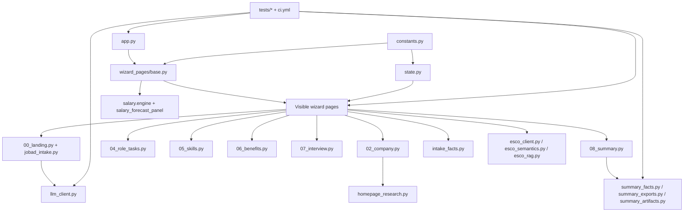

# Deep-Research-Bericht zu KleinerBaum cs_need_analysis

## Executive Summary

Der öffentliche Stand des Repositories `KleinerBaum/cs_need_analysis` ist ein Streamlit-basierter, stark zustandsbehafteter Vacancy-Intake-Wizard auf dem Branch `main`, mit einer breiten Test- und CI-Struktur, klaren kanonischen Zuständigkeitsdateien (`constants.py`, `state.py`, `llm_client.py`, `wizard_pages/*`, `summary_*`) und einer dokumentierten Gesamtarchitektur für OpenAI-Structured-Outputs, ESCO/EURES-Enrichment und nachgelagerte Summary-Artefakte. Die Commit-Historie ist aktiv; am 10. Juni 2026 wurden mehrere kleine Änderungen direkt auf `main` veröffentlicht, zuvor am 9. Juni mehrere PRs rund um Salary-Forecast-UI und ESCO-UI gemergt. citeturn29view0turn29view2turn30view0turn31view0turn36view0

Die beiden angefragten Codex-Deeplinks konnte ich inhaltlich **nicht direkt** auslesen, weil `codex://threads/<thread-id>` laut OpenAI eine **lokale Thread-Deep-Link-Struktur** für die Codex-App ist, also kein öffentlich auflösbarer Web-Transkript-Link. Die beiden ChatGPT-Share-Links konnte ich in dieser Umgebung ebenfalls nicht inhaltlich extrahieren: Shared Links sind zwar ein offizielles ChatGPT-Feature, aber der hier verfügbare Browser unterstützt keine sign-in-/auth-bezogenen Zustände; die bereitgestellten Share-URLs lieferten in dieser Sitzung nur eine Minimalhülle, nicht den Gesprächsinhalt. Deshalb stütze ich die Plan-/Soll-Analyse auf **zugängliche Stellvertreterquellen**: die offenen PRs `#511` und `#92`, die README-/AGENTS-Dokumentation sowie den bereitgestellten ZIP-Snapshot des Repos. citeturn28search0turn28search1turn28search2turn28search8turn1view0turn1view1

Die wichtigste Erkenntnis ist, dass der **größte echte Umsetzungsrückstand** nicht bei der UI, sondern bei der **kanonischen Intake-Fact-Migration** liegt. Das Repo dokumentiert bereits additive `intake_facts` und `intake_fact_evidence` im strukturierten Summary-Export sowie optionale `fact_key`-Unterstützung im `Question`-Schema; zugleich zeigt die aktuelle Implementierung nur eine **teilweise** Durchverdrahtung: Im bereitgestellten ZIP-Snapshot sind nur **13 von 39** kanonischen `FactKey`s im Write-through abgedeckt, der Question-Pack-Compiler setzt weiterhin `target_path`, aber **kein `fact_key`**, und die Summary-Oberfläche nutzt nur einen kleinen Ausschnitt der verfügbaren kanonischen Fakten. Das ist die strategisch wichtigste Lücke. Der Skills-Flow ist dagegen bereits funktional nah an der Planung; die offene PR `#511` ist vor allem ein **Konsolidierungs- und Test-Hardening-Paket**, kein komplett fehlendes Feature. citeturn25view0turn25view1turn25view2turn27view2turn35view4

Aus Umsetzungs- und Risiko-Sicht ergibt sich deshalb diese Priorisierung: **hoch** priorisiert ist die kanonische Fact-Migration in kleinen PRs; **mittel** priorisiert ist die Konsolidierung des Skills-Auto-Generate-Vertrags aus PR `#511`; **niedrig bis entscheidungsabhängig** ist PR `#92`, weil ihr ursprüngliches Zielbild inzwischen offenbar von aktueller Produktcopy überholt wurde. Parallel sollte die README-/Export-Dokumentation strikt synchron gehalten werden; genau das fordert auch `AGENTS.md`. citeturn15view0turn16view0turn17view0turn17view1turn19view0turn36view0

## Quellenlage und Grenzen

Die gewünschte Reihenfolge der Hauptquellen habe ich inhaltlich so weit wie möglich eingehalten: zuerst GitHub-/Repo-Kontext, dann OpenAI-Dokumentation zu Codex-/Share-Link-Verhalten, danach Streamlit-Dokumentation; die öffentliche Streamlit-App selbst war in dieser Sitzung nicht belastbar inspizierbar. Die belastbarsten Primärquellen für den Ist-Stand sind daher GitHub-Repo, Commit-Historie, offene PRs, CI-Workflow und die Architekturhinweise in `AGENTS.md` sowie der README-Text. citeturn29view0turn30view0turn31view0turn36view0turn35view0

Wichtig für die Interpretation: Die Soll-/Planlage aus den beiden Codex-Threads und den beiden ChatGPT-Share-Links ist **nur indirekt** rekonstruierbar. Das bedeutet: Meine Aussagen zum **aktuellen Repo-Zustand** sind hoch belastbar; meine Aussagen zur **ursprünglich geplanten Implementierung** sind dort am belastbarsten, wo sie durch offene PRs und Repo-Dokumentation explizit greifbar werden. Wo die inaccessible Links möglicherweise zusätzliche Acceptance Criteria enthielten, kennzeichne ich das als Unsicherheit. citeturn28search0turn28search1turn28search2turn1view0turn1view1

## Repository-Status und Architektur

Das Repository ist öffentlich, nutzt `main` als sichtbaren Hauptbranch und weist laut GitHub eine Historie von **1.201 Commits** auf. Die letzten sichtbaren Commits auf `main` am **10. Juni 2026** sind `d1c7d5e` (*Update summary action registry test*), `d48613b` (*texts2*), `a6ac159` (*texts*), `bacaad5` (*misc*) und `726a21c` (*flow*). Am **9. Juni 2026** wurden u. a. PRs zu Salary-Forecast-Chart/Theming und zu ESCO-Secondary-Anchor-Controls gemergt. Das spricht für ein Repo mit laufender Feinarbeit an UI-, Summary- und ESCO-Pfaden. citeturn29view0turn30view0

Die Topologie des Repos ist klar in Produktbereiche gegliedert: GitHub zeigt u. a. `.codex`, `.github/workflows`, `tests`, `wizard_pages`, `question_packs`, `salary`, `data`, `summary_*`, `esco_*`, `llm_client.py`, `state.py`, `constants.py`, `app.py` und `AGENTS.md`. Die Wizard-Seiten liegen in `wizard_pages`; sichtbar im Verzeichnis sind `00_landing.py`, `02_company.py`, `04_role_tasks.py`, `05_skills.py`, `06_benefits.py`, `07_interview.py`, `08_summary.py`, daneben auch Legacy-/Hilfsmodule wie `01a_jobspec_review.py`, `03_team.py`, `jobad_intake.py`, `base.py` und Salary-Forecast-Komponenten. README und Tests beschreiben die **aktiven sichtbaren Schritte** als: Start, Unternehmen, Rolle & Aufgaben, Skills, Benefits, Interviewprozess, Summary. citeturn29view0turn32view0turn32view2turn35view0turn35view3

Architektonisch ist das Repo bewusst **nicht** als lose Demo-App organisiert. `AGENTS.md` beschreibt eine enge Kopplung zwischen kanonischen Konstanten/Session-Keys, Session-State-Initialisierung und Reset, OpenAI-Structured-Generation und Routing, ESCO/EURES/NACE-Enrichment sowie Summary-Action-Hub-Artefakten und Exporten. Änderungen sollen stets als **Systemänderungen** verstanden werden. Als maßgebliche Dateien nennt `AGENTS.md` insbesondere `constants.py`, `state.py`, `llm_client.py`, `settings_openai.py`, `model_capabilities.py`, `wizard_pages/08_summary.py`, `wizard_pages/05_skills.py` und `scripts/openai_smoke_test.py`. citeturn36view0

Die README dokumentiert die aktuelle Produktlogik sehr konkret: Der Intake startet direkt auf der Landingpage in **drei Startphasen** – A für Quelle & Datenschutz, B für Extraktionsprüfung, C für ESCO-Suche. Es gibt drei globale Ansichtsmodi `quick`, `standard`, `expert`; die adaptive Fragenbegrenzung reagiert auf den Moduswechsel; die Salary-Sidebar soll in **allen drei Modi** angezeigt werden, sobald genügend Stelleninformationen vorliegen; und für `expert` sind zusätzliche Oberflächen freigeschaltet, etwa erweiterte ESCO-Betriebsparameter sowie der gebündelte Job-Ad-Editor/Selection-Matrix-Bereich. Die README erklärt außerdem die semantischen Exportmodi `degraded` versus `anchored` und die ESCO-Ankerzustände. citeturn35view0turn35view1turn35view3turn35view4

Die CI ist für ein Research-/Action-Review ebenfalls positiv: Der Workflow `ci.yml` läuft auf Pushes und Pull Requests auf `main`, verwendet Python 3.11, installiert per `requirements.txt` plus `constraints.txt`, führt `pip check`, `compileall`, `pytest -q` und einen `openai_smoke_test.py --ci-dry-run-if-no-key` aus. Sichtbar im `tests`-Verzeichnis sind unter anderem Testmodule für `test_openai_smoke_modes.py`, `test_question_pack_compiler.py`, `test_skills_llm_suggestions.py`, `test_state_reset.py`, `test_summary_fact_table.py`, `test_ui_mode_flow.py` und verschiedene Salary-/ESCO-/Summary-/UI-Contracts. citeturn31view0turn33view0turn33view1turn33view2turn33view3



## Plan-Ist-Abgleich

### Rekonstruierte Planbasis

Die direkte Planbasis aus den beiden unzugänglichen Codex-/ChatGPT-Links musste ich durch zugängliche Artefakte ersetzen. Die belastbarsten Planartefakte sind die offenen PRs `#511` und `#92` sowie die README-/Repo-Dokumentation. PR `#511` beschreibt explizit: **einmalige automatische Erzeugung initialer AI-Skill-Vorschläge**, Einführung eines dedizierten Session-State-Keys `SKILLS_AI_DEFAULT_GENERATED`, Integration in Initialisierung und Reset, Anpassung der Button-Copy und konkrete Tests dafür, dass die Default-Generierung genau einmal läuft, mit festem Count `5`, und bei bereits vorhandenen Vorschlägen übersprungen wird. citeturn15view0turn16view0

PR `#92` beschreibt ein anderes, deutlich kleineres UX-Ziel: Der Upload-/Analyse-Button im Start-Intake soll optisch wie der primäre Navigationsbutton wirken und textlich in „Investigiere!“ umbenannt werden. Die PR nennt sogar Test-/Lint-Ergebnisse: `ruff check` für die Zieldatei grün, `ruff format --check .` mit bereits vorher bestehenden Format-Abweichungen an anderer Stelle. citeturn17view0turn17view1turn17view2

Die README liefert die breitere Soll-Landschaft: drei UI-Modi, Start-Phasen A/B/C, Expertenmodus mit erweitertem ESCO-Betriebsblock, Salary-Forecast in allen Modi, einheitliche Blockreihenfolgen in den Fachschritten, strukturierte Summary-Exporte mit `semantic_export_mode`, ESCO-Ankern, Fragefluss-Provenance und – sofern vorhanden – additiven `intake_facts` und `intake_fact_evidence`. Zugleich sagt die README klar, dass der ESCO-Offline-Index **nur teilweise** implementiert ist und eine vollständige offizielle Datensatz-Ingestion weiterhin Zukunftsthema bleibt; außerdem sind ESCO-Qualifications explizit **post-MVP**. citeturn35view0turn35view1turn35view3turn35view4turn34view3turn34view4

### Vergleichstabelle Plan gegen Ist

| Themenfeld | Rekonstruierter Soll-Zustand | Aktueller Ist-Zustand | Bewertung |
|---|---|---|---|
| Skills-AI-Default-Generierung | Einmalig initial generieren, separater SSKey, Reset-Verhalten, dedizierte Tests, angepasste Copy | Funktional bereits weitgehend vorhanden; in `main` existiert bereits ein Once-Only-Verhalten, aber unter anderem Key-Namen und mit anderer Copy; Tests aus PR `#511` fehlen noch | **Teilweise umgesetzt** |
| Upload-/Analyse-CTA im Start | „Investigiere!“ + Style angleichen | `main` nutzt bereits `"Analyse starten"` mit `width="stretch"` und ohne explizites `type="primary"`; das PR-Ziel wirkt gegenüber aktueller Produktcopy veraltet | **Eher obsolet/stale** |
| Kanonische Intake-Facts | Fakturnahe Durchverdrahtung in UI, State, Summary, Export, Coverage | Schema und Exportpfade sind vorbereitet; Compiler und Write-through sind nur teilweise verdrahtet | **Größte Lücke** |
| UI-Modi | `quick`, `standard`, `expert` mit adaptiver Begrenzung und Expert-Sonderflächen | Dokumentiert und im Repo/Testlayout breit angelegt | **Weitgehend umgesetzt** |
| Strukturierter ESCO-Export | `degraded`/`anchored`, Anchor-Provenance, Runtime-Meta | README dokumentiert diese Felder, Current Repo enthält zugehörige Module und Tests | **Weitgehend umgesetzt** |
| Vollständige offizielle ESCO-Ingestion | dedizierter Importpfad für RDF/TTL/XML/JSON-LD | Laut README noch bewusst nicht voll umgesetzt | **Nicht umgesetzt, aber bekanntes Future-Scope-Thema** |

Die erste Tabelle lässt sich mit drei belastbaren Schlüssen lesen. Erstens: **PR `#511` ist kein „Feature fehlt komplett“**, sondern ein **Refactoring-/Contract-Completion-PR**. Zweitens: **PR `#92` ist nach aktuellem Stand wahrscheinlich nicht einfach „noch offen“, sondern fachlich überholt**, weil `main` textlich schon eine modernere, verständliche CTA besitzt. Drittens: Die **kanonische Fact-Migration** ist das Feld, in dem sich Dokumentation, Schema-Unterstützung und echte Runtime-Abdeckung noch am stärksten voneinander unterscheiden. citeturn15view0turn16view0turn17view0turn17view1turn19view0turn25view0turn25view1turn25view2turn27view2turn35view4

### Präzisierte Befunde zu den wichtigsten Lücken

Im Skills-Fluss zeigt `main` bereits die Kernidee der automatischen Erstgenerierung: Die README positioniert Skills als zentralen triagierten Source-Pill-Schritt, und die aktuelle Public-Version enthält weiterhin einen Secondary-AI-Buttontext „Weitere Skill-Vorschläge anzeigen“, während PR `#511` stattdessen „Weitere AI-Skill-Vorschläge generieren“ und den formelleren Key `SKILLS_AI_DEFAULT_GENERATED` einführen will. Zusammen mit den PR-Tests ist klar: Das Ziel ist hier vor allem **kanonische Konsistenz** von State-Key, Helper-Funktion, Reset-Verhalten und Testvertrag. citeturn16view0turn22view0turn22view1turn22view3

Im Intake-/Start-CTA ist die Lage anders: PR `#92` spricht von einem Wechsel vom Symbol `"⬆"` zu `"Investigiere!"`, aber `main` verwendet bereits `"Analyse starten"` mit `width="stretch"` und Hilfetext. Das heißt praktisch: Die PR beschreibt sehr wahrscheinlich ein **früheres UI-Delta**, das von der aktuellen Hauptlinie bereits überholt wurde. Wenn die Produktseite heute „Analyse starten“ bevorzugt, sollte PR `#92` eher **geschlossen oder neu formuliert** werden, statt unverändert gemergt zu werden. citeturn17view0turn17view1turn19view0

Bei den kanonischen Facts ist die Diskrepanz architekturell am größten. Das `Question`-Schema kennt schon ein optionales `fact_key`; der Question-Pack-Compiler baut `Question`-Objekte aber weiterhin ohne `fact_key`; `summary_facts.py` ist bereits so gebaut, dass bei Vorhandensein der kanonischen Fakten diese gegenüber Fallback-Werten bevorzugt werden; und die README bewirbt additive `intake_facts` plus `intake_fact_evidence` bereits im Summary-Export. Das ist ein klassischer Fall von „Schema und Downstream sind vorbereitet, Midstream und UI-Wiring aber noch unvollständig“. citeturn25view0turn25view1turn25view2turn27view2turn35view4

### Relevante Code-Snippets aus dem ZIP-Snapshot

**Aktueller Skills-Once-Only-Mechanismus im ZIP-Snapshot**  
_Datei: `wizard_pages/05_skills.py`, ca. Zeilen 2066–2075_

```python
should_auto_generate_ai = not initial_ai_generated and not existing_llm
if not initial_ai_generated and existing_llm:
    st.session_state[SSKey.SKILLS_AI_INITIAL_GENERATED.value] = True
if should_auto_generate_ai or generate_ai_clicked:
    st.session_state[SSKey.SKILLS_AI_INITIAL_GENERATED.value] = True
    target_skill_count = 5 if should_auto_generate_ai else int(
        st.session_state.get(SSKey.SKILLS_SUGGEST_COUNT.value, 5)
    )
    with st.spinner("Generiere Skill-Vorschläge …"):
        _generate_ai_skill_suggestions(
            job=job,
            suggestion_context=suggestion_context,
            target_skill_count=target_skill_count,
        )
```

Das bestätigt: Der Kern der Soll-Logik ist schon da; die offene PR ergänzt vor allem **Benennung, Kapselung und Tests**.

**Aktueller Question-Pack-Compiler ohne `fact_key`-Vergabe**  
_Datei: `question_packs/registry.py`, ca. Zeilen 18–40_

```python
def _pack_entry(...):
    question = Question(
        id=question_id,
        label=label,
        help=help_text,
        answer_type=answer_type,
        required=required,
        options=options,
        target_path=target_path or f"answers.{step_key}.{question_id}",
        priority=priority,
        group_key=group_key,
    )
```

Das erklärt den größten Migrationsstau: Das Schema kann `fact_key`, die Packs liefern ihn aber nicht mit.

## Änderungspakete pro Datei

Die folgenden Zeilenangaben beziehen sich auf den **bereitgestellten ZIP-Snapshot**. Die dazugehörige öffentliche Repo-/PR-Kontextlage ist jeweils über die genannten GitHub-Quellen belegt. citeturn15view0turn16view0turn17view0turn19view0turn25view0turn25view1turn27view2

### Höchste Priorität

| Zweck | Dateien und lokale Zeilen | Priorität | Aufwand | Risiko | Empfohlene Schritte | Tests |
|---|---|---:|---:|---|---|---|
| Kanonische Intake-Fact-Migration fortsetzen | `intake_facts.py:25–57`, `question_packs/registry.py:18–40`, `wizard_pages/02_company.py`, `04_role_tasks.py`, `05_skills.py`, `06_benefits.py`, `07_interview.py`, `wizard_pages/08_summary.py:2047–2075` | Hoch | 18–28 h | Mittel | Write-through-Mapping von 13 auf alle fachlich relevanten FactKeys ausweiten; UI-Schreibpfade auf `write_intake_fact()`/Evidence erweitern; `fact_key` im Compiler und in ausgewählten Questions verdrahten; Summary-Fakttabelle über die bisherige Kernmenge hinaus ausbauen | `pytest -q`; neue/erweiterte Tests in `test_fact_contract.py`, `test_question_pack_compiler.py`, `test_summary_fact_table.py`, neue Write-through-Tests |
| Fact-Key-Plumbing aktivieren | `question_packs/registry.py:18–40`, ggf. Pack-Definitionen mit neuem optionalem Argument; **kein Schema-Umbau nötig**, da `schemas.py:444–446` bereits vorbereitet ist | Hoch | 6–10 h | Niedrig bis mittel | `_pack_entry(..., fact_key: str | None = None)` ergänzen; `Question(...)` mit `fact_key=fact_key` bauen; zuerst Kernfragen je Schritt verbinden, danach Coverage erhöhen | `test_question_pack_compiler.py`, `test_schema_contracts.py`, neue Snapshot-Tests für `fact_key` im Plan |
| Summary-Fact-Board konsistent auf Intake-Facts heben | `wizard_pages/08_summary.py:2047–2075`, `summary_facts.py` | Hoch | 4–6 h | Niedrig | Kernprofil um zusätzliche faktengestützte Zeilen erweitern; Status/Quelle strikt aus Evidence ableiten; Fallback auf `job_extract` nur dort, wo noch keine Fact-Abdeckung existiert | `test_summary_fact_table.py`, `test_summary_exports.py`, `test_summary_export_payload.py` |

### Mittlere Priorität

| Zweck | Dateien und lokale Zeilen | Priorität | Aufwand | Risiko | Empfohlene Schritte | Tests |
|---|---|---:|---:|---|---|---|
| Skills-Auto-Generate-Vertrag aus PR `#511` konsolidieren | `constants.py:402–404`, `state.py:363–365`, `state.py:544–546`, `wizard_pages/05_skills.py:1455–1515`, `05_skills.py:2066–2075`, `tests/test_skills_llm_suggestions.py`, `tests/test_state_reset.py:147–149` | Mittel | 3–5 h | Niedrig | Entscheiden: bestehenden Key `SKILLS_AI_INITIAL_GENERATED` beibehalten oder auf PR-Namen `SKILLS_AI_DEFAULT_GENERATED` umbenennen; Logik in Helper kapseln; Button-Text konsistent auf „AI“ angleichen; Tests aus PR übernehmen bzw. auf endgültigen Key-Namen anpassen | `test_skills_llm_suggestions.py`, `test_state_reset.py`, zusätzlich UI-smoke für Skills-Step |
| README/AGENTS-Dokumentation strikt nachziehen | `README.md`, ggf. `CHANGELOG.md` | Mittel | 2–3 h | Niedrig | Nach jeder Fact-/Skills-Änderung README-Claims gegen echten Runtime-Stand spiegeln; offene PRs daraufhin prüfen, ob ihr Beschreibungstext noch stimmt | Manuelle Review + `pytest -q` + README-Check im PR |

### Niedrige oder entscheidungsabhängige Priorität

| Zweck | Dateien und lokale Zeilen | Priorität | Aufwand | Risiko | Empfohlene Schritte | Tests |
|---|---|---:|---:|---|---|---|
| UX-Entscheid für Start-CTA treffen | `wizard_pages/jobad_intake.py:453–456` | Niedrig | 0,5–1 h | Niedrig | Produktentscheidung treffen: `Analyse starten` beibehalten oder `Investigiere!` bewusst einführen; PR `#92` vermutlich nicht blind mergen, sondern neu auf aktuellen Stand rebased oder schließen | UI-Regressionstest für Intake-CTA, ggf. `ruff check wizard_pages/jobad_intake.py` lokal |
| Vollständige offizielle ESCO-Ingestion designen | `scripts/build_esco_index.py`, `esco_offline_index.py`, `esco_client.py`, Metadatenmodell | Niedrig bis strategisch | 12–20 h nur für Design/Scoping, deutlich mehr für Vollumsetzung | Hoch | Nur starten, wenn Produktziel bewusst erweitert wird; README nennt dies klar als Future Scope, nicht als Bug | Neue Contract-/Integrationstests für Import- und Runtime-Pfade |

### Empfohlene Minimal-Diffs

Für das Skills-Paket würde ich den Change wirklich klein halten: **entweder** den vorhandenen Namen `SKILLS_AI_INITIAL_GENERATED` als kanonischen Namen akzeptieren und nur Tests + Helper + Button-Text aus PR `#511` übernehmen, **oder** konsequent auf `SKILLS_AI_DEFAULT_GENERATED` umstellen und dann exakt die von `AGENTS.md` geforderte Vollsynchronisierung erledigen: `constants.py`, `state.init_session_state()`, `state.reset_vacancy()`, betroffene UI, Reset-Test. Genau dieses Synchronisierungsmuster ist in `AGENTS.md` ausdrücklich vorgeschrieben. citeturn15view0turn16view0turn36view0

Für die Fact-Migration würde ich **nicht** mit „alles auf einmal“ anfangen. Stattdessen würde ich die Migration in PR-große, fachlich geschnittene Pakete aufteilen: zuerst Company-/Role-Kernfakten, dann Skills/Benefits, dann Interview-Termine/Kontakte, danach Summary-Board und Export-Coverage. Das minimiert Regressionen in einem Repo, dessen Architektur bewusst starke Koppelung zwischen State, UI, Export und Dokumentation vorsieht. citeturn36view0turn35view4

## Modus-Matrix und Timeline

### Matrix nach UI-Modus

| Bereich | quick | standard | expert | Bewertung |
|---|---|---|---|---|
| Sichtbare Navigationsschritte Start → Summary | Ja | Ja | Ja | Implementiert |
| Adaptive Fragenbegrenzung | Ja, reduziert | Ja, reduziert | Ja, voll | Implementiert |
| Detailgruppen standardmäßig offen | Nein | Nein | Ja | Implementiert |
| Salary-Forecast-Sidebar | Ja | Ja | Ja | Implementiert |
| Start-Phasen A/B/C | Ja | Ja | Ja | Implementiert |
| ESCO-Betriebsblock Basiskonfiguration | Ja | Ja | Ja | Implementiert |
| Erweiterte ESCO-Steuerung Stable/Preview, Runtime-Lane, API-Modus | Nein | Nein | Ja | Implementiert, expert-only |
| Job-Ad-Editor / Selection-Matrix im erweiterten Bereich | Nein | Nein | Ja | Implementiert, expert-only |
| Skills-Default-AI-Vorschläge einmalig | Im Kern ja, aber Contract/Test unvollständig | Im Kern ja, aber Contract/Test unvollständig | Im Kern ja, aber Contract/Test unvollständig | Teilweise |
| Vollständige kanonische Fact-Abdeckung | Nein | Nein | Nein | Fehlend/teilweise |
| Vollständige offizielle ESCO-Offline-Ingestion | Nein | Nein | Nein | Future Scope |

Die Modus-Matrix zeigt ein wichtiges Muster: Die produktseitigen UI-Modi sind **nicht** der Haupt-Engpass. Die meisten Modus-Funktionen sind bereits dokumentiert und plausibel implementiert. Die verbliebenen Defizite – Skills-Contract-Härtung, Fact-Migration, Summary-Fact-Abdeckung – treffen **alle Modi**. Das spricht dafür, zuerst **mode-agnostische Kernlogik** zu stabilisieren, bevor weitere Expert- oder UI-Sonderfälle gebaut werden. citeturn35view0turn35view1turn35view3

### Umsetzbare Timeline

| Zeitfenster | PR-Ziel | Inhalt | Ergebnis |
|---|---|---|---|
| Tag eins | PR A | Skills-Contract aus `#511` konsolidieren | Sauberer SSKey-/Reset-/Test-Vertrag für Once-Only-Skills |
| Tag zwei bis drei | PR B | Company-/Role-Facts write-through + `fact_key` für Kernfragen | Sichtbare Erhöhung der kanonischen Fact-Coverage |
| Tag vier | PR C | Summary-Fact-Board auf neue Facts heben | Mehr faktenbasierte Summary-Zeilen, bessere Provenance |
| Tag fünf bis sechs | PR D | Skills-/Benefits-/Interview-Fact-Coverage erweitern | Durchgängigerer Export-/UI-/State-Pfad |
| Nachgelagert | PR E | CTA-Entscheid aus `#92` treffen oder PR schließen | Bereinigter PR-Backlog, keine stale UX-PR |
| Später, separat | Discovery/ADR | Vollständige ESCO-Ingestion scopen | Bewusste Produktentscheidung statt Nebenbei-Implementierung |

### Verifikation und technische Prüfschritte

Die vorhandene CI gibt bereits den besten Basispfad vor. Für jede PR würde ich mindestens dieselben Prüfungen lokal fahren, mit optionalem Dry-Run für OpenAI, damit kein API-Key zwingend erforderlich ist: Python 3.11, Installation über `requirements.txt` plus `constraints.txt`, dann `pip check`, `python -m compileall ...`, `python -m pytest -q` und `python scripts/openai_smoke_test.py --mode all --ci-dry-run-if-no-key --json-only`. Diese Prüfkette ist im aktuellen CI-Workflow explizit hinterlegt. citeturn31view0

## Offene Fragen und konsultierte Quellen

### Offene Fragen und Limitationen

Die größte Limitation dieses Berichts ist die fehlende Direktlesbarkeit der zwei Codex-Threads und der zwei ChatGPT-Share-Links. Deshalb kann ich **nicht garantieren**, dass dort zusätzliche, feinere Acceptance Criteria standen, die weder in PRs noch in README/Repo-Doku auftauchen. Für den Ist-Stand des Codes und für die hier priorisierten Änderungspakete reicht die Evidenz aber aus. citeturn28search0turn28search1turn28search2turn1view0turn1view1

Ebenfalls offen bleibt, ob die UX-Idee aus PR `#92` fachlich noch gewünscht ist. Aus heutiger Sicht spricht mehr dafür, dass diese PR **historisch überholt** ist; das sollte jedoch intern produktseitig bestätigt werden, bevor sie geschlossen oder ersetzt wird. citeturn17view0turn17view1turn19view0

### Konsultierte Quellen

Die wichtigsten konsultierten Quellen waren:

| Quelle | Zweck |
|---|---|
| Repo-Hauptseite und Verzeichnisstruktur citeturn29view0turn29view2 | Branch, Historie, Schlüsselverzeichnisse, README-Einbettung |
| Commit-Historie auf `main` citeturn30view0 | Letzte Commits und jüngste Aktivität |
| CI-Workflow `ci.yml` citeturn31view0 | Verifikation, Python-Version, Testpfad |
| `AGENTS.md` citeturn36view0 | Architekturregeln, Synchronisationspflichten, kanonische Dateien |
| README-Abschnitte zu Wizard, UI-Modi, Salary, ESCO-Export und Offline-Index citeturn35view0turn35view1turn35view3turn35view4turn34view3turn34view4 | Produkt-Sollbild und dokumentierter Funktionsumfang |
| PR `#511` citeturn15view0turn16view0 | Geplante Skills-Default-Generierung, Key, Tests, Acceptance Criteria |
| PR `#92` citeturn17view0turn17view1turn17view2 | Geplanter Start-CTA-Umbau |
| Aktuelle Dateien `constants.py`, `state.py`, `05_skills.py`, `jobad_intake.py` auf `main` citeturn22view0turn22view1turn22view3turn19view0 | Gegenprüfung des Ist-Stands |
| `Question`-Schema und Question-Pack-Compiler citeturn25view0turn25view1turn25view2 | Nachweis der Fact-Key-Lücke |
| `summary_facts.py` citeturn27view2 | Nachweis, dass Intake-Facts im Summary bereits bevorzugt werden |
| OpenAI Codex-/Share-Link-Dokumentation citeturn28search0turn28search1turn28search2turn28search8 | Begründung für die Unerreichbarkeit von Codex-/Share-Inhalten |
| Streamlit-Dokumentation zu aktuellen UI-APIs citeturn20search0turn20search1turn20search10 | Kontext für moderne Streamlit-Widget-/HTML-/Iframe-Nutzung |

**Kurzfazit:**  
Wenn das Ziel ist, den Abstand zwischen geplanter und realer Implementierung maximal effizient zu schließen, dann sollten Sie **nicht** mit der alten CTA-PR anfangen, sondern mit **kanonischer Fact-Migration** und direkt danach mit der **Skills-Contract-Konsolidierung** aus PR `#511`. Genau dort ist der größte Hebel pro Entwicklungsstunde.