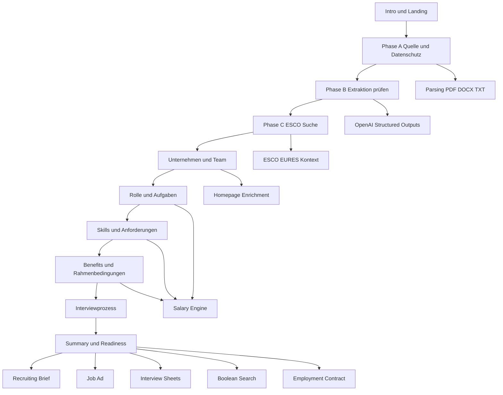

# Tiefenrecherche zum Repository KleinerBaum cs_need_analysis

## Executive Summary

Das Repository `KleinerBaum/cs_need_analysis` ist kein kleiner Demo-Prototyp, sondern eine umfangreiche, zustandsbehaftete Streamlit-Anwendung für strukturiertes Vacancy Intake beziehungsweise Recruitment-Need-Analysis mit OpenAI-gestützter Jobspec-Extraktion, ESCO/EURES-Anreicherung, Gehaltsprognose, Interviewprozess-Erfassung sowie Summary-, Artefakt- und Export-Workspaces. Die Projekt-Dokumentation beschreibt den aktiven Wizard als Kette aus `intro`, `landing`, `company`, `role_tasks`, `skills`, `benefits`, `interview` und `summary`; die früheren separaten Schritte `jobspec_review` und `team` sind ausdrücklich als legacy/non-routable markiert. Ebenso dokumentiert das Repo selbst, dass ESCO-Bulk-Ingestion, fortgeschrittene Matrix-/Benchmarking-Funktionen sowie repo-lokale Ruff-/Black-/Mypy-/Pyright-Konfigurationen noch nicht vollständig umgesetzt sind und CI derzeit auf Installationscheck, Compile, Pytest und OpenAI-Smoke-Dry-Run setzt. citeturn8view0turn7view0turn7view1

Mein Gesamturteil lautet: **fachlich weitgehend vollständig, technisch solide, aber an mehreren Stellen noch nicht ausreichend gehärtet**. Besonders stark sind der kanonische Vertragsansatz rund um `constants.py`, `state.py`, `schemas.py` und `intake_facts.py`, die breite Unit-/Regressionstestbasis sowie die klare Produktlogik rund um ESCO-Anker, Summary-Readiness und Artefakt-Generierung. Die größten Risiken liegen dagegen in sehr großen Hotspot-Dateien wie `wizard_pages/08_summary.py`, `ui_components.py`, `llm_client.py` und `wizard_pages/05_skills.py`, in einem hohen Coupling über Session-State, in Sicherheitskanten bei Homepage-Fetching und Upload-Verarbeitung sowie in fehlenden Browser-E2E-, Lint-, Typ- und Security-Gates. citeturn8view0turn7view0turn7view1turn10search0turn10search2turn10search6

Wichtig für die Begriffsklärung: Der im Repo sichtbare **“Need Analysis”**-Bezug ist zweigeteilt. Einerseits gibt es eine explizite, visuelle Iceberg-Komponente als erklärendes Produktmodell auf Intro/Landing. Andererseits ist der operative Kern des Produkts inzwischen ein integrierter Vacancy-Intake-Wizard, in dem Need-Analysis-Logik direkt in die Start-Phasen, die Downstream-Fragen, die ESCO-Semantik und die Summary-Artefakte eingebettet ist, statt als separater eigener Wizard zu existieren. Das ist aus Produktsicht sinnvoll, erzeugt aber Dokumentations- und Architekturdrift, wenn Begriffe wie “Need Analysis Wizard” und “Vacancy Intake Wizard” nicht konsequent synchronisiert werden. citeturn8view0turn7view0

## Vorgehen und Evidenzbasis

Ich habe die Untersuchung in dieser Reihenfolge durchgeführt:

1. **Live-Repository auf GitHub geöffnet** und die zentralen Projektquellen geprüft: Repo-Root, `README.md`, `AGENTS.md`, Workflow `ci.yml` sowie mehrere Kernmodule und Testdateien.
2. **Den bereitgestellten Snapshot** `/mnt/data/cs_need_analysis-main.zip` lokal entpackt und als Arbeitsstand analysiert.
3. **Vollständige Dateiinventur** des Snapshots erstellt und alle enthaltenen Dateien systematisch nach Verzeichnis gegliedert erfasst.
4. **Statische Python-Analyse** durchgeführt: Syntax-/AST-Prüfung aller Python-Dateien, Größen-/Hotspot-Auswertung, grobe Kopplungsanalyse, Grep-basierte Scans zu Sicherheit, Caching, Uploads, HTML-Rendering und Telemetrie.
5. **`compileall` ausgeführt**; die statische Kompilierung der relevanten Quellbäume lief erfolgreich durch.
6. **`pytest -q` versucht**; die vollständige Testausführung konnte im Sandbox-Kontext nicht abgeschlossen werden, weil Abhängigkeiten wie `streamlit` ohne Paketindexzugriff nicht installierbar waren. Das ist ein Analyse-Limit der Umgebung, nicht automatisch ein Repo-Fehler.
7. **Die projektinterne CI-Definition** als primäres Ausführungssignal für den Normalfall herangezogen: Installation, `pip check`, `compileall`, `pytest -q` und OpenAI-Smoke-Dry-Run sind dort fest verdrahtet. citeturn7view1
8. **Außenquellen nur ergänzend** eingesetzt: offizielle ESCO-, Streamlit- und OpenAI-Dokumentation, um Architektur- und Verbesserungsempfehlungen an Primärquellen zu spiegeln. Für ESCO ist dabei besonders relevant, dass ESCO eine mehrsprachige europäische Klassifikation für Berufe, Fähigkeiten und Kompetenzen ist, über APIs und Downloads bereitgestellt wird und aktuell offiziell als ESCO v1.2 ausgewiesen wird. citeturn15search1turn15search2turn15search3turn15search14

In meiner lokalen Snapshot-Analyse umfasst der Arbeitsstand **227 Dateien**, darunter **179 Python-Dateien** und **89 Testdateien**. Die statische Python-Kompilierung war erfolgreich; die Testbasis ist für ein Streamlit-Projekt ungewöhnlich breit. Gleichzeitig gibt es in der Analyseumgebung keine vollständige installierbare Runtime, weshalb ich **Code, Teststruktur und CI-Konfiguration** als belastbarere Reife-Indikatoren gewichtet habe als einen nicht reproduzierbaren lokalen “alles grün”-Anspruch.

## Architektur, Wizard-Status und Vollständigkeit

Die Repo-Dokumentation beschreibt eine klare, stufenweise Informationsgewinnung: Quelle/Datenschutz, Jobspec-Extraktionsreview, ESCO-Anker, Unternehmens- und Teamkontext, Rollen-/Skill-/Benefit-Kuration, Interviewprozess sowie Summary-Readiness mit Folgeartefakten. Diese Beschreibung ist im `README` und in `AGENTS.md` konsistent angelegt; dort wird auch ausdrücklich festgelegt, dass `constants.py` die Single Source of Truth für Step-IDs, Session-Keys, UI-Modi und kanonische IDs ist. citeturn8view0turn7view0



### Vollständigkeitsmatrix des operativen Wizards

| Bereich | Status | Begründung |
|---|---|---|
| Intro-Schritt | **Implementiert** | In `AGENTS.md` als aktiver erster Schritt dokumentiert; Tests und lokale Dateistruktur bestätigen `wizard_pages/00_intro.py`. citeturn7view0 |
| Start/Phase A–C | **Implementiert** | Quelle/Datenschutz, Extraktionsreview und ESCO-Suche sind im Start-Schritt integriert; ein separater `jobspec_review`-Schritt existiert bewusst nicht mehr. citeturn8view0turn7view0 |
| ESCO-Anker mit degraded fallback | **Implementiert** | Repo-Dokumente beschreiben bestätigten Primäranker, optionale Kontextanker und degradierte Fortsetzung ohne harten Abbruch. citeturn8view0turn15search2turn15search10 |
| Unternehmens- und Teamkontext | **Implementiert** | Laut Dokumentation inklusive Website-Enrichment und Teamkontext im Company-Step. citeturn8view0turn7view0 |
| Rolle/Skills/Benefits | **Implementiert** | Einheitliche Source-Pill-Logik und Salary-Block dokumentiert. citeturn8view0 |
| Interviewprozess | **Implementiert** | Als eigener Fachschritt mit Workflow-Board und exportrelevanten Werten dokumentiert. citeturn8view0turn7view0 |
| Summary/Action Hub/Artefakte | **Implementiert** | Readiness, Faktentabelle, Artefaktpipeline und Exporte sind ausdrücklich Kernbestandteil der aktuellen Implementierung. citeturn8view0turn7view0 |
| Need-Analysis-Iceberg als erklärende UX | **Implementiert** | Im Snapshot klar vorhanden und eigenständig getestet; funktional eher Produkt-Explainer als eigener operativer Step. |
| ESCO-Bulk-Ingestion | **Partial** | Repo beschreibt die Offline-Index-Route ausdrücklich als lookup-fokussiert; vollständige Bulk-Ingestion ist nicht umgesetzt. citeturn8view0turn15search14 |
| ESCO-Matrix-Coherence/Benchmarking | **Partial** | Matrix-Priors sind optional; fortgeschrittene Metriken fehlen laut Repo-Status. citeturn8view0 |
| Lint-/Type-Gates | **Partial bis Missing** | Repo nennt selbst das Fehlen repo-lokaler Ruff-/Black-/Mypy-/Pyright-Konfigurationen. citeturn8view0 |
| Browser-E2E | **Missing im Snapshot** | Es gibt viele Unit-/Regressionstests, aber keine Playwright-/Selenium-/Cypress-Spur im Snapshot. |

### Fachliche Einordnung des ESCO-Einsatzes

Der ESCO-Einsatz des Repositories ist konzeptionell richtig positioniert. ESCO ist laut EU-Kommission eine mehrsprachige Klassifikation für Berufe, Fähigkeiten und Kompetenzen samt API- und Download-Zugängen; der größte Mehrwert liegt in Normalisierung, Vergleichbarkeit, Matching und digitaler Interoperabilität — nicht in einer fertigen Benefit-Taxonomie oder in kanonisch vorformulierten Interviewfragen. Genau das reflektiert auch das Repo: ESCO dient dort als semantischer Anker, Skill-/Kontextquelle und Exportmetadatenbasis, nicht als Allzweck-Contentgenerator. Das ist architektonisch vernünftig. citeturn15search1turn15search5turn15search10turn10search13

## Qualitätsbild, Risiken und Prioritäten

Die stärksten Architekturentscheidungen des Projekts sind die **kanonische Vertragsführung**, die **explizite Wizard-Route**, die **schemaorientierte LLM-Einbettung** sowie die **breite Regressionstestbasis**. Positiv hervorzuheben ist auch, dass das Repository selbst die wichtigsten Invarianten dokumentiert: Single Source of Truth in `constants.py`, zentrale OpenAI-Settings-Auflösung in `settings_openai.py`, zentrales Request-Building und Error-Mapping in `llm_client.py` sowie privacy-sensitive Logging nur mit freigegebener Metadaten-Auswahl. citeturn7view0turn8view0

Gleichzeitig ist die **technische Wartbarkeit bereits sichtbar angespannt**. In der lokalen Analyse dominieren einige sehr große Hotspots: `wizard_pages/08_summary.py`, `ui_components.py`, `llm_client.py`, `wizard_pages/05_skills.py`, `wizard_pages/base.py` und `wizard_pages/jobad_intake.py`. Dazu kommen sehr stark referenzierte Kernmodule wie `constants`, `schemas`, `state`, `llm_client` und `ui_components`. Das ist funktional noch beherrschbar, aber es erhöht Defektwahrscheinlichkeit, Review-Aufwand und Merge-Risiko bei jeder größeren Änderung.

### Hotspot-Dateien mit höchster Änderungs- und Regressionsgefahr

| Datei | Lokale Auffälligkeit | Hauptproblem |
|---|---|---|
| `wizard_pages/08_summary.py` | größter Runtime-Hotspot | zu viele Verantwortlichkeiten: Readiness, Artefakte, Exporte, Rendering, Fingerprints, State |
| `ui_components.py` | sehr groß und breit gekoppelt | UI-Monolith mit hohem Seiteneffekt-Risiko |
| `llm_client.py` | zentraler Integrations-Hub | Prompting, Routing, Caching, Fehlerbehandlung und Fallbacks in einer Datei |
| `wizard_pages/05_skills.py` | fachlich komplex | Skill-Normalisierung, ESCO, Matrix, UI-Kuration in einem Modul |
| `wizard_pages/base.py` | Shell-/Routing-/Layout-Basis | hohe Querschnittslast |
| `homepage_research.py` | sicherheitsrelevant | Outbound Fetching, Redirects, Parsing und Logging in einem sensiblen Bereich |

### Zentrale Stärken und Schwächen im direkten Vergleich

| Dimension | Stärken | Schwächen | Empfehlung |
|---|---|---|---|
| Domänenmodell | klare kanonische Konstanten und Faktenregistry | hohe Coupling-Dichte | in kleinere, vertikale Module aufspalten |
| Streamlit-State | bewusst stateful, workflowgeeignet | Session-State breitet sich stark aus | typed access layer und State-Repository |
| LLM-Integration | strukturierte Outputs, Capability-Gating, Caching | monolithischer Client, Cache ohne klare Eviction-Policy | Funktionsbündel trennen, Cache begrenzen |
| ESCO-Integration | fachlich sinnvoll, degrade-fähig, exportrelevant | Vollständigkeit bewusst begrenzt | Guardrails härten, Offline-Pfade besser operationalisieren |
| Tests | sehr breite Unit-/Regressionstiefe | keine Browser-E2E, keine Security-/Perf-Suites | Playwright + Sicherheits- und Lasttests ergänzen |
| Build/CI | klare Basiskette in GitHub Actions | keine Linter, Typchecker, Locks, Security-Scans | QA-Gates schrittweise ausbauen |

Die Performance- und State-Themen sind für Streamlit besonders relevant. Die offiziellen Streamlit-Dokumente unterscheiden klar zwischen `st.cache_data`, `st.cache_resource`, Session State und fragment-basierten Teil-Reruns. `st.cache_resource` teilt Objekte global über Sessions und verlangt thread-safe Ressourcen; Session State ist pro Session; Forms batchen Eingaben; Fragmente können nur Teilbereiche neu ausführen und so große Apps deutlich effizienter machen. Das passt direkt zu den beobachteten Hotspots des Repositories und begründet mehrere meiner Verbesserungsprioritäten. citeturn10search0turn10search2turn10search6turn10search12turn10search15turn13search0turn13search2turn13search6

## DateifürDatei Analyse

Für die nachfolgende Analyse gilt: **Die Bewertung von Abhängigkeiten, Tests, Codequalität, Sicherheit, Performance, Edge Cases, UX-Lücken und Wartbarkeit erfolgt jeweils auf Verzeichnis- bzw. Modulcluster-Ebene; die Tabellen listen anschließend jede einzelne Datei des Snapshots.** So bleibt die Analyse vollständig, ohne dieselben Befunde 227-mal zu wiederholen.

**Legende:**  
**Aktiv** = operative Runtime-Datei  
**Legacy** = bewusst nicht routbar / Altpfad  
**Doc/Asset** = statische Doku oder Ressourcen-Datei  
**Test** = Pytest-Datei

### Kernruntime und Root-Dateien

Gesamtbild: Hier liegen die fachlichen Kernmodule. Positiv sind die kanonischen Verträge (`constants.py`, `schemas.py`, `state.py`, `intake_facts.py`) und die klare Trennung zwischen Parsing, ESCO, Summary, Salary und LLM-Aufgaben. Negativ fallen vor allem sehr große Dateien, ein breiter Session-State-Footprint, teils fehlende harte Sicherheitsgrenzen bei Fetching/Uploads sowie der Mix aus Runtime- und Dev-Abhängigkeiten in `requirements.txt` auf. Das Repo dokumentiert selbst, dass lokale Lint-/Type-Konfigurationen fehlen; CI prüft stattdessen Installation, Compile, Tests und OpenAI-Smoke-Dry-Run. citeturn8view0turn7view0turn7view1

| Datei | Status | Zweck | Kurzbewertung |
|---|---|---|---|
| `.gitignore` | Aktiv | Git-Artefaktfilter | zweckmäßig |
| `AGENTS.md` | Aktiv | Repo-Kontrakt für Agenten/Entwicklung | sehr wertvoll; gut gepflegt |
| `CHANGELOG.md` | Aktiv | Änderungsverlauf | nützlich, aber Drift-Risiko zu README/Code |
| `LICENSE` | Aktiv | MIT-Lizenz | unkritisch |
| `README.md` | Aktiv | Produkt-, Architektur- und Setup-Dokumentation | informativ; leichte Drift zum Snapshot wahrscheinlich |
| `app.py` | Aktiv | Streamlit-Entrypoint, Routing, Sidebar, Theme-Injektion | zentral; mittleres Regressionsrisiko |
| `constants.py` | Aktiv | kanonische IDs, Step-Keys, Session-Keys, Faktenregistry | essenziell; zu groß für langfristige Wartung |
| `constraints.txt` | Aktiv | Constraints für kritische Abhängigkeiten | zu schmal, nur OpenAI gepinnt |
| `document_preview.py` | Aktiv | HTML-/Dokumentvorschau für Uploads/Artefakte | gute Escape-Tendenz; Renderinglogik könnte getrennt werden |
| `esco_client.py` | Aktiv | API-/Index-Lookups für ESCO | sinnvoll gekapselt; Netzwerk- und Cachegrenzen weiter härtbar |
| `esco_matrix.py` | Aktiv | ESCO-Matrix-Priors laden/normalisieren | fachlich nützlich; optionaler Pfad |
| `esco_offline_index.py` | Aktiv | lokaler ESCO-Lookup-Index | gute Offline-Strategie; Bulk-Ingestion nicht voll |
| `esco_rag.py` | Aktiv | optionale ESCO-RAG-Schicht | sinnvoll, aber erhöhte Betriebs- und Testkomplexität |
| `esco_semantics.py` | Aktiv | Semantik und Erklärbarkeit des ESCO-Ankers | wichtig für Transparenz |
| `eures_mapping.py` | Aktiv | EURES-/Crosswalk-Mapping | nützlicher Integrationsbaustein |
| `homepage_research.py` | Aktiv | Website-Enrichment, Fetching, Extraktion, Matching | sicherheitsrelevant; höchste Härtungspriorität |
| `i18n.py` | Aktiv | i18n-Text- und Labelverwaltung | hilfreich, aber groß |
| `iceberg_need_analysis_visual_patch.diff` | Doc/Asset | Patch-/Entwurfsartefakt | nicht runtime-kritisch; potenziell veraltbar |
| `intake_facts.py` | Aktiv | kanonische Fakten-/Evidenzhaltung | starker Kernbaustein |
| `interview_process.py` | Aktiv | Domänenlogik für Interviewprozess | fachlich sauber platziert |
| `job_extract_evidence.py` | Aktiv | Evidence-/Confidence-Helfer zur Extraktion | wertvoll für Nachvollziehbarkeit |
| `job_extract_review_helpers.py` | Aktiv | Review-/Promotion-Helfer für Jobspec-Fakten | wichtig für manuelle Autorität |
| `llm_client.py` | Aktiv | OpenAI-Routing, Structured Outputs, Cache, Retries, Errors | kritischer Monolith; Refactoring empfohlen |
| `model_capabilities.py` | Aktiv | Modellfamilien- und Request-Gating | gute Kapselung |
| `occupation_context.py` | Aktiv | Occupation-aware Question Context | fachlich zentral, relativ komplex |
| `parsing.py` | Aktiv | PDF-/DOCX-/TXT-Parsing | wichtig; Upload-Grenzen fehlen |
| `question_dependencies.py` | Aktiv | Abhängigkeitslogik für Fragen | sinnvoll |
| `question_limits.py` | Aktiv | UI-Mode-Limits und Kürzung | gut für adaptive Tiefe |
| `question_plan_compiler.py` | Aktiv | deterministische Kompilierung des Frageplans | zentral und testrelevant |
| `question_progress.py` | Aktiv | Fortschrittslogik | klein, wichtig |
| `requirements.txt` | Aktiv | Runtime-/Test-Abhängigkeiten | sollte in runtime/dev getrennt werden |
| `schemas.py` | Aktiv | Pydantic-Verträge | sehr zentral; gute Domain-Disziplin |
| `settings_openai.py` | Aktiv | OpenAI-Settingsauflösung | zentralisiert, positiv |
| `site_ui.py` | Aktiv | Site-/Theme-UI-Helfer | moderate Bedeutung |
| `state.py` | Aktiv | Session-State-Defaulting, Reset, Adapter | sehr zentral; State-Komplexität hoch |
| `step_payload.py` | Aktiv | Step-Payload-Helper | okay |
| `step_sections.py` | Aktiv | Strukturierung der Step-Sektionen | okay |
| `step_status.py` | Aktiv | Status-/Readiness-Aufbereitung | wichtig für Summary |
| `summary_artifacts.py` | Aktiv | Artefakt-Registry und Metadaten | sinnvoll |
| `summary_esco.py` | Aktiv | Summary-Helfer für ESCO | gut separiert |
| `summary_exports.py` | Aktiv | Markdown-/Export-Fingerprints und Formatter | gut separierbar |
| `summary_facts.py` | Aktiv | Faktenaggregation für Summary | wichtig |
| `summary_job_ad.py` | Aktiv | Summary-Helfer für Stellenanzeige | sinnvoll |
| `ui_components.py` | Aktiv | generische UI-Bibliothek | sehr großer UI-Hotspot |
| `ui_layout.py` | Aktiv | Layout-/Shell-Helfer | sinnvoll, aber mit HTML-Injektion sorgfältig prüfen |
| `usage_events.py` | Aktiv | privacy-safe Telemetrie | starke Produktentscheidung |
| `usage_utils.py` | Aktiv | Utility-Funktionen für Usage/Cache | okay |

### Konfigurations- und Plattformdateien

Gesamtbild: zweckmäßige Plattformstütze, aber mit zwei Auffälligkeiten. Erstens ist die Devcontainer-Konfiguration bewusst komfortabel, deaktiviert aber beim lokalen `streamlit run` CORS/XSRF — das ist im Devcontainer vertretbar, darf aber nicht in Produktionsmuster ausstrahlen. Zweitens enthält `config/preferences.py` einen Verweis auf `pages/10_Praeferenz_Center.py`, obwohl diese Datei im Snapshot nicht existiert; das wirkt wie ein toter Altpfad.

| Datei | Status | Zweck | Kurzbewertung |
|---|---|---|---|
| `.codex/cconfig.toml` | Aktiv | repo-lokale Codex-Konfiguration | solide, pragmatisch |
| `.codex/chome_codex_config.toml` | Aktiv | globale/alternative Codex-Konfiguration | unkritisch |
| `.devcontainer/devcontainer.json` | Aktiv | Devcontainer-Setup | nützlich; Dev-only Security-Flags beachten |
| `.github/workflows/ci.yml` | Aktiv | CI-Pipeline | funktional, aber qualitativ zu schmal citeturn7view1 |
| `.streamlit/config.toml` | Aktiv | Streamlit-App-Config | sinnvoll; Usage-Stats aus |
| `config/preferences.py` | Aktiv | Präferenz- und Rechtsseiten-Definitionen | enthält toten Page-Pfad; von Canonical-Constants teilweise entkoppelt |

### Komponenten, Content, Salary, Scripts und Styles

Gesamtbild: gute Domänentrennung. Besonders positiv ist die Trennung von Iceberg-Content (`content/iceberg_need_analysis.json`) und Rendering (`components/iceberg_need_analysis.py`); das ist wartbar und testbar. Im Salary-Bereich ist die Isolierung der Prognoselogik eine Stärke. Die Script-Sammlung ist praktisch, aber eher Build-/Smoke-orientiert als voll operationalisiert.

| Datei | Status | Zweck | Kurzbewertung |
|---|---|---|---|
| `components/__init__.py` | Aktiv | Paketmarker | unkritisch |
| `components/design_system.py` | Aktiv | wiederverwendbares Design-System | wertvoll, aber teilweise Überschneidung zu `ui_components.py` |
| `components/iceberg_need_analysis.py` | Aktiv | Need-Analysis-Iceberg-Komponente | positiv; gutes Escaping |
| `components/layout.py` | Aktiv | CSS-/Layout-Helfer | okay |
| `components/sidebar.py` | Aktiv | Sidebar-Rendering | klar, aber Präferenzmodell entkoppelt |
| `content/iceberg_need_analysis.json` | Aktiv | textuelle Content-Basis des Iceberg-Explainers | sehr gut ausgelagert |
| `content/start_page.py` | Aktiv | Landing-/Start-Content | okay |
| `salary/__init__.py` | Aktiv | Paketmarker | unkritisch |
| `salary/benchmarks.py` | Aktiv | Benchmark-Laden | gut isoliert |
| `salary/engine.py` | Aktiv | Gehaltsengine | starkes Fachmodul |
| `salary/features_esco.py` | Aktiv | ESCO-basierte Salary-Features | sinnvoll |
| `salary/mapping.py` | Aktiv | Mapping in Salary-Kontext | okay |
| `salary/scenario_lab_builders.py` | Aktiv | Szenario-Lab-Bausteine | nützlich |
| `salary/scenarios.py` | Aktiv | Szenariologik | sinnvoll |
| `salary/skill_premiums.py` | Aktiv | Skill-Premium-Logik | okay |
| `salary/types.py` | Aktiv | Salary-Datentypen | sinnvoll |
| `scripts/build_esco_index.py` | Aktiv | Build-Script für Offline-Index | nützlich |
| `scripts/build_esco_matrix.py` | Aktiv | Build-Script für Matrixdaten | nützlich |
| `scripts/esco_smoke_test.py` | Aktiv | Smoke-Test für ESCO | sinnvoll |
| `scripts/evaluate_feature_combinations.py` | Aktiv | Feature-Kombinationsauswertung | sehr hilfreich für Produktsteuerung |
| `scripts/openai_smoke_test.py` | Aktiv | OpenAI-Smoke-Test | wichtig für CI |
| `scripts/prepare_esco_for_vectorstore.py` | Aktiv | Vorbereitung für Vectorstore/RAG | sinnvoll |
| `styles/theme.css` | Aktiv | Globales Theme | okay |

### Wizard-Seiten und operative UI

Gesamtbild: Das ist der geschäftskritische Kern. Der aktive Wizard ist fachlich umfangreich und gut nachvollziehbar. Gleichzeitig liegen hier die größten Wartbarkeitsprobleme: sehr große Seitenmodule, hoher Shared-State, viele Querschnittsabstraktionen in `base.py` und große fachliche Blöcke in Skills und Summary. Positiv ist, dass `wizard_pages/__init__.py` die Route explizit lädt und legacy-Dateien bewusst ignoriert. citeturn7view0turn9view0

| Datei | Status | Zweck | Kurzbewertung |
|---|---|---|---|
| `wizard_pages/00_intro.py` | Aktiv | vorgeschalteter Intro-Step | sinnvoll; klärt Produkt vor Intake |
| `wizard_pages/00_landing.py` | Aktiv | Landing und Eintritt in Startflow | wichtig, mit Need-Analysis-Explainer |
| `wizard_pages/01a_jobspec_review.py` | Legacy | früherer separater Review-Step | bewusst nicht mehr routbar |
| `wizard_pages/02_company.py` | Aktiv | Unternehmenskontext und Homepage-Enrichment | stark, aber komplex |
| `wizard_pages/03_team.py` | Legacy | früherer separater Team-Step | bewusst nicht mehr routbar |
| `wizard_pages/04_role_tasks.py` | Aktiv | Rollen-/Aufgabenkuration | zentraler Fachschritt |
| `wizard_pages/05_skills.py` | Aktiv | Skill-Mapping, ESCO, Matrix, Review | sehr komplexer Hotspot |
| `wizard_pages/06_benefits.py` | Aktiv | Benefits und Rahmenbedingungen | sinnvoll |
| `wizard_pages/07_interview.py` | Aktiv | Interview-Workflow-Board | funktional reichhaltig |
| `wizard_pages/08_summary.py` | Aktiv | Readiness, Artefakte, Exporte | größter Monolith im Projekt |
| `wizard_pages/__init__.py` | Aktiv | expliziter Seitenloader und Routing-Contract | positiv; verhindert zufällige Routability citeturn9view0 |
| `wizard_pages/base.py` | Aktiv | gemeinsame Shell, Navigation, Helpers | starker Querschnitt, aber zu groß |
| `wizard_pages/esco_occupation_ui.py` | Aktiv | ESCO-Picker/UI | wichtig und relativ groß |
| `wizard_pages/fact_inputs.py` | Aktiv | Eingabehilfen für Fakten | nützlich |
| `wizard_pages/jobad_intake.py` | Aktiv | operative Phase A/B/C des Startschritts | zentral, fachlich breit |
| `wizard_pages/salary_forecast.py` | Aktiv | Salary-Helfer | okay |
| `wizard_pages/salary_forecast_panel.py` | Aktiv | Salary-UI-Panel und Charts | nützlich, interaktiv |
| `wizard_pages/team_section.py` | Aktiv | Team-Kontext innerhalb Company-Step | gute Ablösung des Legacy-`03_team.py` |

### Öffentliche Seiten, Daten, Doku, Reports und Assets

Gesamtbild: überwiegend niedriges Laufzeitrisiko, aber mittleres **Drift-Risiko**. Die Doku im Repo ist reichhaltig und ungewöhnlich nützlich, sollte aber künftig automatisiert gegen den tatsächlichen Wizard-Contract geprüft werden. Die Demodaten sind klar als Demo zu verstehen und für produktive Salary-Aussagen allein nicht ausreichend. Die Bilder sind Branding-/Landing-Assets und fachlich unkritisch.

| Datei | Status | Zweck | Kurzbewertung |
|---|---|---|---|
| `data/salary_benchmarks/demo_de.csv` | Doc/Asset | Demo-Benchmarkdaten Deutschland | nur Demo |
| `data/salary_skill_premiums/demo_skill_premiums.json` | Doc/Asset | Demo-Skill-Premiums | nur Demo |
| `docs/debugging_incident_template.md` | Doc/Asset | Incident-/Debug-Runbook | wertvoll |
| `docs/feature_combination_evaluation.md` | Doc/Asset | Bewertungslogik für Feature-Kombinationen | sehr nützlich |
| `docs/intake_fact_migration_plan.md` | Doc/Asset | Migrationsplan Faktenmodell | architektonisch relevant |
| `docs/salary_benchmarks.md` | Doc/Asset | Benchmark-Dokumentation | gut |
| `docs/salary_forecast_concept_a.md` | Doc/Asset | Salary-Konzeptpapier | hilfreich |
| `docs/salary_mapping.md` | Doc/Asset | Salary-Mapping-Doku | nützlich |
| `docs/team_runbook_debugging.md` | Doc/Asset | Team-Debugging-Runbook | sinnvoll |
| `docs/texts.md` | Doc/Asset | Text- und Inhaltsdokumentation | potentielle Drift-Quelle |
| `pages/01_Unsere_Kompetenzen.py` | Aktiv | öffentliche Inhaltsseite | niedriges Risiko |
| `pages/02_Über_Cognitive_Staffing.py` | Aktiv | öffentliche Inhaltsseite | niedriges Risiko |
| `pages/03_Impressum.py` | Aktiv | Impressum | niedriges Risiko |
| `pages/11_Datenschutzrichtlinie.py` | Aktiv | Datenschutzseite | niedriges Risiko |
| `pages/12_Nutzungsbedingungen.py` | Aktiv | Nutzungsbedingungen | niedriges Risiko |
| `pages/13_Cookie_Policy_Settings.py` | Aktiv | Cookie-Policy/Settings | niedriges Risiko |
| `pages/14_Erklaerung_zur_Barrierefreiheit.py` | Aktiv | Barrierefreiheitsseite | wichtig für Compliance |
| `pages/15_Kontakt.py` | Aktiv | Kontaktseite | niedriges Risiko |
| `question_packs/__init__.py` | Aktiv | Paketmarker | unkritisch |
| `question_packs/registry.py` | Aktiv | Fragepack-Registry | funktional stark, datenlastig |
| `question_packs/types.py` | Aktiv | Typen für Fragepacks | sinnvoll |
| `reports/Aktualisierter Implementierungsreport für den dynamischen Intake-Wizard.md` | Doc/Asset | interner Bericht | nicht runtime-kritisch |
| `reports/Key-Analyse-report.md` | Doc/Asset | interner Bericht | nicht runtime-kritisch |
| `reports/deep-research-report.md` | Doc/Asset | interner Deep-Research-Bericht | nützlich, aber Drift-gefahr |
| `images/AdobeStock_288526357.jpeg` | Doc/Asset | Bild-Asset | niedriges Risiko |
| `images/AdobeStock_506577005.jpeg` | Doc/Asset | Bild-Asset | niedriges Risiko |
| `images/Background Step Start.png` | Doc/Asset | Landing-/Step-Hintergrund | niedriges Risiko |
| `images/Eisberg.png` | Doc/Asset | Visual-Asset | niedriges Risiko |
| `images/OpenAI eisberg.png` | Doc/Asset | Visual-Asset | niedriges Risiko |
| `images/animation_pulse_Default_7kigl22lw.gif` | Doc/Asset | Animationsasset | niedriges Risiko |
| `images/animation_pulse_SingleColorHex1_7kigl22lw.gif` | Doc/Asset | Animationsasset | niedriges Risiko |
| `images/base_logo_white_background.png` | Doc/Asset | Logo-Asset | niedriges Risiko |
| `images/black_logo_white_background.png` | Doc/Asset | Logo-Asset | niedriges Risiko |
| `images/color1_icon_light_background.png` | Doc/Asset | Logo-/Icon-Asset | niedriges Risiko |
| `images/color1_logo_light_background.png` | Doc/Asset | Logo-Asset | niedriges Risiko |
| `images/color1_logo_transparent_background.png` | Doc/Asset | Logo-Asset | niedriges Risiko |
| `images/dark.png` | Doc/Asset | Theme-Asset | niedriges Risiko |
| `images/dark2.png` | Doc/Asset | Theme-Asset | niedriges Risiko |
| `images/eisberg_need_analysis_surface_deep.png` | Doc/Asset | zentrales Iceberg-Bild | wichtig für Explainer |
| `images/iceberg v1.png` | Doc/Asset | frühes Visual | potentiell veraltbar |
| `images/light.png` | Doc/Asset | Theme-Asset | niedriges Risiko |
| `images/light2.png` | Doc/Asset | Theme-Asset | niedriges Risiko |
| `images/white_icon_color1_background.png` | Doc/Asset | Icon-Asset | niedriges Risiko |
| `images/white_logo_color1_background.png` | Doc/Asset | Logo-Asset | niedriges Risiko |

### Test-Suite

Gesamtbild: Die Testbasis ist ein deutlicher Pluspunkt. Sie deckt Wizard-Contract, UI-Modi, Summary-Status, ESCO, Salary, Parsing, OpenAI-Settings, öffentliche Seiten, Source-Pills und viele Regressionsfälle ab. Was fehlt, sind **browsernahe End-to-End-Tests**, echte Last-/Performance-Tests und dedizierte Security-Fuzz-Tests. Die CI führt Pytest aus, was diese Tests im Normalfall nutzbar macht. citeturn7view1turn14view1turn14view2

| Testdatei | Schwerpunkt |
|---|---|
| `tests/test_additional_task_generators.py` | zusätzliche Artefaktgeneratoren |
| `tests/test_ai_strategy_jobspec_regression.py` | Jobspec-/AI-Strategie-Regressionsfall |
| `tests/test_app_preferences.py` | App-Präferenzen |
| `tests/test_app_scroll_reset.py` | Scroll-Reset |
| `tests/test_app_step_query_params.py` | Step-Query-Params |
| `tests/test_app_theme_styles.py` | Theme-/Style-Verhalten |
| `tests/test_base_esco_migration.py` | ESCO-Migration in Base |
| `tests/test_base_progress_scopes.py` | Progress-Scopes |
| `tests/test_company_homepage_research.py` | Homepage-Enrichment/Fetching |
| `tests/test_company_team_scope_regression.py` | Company-/Team-Scope |
| `tests/test_design_system_step_header.py` | Design-System-Step-Header |
| `tests/test_esco_client.py` | ESCO-Client |
| `tests/test_esco_explainability.py` | ESCO-Erklärbarkeit |
| `tests/test_esco_matrix_loader.py` | ESCO-Matrix-Laden |
| `tests/test_esco_metadata.py` | ESCO-Metadaten |
| `tests/test_esco_occupation_ui.py` | ESCO-Occupation-UI |
| `tests/test_esco_offline_contract.py` | Offline-ESCO-Contract |
| `tests/test_esco_rag.py` | ESCO-RAG |
| `tests/test_eures_mapping.py` | EURES-Mapping |
| `tests/test_evaluate_feature_combinations.py` | Feature-Kombinationsauswertung |
| `tests/test_fact_contract.py` | Faktenvertrag |
| `tests/test_fact_inputs.py` | Fakteneingaben |
| `tests/test_generate_question_plan_prompt.py` | Prompt für Frageplan |
| `tests/test_generate_vacancy_brief.py` | Vacancy-Brief-Generierung |
| `tests/test_i18n.py` | Internationalisierung |
| `tests/test_intake_facts.py` | Intake-Fakten |
| `tests/test_job_extract_evidence.py` | Extraktionsevidenz |
| `tests/test_job_extract_review_helpers.py` | Review-Helfer |
| `tests/test_jobad_intake_cache_usage.py` | Cache-Nutzung im Intake |
| `tests/test_jobad_intake_identified_info_block.py` | Block „Identifizierte Informationen“ |
| `tests/test_jobad_intake_upload_extract.py` | Upload/Extraktion/Preview |
| `tests/test_jobspec_title_variants.py` | Jobtitelvarianten |
| `tests/test_landing_iceberg_component.py` | Need-Analysis-Iceberg und Landing |
| `tests/test_occupation_context.py` | Occupation Context |
| `tests/test_openai_error_mapping.py` | OpenAI-Fehlermapping |
| `tests/test_openai_settings.py` | OpenAI-Settings |
| `tests/test_openai_smoke_modes.py` | Smoke-Modes |
| `tests/test_parsing_upload_stream.py` | Upload-Parsing |
| `tests/test_progressive_disclosure_helpers.py` | Progressive Disclosure |
| `tests/test_public_page_links.py` | öffentliche Seitenlinks |
| `tests/test_question_dependencies.py` | Frageabhängigkeiten |
| `tests/test_question_limits.py` | Fragenlimits |
| `tests/test_question_option_labels.py` | Optionslabels |
| `tests/test_question_pack_compiler.py` | Pack-Compiler |
| `tests/test_question_plan_normalization.py` | Plannormalisierung |
| `tests/test_question_progress.py` | Fragefortschritt |
| `tests/test_role_task_suggestions.py` | Rollen-/Aufgabenvorschläge |
| `tests/test_salary_engine.py` | Salary Engine |
| `tests/test_salary_features_esco.py` | Salary-ESCO-Features |
| `tests/test_salary_forecast_plot_theme.py` | Salary-Plot-Theme |
| `tests/test_salary_forecast_schema.py` | Salary-Schema |
| `tests/test_salary_mapping.py` | Salary-Mapping |
| `tests/test_salary_scenario_lab_builders.py` | Salary-Szenario-Lab |
| `tests/test_salary_skill_premiums.py` | Skill-Premiums |
| `tests/test_schema_contracts.py` | Schema-Verträge |
| `tests/test_skills_llm_suggestions.py` | Skills-LLM-Vorschläge |
| `tests/test_skills_occupation_suggestions.py` | Skills aus Occupation |
| `tests/test_state_esco_loaders.py` | State-ESCO-Loader |
| `tests/test_state_reset.py` | State-Reset |
| `tests/test_step_status_payload.py` | Step-Status/Payload |
| `tests/test_summary_action_registry.py` | Summary-Action-Registry |
| `tests/test_summary_active_artifact.py` | aktives Summary-Artefakt |
| `tests/test_summary_artifacts.py` | Summary-Artefakte |
| `tests/test_summary_brief_requirements.py` | Brief-Voraussetzungen |
| `tests/test_summary_brief_status_consistency.py` | Brief-Status-Konsistenz |
| `tests/test_summary_dirty_state.py` | Dirty-State im Summary |
| `tests/test_summary_entry_behavior.py` | Summary-Einstieg |
| `tests/test_summary_esco.py` | Summary-ESCO |
| `tests/test_summary_export_payload.py` | Export-Payload |
| `tests/test_summary_exports.py` | Exportformatierung |
| `tests/test_summary_fact_table.py` | Faktentabelle |
| `tests/test_summary_facts_helpers.py` | Summary-Facts-Helfer |
| `tests/test_summary_hero.py` | Summary-Hero |
| `tests/test_summary_invalid_brief_handling.py` | invalider Brieffall |
| `tests/test_summary_job_ad.py` | Job-Ad im Summary |
| `tests/test_summary_job_ad_config_panel.py` | Job-Ad-Config-Panel |
| `tests/test_summary_readiness_dashboard.py` | Readiness-Dashboard |
| `tests/test_summary_salary_forecast_helpers.py` | Summary-/Salary-/DOCX-/PDF-Helfer |
| `tests/test_team_section.py` | Team-Section |
| `tests/test_ui_boolean_search_pack.py` | UI Boolean Search |
| `tests/test_ui_compact_requirement_board.py` | kompaktes Requirement Board |
| `tests/test_ui_esco_picker_copy.py` | ESCO-Picker-Texte |
| `tests/test_ui_mode_flow.py` | UI-Mode-Flow |
| `tests/test_ui_number_percent_slider.py` | Number-/Percent-Slider |
| `tests/test_ui_review_helpers.py` | UI-Review-Helfer |
| `tests/test_ui_step_shell_order.py` | Reihenfolge der Step-Shell-Blöcke |
| `tests/test_usage_events.py` | Usage Events |
| `tests/test_wizard_contract.py` | aktiver Wizard-Contract |

## Priorisierte Top-50 Verbesserungen

Die nachfolgende Liste ist nach **Kategorie** gruppiert und innerhalb jeder Kategorie nach **Priorität** sortiert. Aufwand: **S / M / L**. Risiko meint das **Produktionsrisiko des Status quo**, nicht das Implementierungsrisiko.

### Bugfixes und funktionale Korrekturen

| Priorität | Titel | Beschreibung und Begründung | Aufwand | Risiko | Umsetzungsschritte |
|---|---|---|---|---|---|
| Hoch | Homepage-Fetch gegen DNS-Rebinding härten | `homepage_research.py` blockiert private IP-Literale, aber ein externer Hostname kann weiterhin auf private/loopback Adressen auflösen. Für ein öffentliches Fetch-Feature ist das die wichtigste operative Sicherheitslücke. | M | Hoch | Hostname auflösen, alle A/AAAA-Ziele prüfen, private/link-local/loopback/reserved verwerfen; nach Redirects erneut validieren; Tests ergänzen. |
| Hoch | Upload-Größen- und Signaturprüfung vor Parsing | In `jobad_intake.py`/`parsing.py` gibt es keinen harten Vorab-Guard gegen sehr große oder manipulierte Uploads. Das erhöht DoS- und Fehlerquoten beim PDF-/DOCX-Parsing. | M | Hoch | max. Bytes definieren, MIME-/Magic-Byte-Checks ergänzen, verständliche Fehlermeldungen, Tests für Oversize/Corrupt Files. |
| Hoch | Redirect-, Port- und Protocol-Policy für Homepage-Enrichment ergänzen | Neben DNS-Rebinding sollten nur `http`/`https` auf Standardports und nur begrenzte Redirect-Ketten erlaubt werden. Das reduziert SSRF- und Timeout-Fläche deutlich. | S | Hoch | nur Ports 80/443 zulassen, Redirect-Limit ~3, final URL erneut validieren, Logging anpassen. |
| Mittel | Toten Präferenz-Center-Pfad bereinigen | `config/preferences.py` referenziert `pages/10_Praeferenz_Center.py`, obwohl die Datei im Snapshot fehlt. Das erzeugt konzeptionellen und potenziell später auch funktionalen Ballast. | S | Mittel | PAGE_DEFS bereinigen oder echte Seite anlegen; Tests für alle `PAGE_DEFS` ergänzen, nicht nur sichtbare Seiten. |
| Mittel | Session-LLM-Cache mit Eviction versehen | Die Session-Response-Caches im `llm_client.py` wachsen ohne klare Begrenzung. In langen Sessions kann das zu unnötigem Speicherverbrauch und unvorhersehbaren Zuständen führen. | M | Mittel | LRU pro Task oder globales Limit; Fingerprint-basiertes Pruning; Cache-Metriken hinzufügen. |
| Mittel | Upload/Manual-Source-Switch härter entstalen | Die entkoppelte Quellenlogik ist konzeptionell gut, aber seiteneffektanfällig: alte Extraktions-, Cache- und Preview-Zustände können leichter “mitwandern” als nötig. | M | Mittel | konsolidierte Reset-Funktion beim Quellenwechsel; Fingerprints für aktive Quelle überall zentral anwenden. |
| Mittel | Optional-Package-Gates konsistent machen | DOCX/PDF-Exporte behandeln optionale Abhängigkeiten teilweise defensiv, aber dieser Umgang sollte zentralisiert und im UI einheitlich gemacht werden. | S | Mittel | Feature-Flags + Capability-Resolver; UI und CI daran ausrichten. |
| Mittel | README-/Wizard-Contract drift automatisch erkennen | README, AGENTS und Snapshot-Stände zeigen Anzeichen von Textdrift. Das ist kein Crash-Bug, aber ein realer Wartungsbug. | S | Mittel | Test oder Script, das `constants.STEPS`, `wizard_pages/__init__.py` und README-Tabellen vergleicht. |

**Beispiel-Snippet für die Top-Priorität**

```python
# homepage_research.py
import socket
import ipaddress

def _resolved_ips_are_public(hostname: str) -> bool:
    try:
        infos = socket.getaddrinfo(hostname, None, type=socket.SOCK_STREAM)
    except socket.gaierror:
        return False

    addresses = set()
    for info in infos:
        ip = info[4][0]
        address = ipaddress.ip_address(ip)
        if (
            address.is_private
            or address.is_loopback
            or address.is_link_local
            or address.is_multicast
            or address.is_reserved
            or address.is_unspecified
        ):
            return False
        addresses.add(ip)
    return bool(addresses)

def _validate_public_target(url: str) -> str:
    normalized = normalize_url(url)
    if not normalized:
        raise HomepageFetchError("invalid_or_disallowed_url")
    parsed = urlparse(normalized)
    if parsed.port not in (None, 80, 443):
        raise HomepageFetchError("unsupported_port")
    if not _resolved_ips_are_public(parsed.hostname or ""):
        raise HomepageFetchError("non_public_resolution")
    return normalized
```

### Sicherheit und Datenschutz

| Priorität | Titel | Beschreibung und Begründung | Aufwand | Risiko | Umsetzungsschritte |
|---|---|---|---|---|---|
| Hoch | `unsafe_allow_html` systematisch auditieren | Das Repo nutzt `unsafe_allow_html=True` breit. Vieles ist intern und teilweise escaped, aber die Auditierbarkeit ist niedrig. Das ist ein typischer späterer XSS-Einfallspunkt. | M | Hoch | zentralen Wrapper einführen; nur whitelisted HTML; userkontrollierte Inhalte erzwingen zu escapen; Regressionstests erweitern. |
| Hoch | Security-Test-Suite für Fetching und Previewing | Der Need-Analysis-Iceberg ist gut auf XSS getestet; das sollte auf Homepage-Enrichment, Dokument-Preview und Summary-Exportpfade ausgedehnt werden. | M | Hoch | Security-Cases für HTML, Redirects, Oversize, Corrupt DOCX/PDF, hostile URLs. |
| Mittel | Secrets- und Binärdatei-Scanning in CI | Das Repo enthält viele Assets und generiert im lokalen Arbeiten leicht Binär-/Cache-Artefakte. Secret-Scanning und committed-artifact guards würden das Risiko senken. | S | Mittel | GitHub secret scanning, Gitleaks/TruffleHog, Artefakt-Blocklisten, CI-Fail bei `.pyc`/Secrets. |
| Mittel | Telemetrie-Metadaten weiter minimieren | Der privacy-safe Ansatz ist gut; bei Homepage-Fetch-Events würde ich Host-/Fehlergranularität zusätzlich überprüfen, um Re-Identifizierbarkeit weiter zu senken. | S | Mittel | Logging-Allowlist prüfen, Telemetrie-Contract dokumentieren, Tests ergänzen. |
| Mittel | Logo-/Style-Uploads validieren | Zusammenfassungs-/Artefaktpfade akzeptieren Uploads für Logos und Styleguides. Dateiart, Größe und Bilddekodierung sollten strenger behandelt werden. | S | Mittel | MIME-/Magic-Checks, Größenlimits, Dateinamen ignorieren, image decode try/except. |
| Mittel | Produktions-Allowlist für Homepage-Domains vorsehen | In manchen Deployments ist nur Corporate-/kundennahe Homepage-Recherche sinnvoll. Eine optionale Domain-Allowlist wäre operativ stark. | M | Mittel | ENV-basierte Allowlist, Feature-Flag, UI-Hinweise, Tests. |
| Niedrig | Outbound-Retry-Circuit-Breaker ergänzen | Wiederholte Fehler gegen dieselben Hosts können Rate-Limits/Trouble verschärfen. | S | Niedrig | negative cache und kurze cool-down windows. |

### Architektur und Wartbarkeit

| Priorität | Titel | Beschreibung und Begründung | Aufwand | Risiko | Umsetzungsschritte |
|---|---|---|---|---|---|
| Hoch | `wizard_pages/08_summary.py` in vertikale Slices aufteilen | Die Summary-Datei vereint ViewModel, Readiness, Artefakt-Freshness, Exportformate, UI, Uploads und Downloads. Das ist der größte langfristige Wartungsbremsklotz. | L | Hoch | Slice in `summary_readiness.py`, `summary_artifact_actions.py`, `summary_exporters.py`, `summary_view.py`; Contract-Tests unangetastet halten. |
| Hoch | `ui_components.py` modularisieren | Die Datei ist zu groß und zu breit gekoppelt. UI-Regressionen werden unnötig teuer. | L | Hoch | in `ui_fact_review.py`, `ui_source_pills.py`, `ui_inputs.py`, `ui_feedback.py`, `ui_badges.py` splitten. |
| Hoch | Typisierte State-Fassade über `st.session_state` einziehen | Der Repo-Kontrakt ist kanonisch, die operative Nutzung bleibt aber stark dict- und key-zentriert. Eine dünne typed repository/facade würde Sicherheit und Lesbarkeit erhöhen. | M | Hoch | `state_store.py` mit Getter/Setter pro Domäne; `SSKey` beibehalten, aber Zugriff kapseln. |
| Mittel | `constants.py` fachlich segmentieren | Die Datei ist Single Source of Truth, aber inzwischen zu groß. Das ist ein klassischer Fall für logische Zerlegung ohne Verlust der Kanonizität. | M | Mittel | `constants_steps.py`, `constants_facts.py`, `constants_usage.py`; ein aggregierender Namespace bleibt erhalten. |
| Mittel | `question_packs/registry.py` datengetrieben machen | Große statische Registry-Daten in Python sind schwer diffbar und erhöhen Importkosten. | M | Mittel | Packs in JSON/YAML/CSV überführen; Loader + Schema-Validation. |
| Mittel | Enrichment-Services klar separieren | Homepage-, ESCO-, Salary- und LLM-enrichment sind fachlich eigenständig, laufen aber in der UI oft eng zusammen. | M | Mittel | `services/homepage.py`, `services/esco.py`, `services/artifacts.py`. |
| Mittel | Exporter in artefaktspezifische Module auslagern | DOCX-/PDF-Generierung lebt derzeit stark im Summary-Monolithen. | M | Mittel | `exporters/brief.py`, `exporters/job_ad.py`, `exporters/interview.py`, `exporters/contract.py`. |
| Niedrig | Projekt zu `pyproject.toml` + optionalen Extras migrieren | Moderner Packaging- und Tooling-Stack senkt Reibung und schafft Platz für dev/test/security extras. | M | Niedrig | `pyproject.toml`, `extras = ["dev","test","security"]`, CI anpassen. |
| Niedrig | Zentrales Feature-Flag-Registry-Modul einführen | Einzelne Runtime-Switches sind über Settings und Session-State verteilt. | S | Niedrig | `feature_flags.py` plus Validation und UI-Expose. |

### Tests und Qualitätssicherung

| Priorität | Titel | Beschreibung und Begründung | Aufwand | Risiko | Umsetzungsschritte |
|---|---|---|---|---|---|
| Hoch | Browsernahe Playwright-Smoke-Tests ergänzen | Die Repo-Testbasis ist stark, aber fast vollständig unterhalb der echten Browser-/Streamlit-Laufzeit. | M | Hoch | Smoke für Einstieg, Upload, Step-Navigation, Summary-CTA, Download. |
| Hoch | Integrationslauf mit echten Dependencies | Ein modulares Streamlit-Projekt sollte mindestens einen CI-Job haben, der nicht nur importnah, sondern “wirklich installierte Runtime” testet. | M | Hoch | separates CI-Jobprofil mit vollen Abhängigkeiten und einigen ausgewählten Integrationstests. |
| Mittel | Property-Tests für Frageplan/Faktenauflösung | Gerade der Compiler und die Fact-Resolution profitieren von invariantenbasiertem Testen. | M | Mittel | Hypothesis für Reihenfolge, Idempotenz, required visibility, readiness buckets. |
| Mittel | Lasttests für große PDFs/DOCX | Parsing und Preview sind geschäftskritisch. Es fehlen definierte Performance-Grenzen. | M | Mittel | synthetische große Dateien, Messung Laufzeit/Speicher, harte Grenzen dokumentieren. |
| Mittel | Security-Contract-Tests für Homepage-Fetching | Nach Härtung sollte das Fetching nicht nur unit-getestet, sondern als eigenständiger Sicherheitscontract geführt werden. | S | Mittel | hostile URLs, redirects, IPv6, rebinding, content-type spoofing. |
| Mittel | Snapshot-/Approval-Tests für Exporte | Markdown/DOCX/PDF-Outputs sollten golden tests erhalten, damit Refactorings nicht unbemerkt Inhalte verschieben. | M | Mittel | text snapshots, DOCX text extraction, PDF text smoke. |
| Niedrig | Prompt-/Artefakt-Golden-Tests | Besonders für Brief, Job Ad und Boolean Search. | M | Niedrig | normalize, snapshot, non-sensitive fixtures. |
| Niedrig | Parser-Fuzzing | Für Dateien und Textblöcke mit ungewöhnlichen Encodings/Formatdefekten. | M | Niedrig | fuzz harness für `parsing.py` und HTML preview helpers. |

### Performance und Laufzeitverhalten

| Priorität | Titel | Beschreibung und Begründung | Aufwand | Risiko | Umsetzungsschritte |
|---|---|---|---|---|---|
| Hoch | Schwere Panels auf Streamlit-Fragmente umstellen | Streamlit-Fragmente können Teil-Reruns statt Voll-Reruns auslösen; das passt sehr gut zu Salary-/Summary-/Skills-Hotspots. | M | Mittel | Pilot in Salary-Panel oder Summary-CTA-Bereich; danach auf weitere Hotspots ausrollen. citeturn13search6 |
| Mittel | Parsing per Content-Hash cachen | Dieselbe Datei wird in realen Sessions oft mehrfach angeschaut oder weiterverarbeitet. | M | Mittel | SHA-256 über Dateibytes; `st.cache_data` oder Session-Cache mit Größenlimit. citeturn10search15turn10search6 |
| Mittel | Negative Caches und TTLs konsolidieren | Vor allem für ESCO-Fehler, Homepage-Failures und nicht gefundene Suchpfade. | S | Mittel | zentrale Cache-Policy definieren. |
| Mittel | Optional schwere Bibliotheken noch später laden | Export- und Chartpfade sollten heavy imports nur wirklich bedarfsgerecht aktivieren. | S | Niedrig | lokale Imports, Capability-Resolver, Messung Kaltstart. |
| Niedrig | Fragepacks/ESCO-Matrix vorkompilieren | Reduziert Import- und Startkosten. | M | Niedrig | normalisierte Artefakte builden und versionieren. |
| Niedrig | Rerun-Profiling-Hooks einbauen | Ohne Profildaten werden Hotspots nur gefühlt optimiert. | S | Niedrig | non-sensitive timers, optional debug overlay. |

### UX und Produktlogik

| Priorität | Titel | Beschreibung und Begründung | Aufwand | Risiko | Umsetzungsschritte |
|---|---|---|---|---|---|
| Hoch | Readiness-Gaps mit Deep Links zu Feldern | Summary weiß, was fehlt; Nutzer sollten mit einem Klick direkt zum betroffenen Feld oder Step springen können. | M | Mittel | `step_key + question_id/fact_key` Mapping, CTA je Gap. |
| Mittel | Bulk-Aktionen für Source-Pill-Blöcke | Rollen, Skills und Benefits profitieren stark von “alles aus Jobspec übernehmen”, “alle ESCO-Vorschläge markieren” oder “Auswahl zurücksetzen”. | M | Mittel | Bulk-Buttons + Undo. |
| Mittel | Provenance/Confidence visuell vereinheitlichen | Faktquelle, Confidence und Resolution-Status sind fachlich stark, aber UX-seitig noch nicht überall gleich lesbar. | M | Mittel | einheitliche Chips/Badges/Legende. |
| Mittel | Session-Snapshots exportieren/importieren | Für Recruiting-Workshops und Restart-Szenarien ist das sehr wertvoll. | M | Mittel | JSON Snapshot mit Schema-Version und Sanitizing. |
| Niedrig | Accessibility-Runde außerhalb der Legal-Seite | Barrierefreiheitserklärung ist da; die operative Wizard-UX sollte systematisch auf Fokus, Keyboard, Screenreader und Motion geprüft werden. | M | Mittel | WCAG-orientierte UI-Review, Tests, reduced motion global. |
| Niedrig | Degraded-Mode-Rückweg verbessern | Nutzer sollten besser erkennen, wie sie aus `degraded_unconfirmed` wieder in einen bestätigten ESCO-Zustand kommen. | S | Niedrig | stärkere Recovery CTAs und Zustandsbanner. |

### Dokumentation

| Priorität | Titel | Beschreibung und Begründung | Aufwand | Risiko | Umsetzungsschritte |
|---|---|---|---|---|---|
| Mittel | Setup-Guide für lokale Entwicklung ergänzen | Für komplexe Streamlit-/OpenAI-/ESCO-Projekte braucht es eine glasklare Setup-Anleitung. | S | Mittel | venv, env vars, secrets, Smoke-Kommandos, bekannte Fehler, optional reportlab. |
| Mittel | Architektur-ADR zum kanonischen Faktenmodell schreiben | Der Kernwert des Repos steckt im Fakten-/Frage-/State-Modell. | S | Mittel | ADR zu `constants` + `intake_facts` + `state` + `schemas`. |
| Niedrig | Datenwörterbuch für Intake-Facts und Artefakte | Hilft Produkt, Engineering, Prompting und Export-Konsumenten zugleich. | M | Niedrig | tabellarischer Katalog mit FactKey, Quelle, Status, Exportwirkung, Requirement Stage. |

### CI/CD und Engineering-Disziplin

| Priorität | Titel | Beschreibung und Begründung | Aufwand | Risiko | Umsetzungsschritte |
|---|---|---|---|---|---|
| Hoch | Ruff, Black, Mypy/Pyright und Security-Scans ergänzen | Das Repo benennt selbst das Fehlen dieser Gatter. Für eine so große Streamlit-Codebasis ist das inzwischen überfällig. | M | Hoch | schrittweise: Ruff → Black → mypy/pyright → Bandit/Semgrep. citeturn8view0turn7view1 |
| Mittel | Abhängigkeiten sauber locken und trennen | `requirements.txt` und `constraints.txt` sind für reproduzierbare Teams zu dünn. | M | Mittel | runtime/dev/security trennen; lockfile via pip-tools oder uv. |
| Mittel | CI-Matrix und Testreports einführen | Mehr Transparenz für Python-Versionen, schnellere Diagnose und bessere Review-Hygiene. | M | Niedrig | Matrix 3.11/3.12, junit xml, coverage-artifacts, optional HTML. |

## Codex-optimierte Umsetzungsaufgabe

**Top-Priorität:** `homepage_research.py` gegen SSRF, DNS-Rebinding und unkontrollierte Redirect-/Port-Ziele härten.

### Empfohlenes Modell

Für diese Änderung empfehle ich in Codex **`gpt-5.4`** als primäres Implementierungs- und Review-Modell. Für schnellere Iterationen kann **`gpt-5.4-mini`** als erster Draft sinnvoll sein, aber für die sicherheitsrelevante Endfassung und Testergänzung ist das stärkere Review-Modell vorzuziehen. Das passt auch zur bereits im Snapshot sichtbaren Codex-Konfiguration des Repos.

### Zielbild

Das Ergebnis soll:

- alle aktuellen Guardrails beibehalten,
- zusätzlich DNS-Auflösung prüfen,
- private/link-local/loopback/reserved Ziele auch nach Host-Auflösung und Redirects sperren,
- Ports einschränken,
- Redirect-Limits setzen,
- die Telemetrie weiterhin non-sensitive halten,
- vorhandene Tests **ergänzen**, nicht ersetzen.

### Exakter Prompt für Codex

```text
You are modifying the repository cs_need_analysis.

Task:
Harden homepage enrichment fetch security in homepage_research.py without changing the public product flow.

Context:
- Current code already normalizes URLs and rejects obvious local/private IP literals.
- Remaining gap: external hostnames may still resolve to private or loopback addresses (DNS rebinding / SSRF-by-resolution).
- The app must still support public HTTP(S) company homepages.
- Keep changes surgical and aligned with AGENTS.md.
- Do not widen scope. Do not refactor unrelated modules.

Required outcomes:
1. Add a secure target-validation layer that:
   - normalizes the URL,
   - allows only http/https,
   - allows only standard ports (80/443 or no explicit port),
   - resolves hostname(s) and rejects any private, loopback, link-local, multicast, reserved, or unspecified target IPs,
   - re-validates redirect destinations before reading payload,
   - enforces a small redirect limit.
2. Preserve existing content-type and max-bytes guardrails.
3. Keep logging privacy-safe. Do not log full URLs or payloads.
4. Add or update focused tests in tests/test_company_homepage_research.py to cover:
   - allowed public target,
   - private IP literal rejection,
   - hostname resolving to private IP rejection,
   - redirect to private target rejection,
   - explicit unsupported port rejection.
5. Keep function names and external behavior stable unless a small internal helper rename materially improves clarity.
6. Update any inline comments/docstrings needed for maintainability.

Implementation hints:
- Prefer helper functions in homepage_research.py, e.g. for socket resolution and public-IP validation.
- Use minimal diffs.
- Follow canonical repo style and existing exception patterns (HomepageFetchError).
- Avoid adding new third-party dependencies.

Verification:
- Run targeted tests first:
  python -m pytest -q tests/test_company_homepage_research.py
- Then run a broader smoke selection if practical:
  python -m pytest -q tests/test_public_page_links.py tests/test_wizard_contract.py

Deliverables:
- code changes
- updated tests
- concise summary of what changed and why
- explicit note of any assumptions or environment limitations
```

### Plan und Zielartefakte

| Element | Erwartung |
|---|---|
| Eingaben | vorhandener Snapshot des Repos; Fokus auf `homepage_research.py` und `tests/test_company_homepage_research.py` |
| Ziel-Dateien | primär `homepage_research.py`, sekundär zugehörige Tests |
| gewünschte Ausgabe | minimaler Patch, neue Sicherheitshelfer, zusätzliche Tests, kurze Änderungszusammenfassung |
| Nicht-Ziele | keine UI-Redesigns, keine neuen Dependencies, keine Änderungen an ESCO-/LLM-/Summary-Logik |
| Verifikation | zuerst gezielte Fetch-Tests, danach leichte Contract-/Link-Smokes |
| Reasoning-Niveau | **hoch**, aber mit **konkret-knapper Schlussdarstellung**; wichtig ist präzises Threat-Modeling statt breitflächiger Refactors |

### Erwartete Implementierungsschritte

1. URL-Vorprüfung in einen klaren Security-Validator extrahieren.
2. Socket-basierte Host-Auflösung hinzufügen.
3. IP-Klassen strikt prüfen.
4. Redirect-Ziele vor jeder Weiterverfolgung erneut validieren.
5. Unsupported ports sauber blocken.
6. Tests mit gemockter Auflösung und Redirect-Fällen ergänzen.
7. Logging-Datensparsamkeit nach dem Patch erneut überprüfen.

### Verifikationskommandos und Voraussetzungen

**Voraussetzungen**

- Python-Umgebung mit Repo-Abhängigkeiten
- `streamlit`, `openai`, `pytest`
- keine echten Secrets nötig, weil dieser Task keine Live-OpenAI-Calls benötigt

**Kommandos**

```bash
python -m pytest -q tests/test_company_homepage_research.py
python -m pytest -q tests/test_public_page_links.py tests/test_wizard_contract.py
python -m compileall -q homepage_research.py tests
```

### Warum genau dieser Task zuerst

Er verbindet **hohe Risikoreduktion** mit **überschaubarem Implementierungsumfang**. Im Vergleich dazu wären Summary-Refactoring, State-Fassade oder E2E-Suite zwar ebenfalls sehr wichtig, aber größer, teurer und review-intensiver. Die Homepage-Fetch-Härtung liefert dagegen schnell einen klaren Sicherheitsgewinn, ohne das Produktmodell oder die Wizard-UX umzubauen.